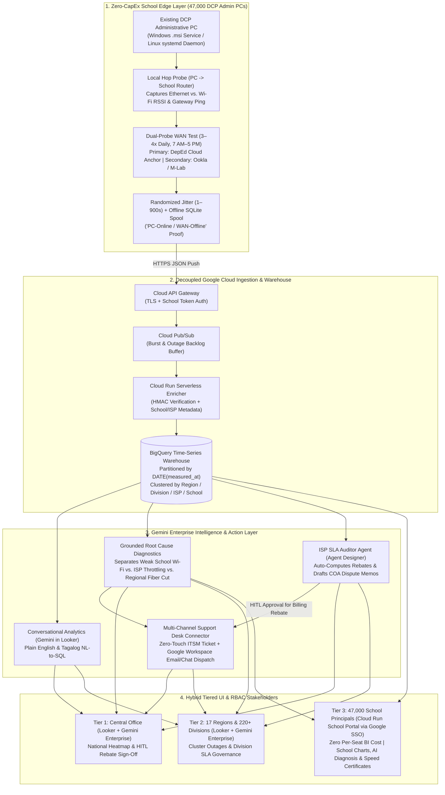
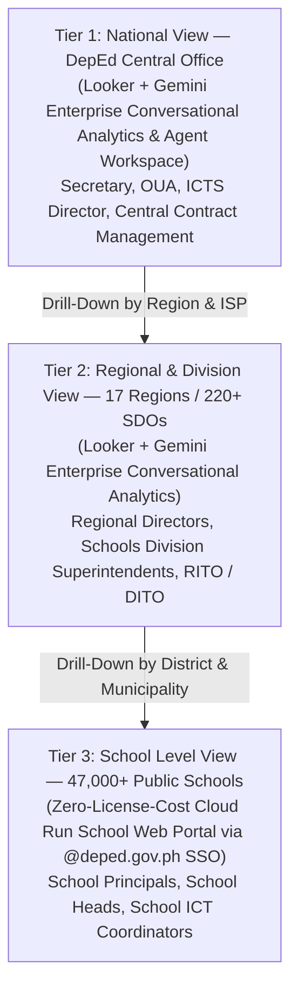

# BUSINESS REQUIREMENTS DOCUMENT (BRD)
## DepEd National Network Speed Tracker & Autonomous ISP SLA Governance Platform
### Zero-Hardware-CapEx Push Telemetry on DCP Administrative PCs Powered by Google Cloud & Gemini Enterprise

**Document Reference:** DEPED-ICTS-BRD-NST-2026-v2.0  
**Project Code:** PROJECT-BAYANIHAN-NETPULSE  
**Client / Agency:** Department of Education (DepEd) – Republic of the Philippines  
**Operating Unit:** Information and Communications Technology Service (ICTS) – Technology Infrastructure Division (TID)  
**Coverage Scope:** ~47,000 Public Elementary and Secondary Schools | 17 Regions | 220+ Schools Division Offices (SDOs)  
**Target Platform:** Google Cloud Platform (`API Gateway`, `Pub/Sub`, `Cloud Run`, `BigQuery`, `Looker`) & `Gemini Enterprise`  
**Edge Footprint:** Existing DepEd Computerization Program (DCP) Administrative PCs (Zero New Hardware CapEx)  
**Security Classification:** OFFICIAL – Government Infrastructure & Telecommunications Governance  

---

### Table of Contents
1. [Document Control & Institutional Sign-Off](#1-document-control--institutional-sign-off)
2. [Executive Summary & Statutory Mandate](#2-executive-summary--statutory-mandate)
3. [Business Problem Statement & Operational Bottlenecks](#3-business-problem-statement--operational-bottlenecks)
4. [Core Architectural & Governance Decisions (BRD Baseline v2.0)](#4-core-architectural--governance-decisions-brd-baseline-v20)
5. [Strategic Acceleration with Gemini Enterprise](#5-strategic-acceleration-with-gemini-enterprise)
6. [Project Objectives & Quantifiable Success Metrics (KPIs)](#6-project-objectives--quantifiable-success-metrics-kpis)
7. [Stakeholder Analysis, Hybrid Tiered UI & RBAC Hierarchy](#7-stakeholder-analysis-hybrid-tiered-ui--rbac-hierarchy)
8. [Project Scope: In-Scope vs. Out-of-Scope](#8-project-scope-in-scope-vs-out-of-scope)
9. [Business Use Cases & End-to-End Operational Workflows](#9-business-use-cases--end-to-end-operational-workflows)
10. [Detailed Functional Requirements (FRs)](#10-detailed-functional-requirements-frs)
11. [Non-Functional Requirements (NFRs)](#11-non-functional-requirements-nfrs)
12. [ISP SLA Penalty, Outage Attribution & HITL Rebate Governance](#12-isp-sla-penalty-outage-attribution--hitl-rebate-governance)
13. [Risk Management & Phased Implementation Roadmap](#13-risk-management--phased-implementation-roadmap)

---

### 1. Document Control & Institutional Sign-Off

#### 1.1 Document Revision History
| Version | Date | Author / Role | Summary of Changes |
| :--- | :--- | :--- | :--- |
| **0.1** | 2026-10-01 | Lead Cloud & AI Solutions Architect | Initial architecture concept for 47,000-school push-based telemetry |
| **1.0** | 2026-10-06 | Lead Enterprise AI Architect | Integrated Gemini Enterprise capabilities: Conversational Analytics, ISP SLA Auditor Agent, Grounded Diagnostics, RBAC, and Agent Identity Auditability |
| **2.0** | 2026-10-06 | Lead Enterprise AI Architect & Product Owner | **Hardened BRD Baseline (`v2.0`):** Standardized on zero-hardware-CapEx DCP Admin PC OS Service agents, `PC-Online / WAN-Offline` outage attribution during school hours (7 AM–5 PM), local Wi-Fi vs. WAN diagnostics, Dual-Probe anti-gaming speed test anchors, Hybrid Looker + Cloud Run School Portal UI, Split Governance (Zero-Touch Ticketing + HITL Financial Rebates), and Multi-Channel ITSM + Google Workspace dispatch |

#### 1.2 Institutional Stakeholders & Approvals
| Role | Title / Office | Agency / Organization | Status |
| :--- | :--- | :--- | :--- |
| **Executive Sponsor** | Undersecretary for Administration & ICT | DepEd Central Office | Pending Review |
| **Business Owner** | Director IV, ICTS | DepEd ICTS | Pending Review |
| **Technical Authority** | Chief, Technology Infrastructure Division (TID) | DepEd ICTS | Pending Review |
| **Field Operations Lead** | Regional IT Officers (RITO) & Division IT Officers (DITO) | DepEd Regional / Division Offices | Consulted |
| **Cloud & AI Architect** | Principal Solutions Architect | Google Cloud Public Sector | Approved |

---

### 2. Executive Summary & Statutory Mandate

#### 2.1 Executive Summary
The **Department of Education (DepEd)** oversees more than **47,000 public elementary and secondary schools** distributed across over 7,600 islands in the Philippines. Under the **DepEd Computerization Program (DCP)** and national digital education initiatives, DepEd contracts multiple telecommunications providers (Fiber, Fixed Wireless, LTE/5G, and LEO Satellite/Starlink) to deliver school internet connectivity.

However, verifying whether these Internet Service Providers (ISPs) actually deliver the bandwidth paid for by the Philippine government—and diagnosing connectivity outages across 47,000 dispersed sites **without requiring new hardware capital expenditure (CapEx)**—presents a critical operational challenge:
1. **Centralized Polling Fails at National Scale:** Centrally pinging 47,000 schools from the DepEd Central Office saturates central bandwidth, produces inaccurate latency measurements, fails across CGNAT cellular/satellite links, and triggers automated ISP DDoS protections.
2. **Hardware Budget Constraints & Locked ISP Routers:** Many schools use locked ISP modems or Starlink routers that cannot run custom scripts, and procuring 47,000 dedicated hardware probes requires additional budget. Therefore, telemetry collection must operate **100% as a tamper-resistant background software service on existing DCP Administrative PCs**.
3. **Defensible SLA Attribution on Admin PCs:** Because school administrative PCs are turned off outside school hours and may connect via local Wi-Fi or wired LAN, the system must mathematically separate **"Admin PC Turned Off"** or **"Weak Classroom Wi-Fi"** from **"True ISP WAN Degradation or Outage"** so telcos cannot dispute SLA penalty rebates.
4. **Bridging Raw Telemetry to Administrative Action:** Collecting millions of speed test rows is only useful if non-technical school principals, division superintendents, and central office contract managers can query data in plain language and automate trouble tickets and SLA rebate deductions.

**PROJECT-BAYANIHAN-NETPULSE (DepEd Network Speed Tracker)** solves these challenges through a **Decoupled Push-Based Telemetry Pipeline on Google Cloud** paired with **Gemini Enterprise**:

#### 2.2 Statutory & Regulatory Framework
1. **Republic Act No. 10929 (Free Internet Access in Public Places Act):** Mandates reliable internet connectivity across public basic education institutions.
2. **DepEd Computerization Program (DCP) — DepEd Order No. 78, s. 2010 (and subsequent guidelines):** Governs the deployment and utilization of administrative and instructional ICT packages in public schools.
3. **Republic Act No. 12009 (New Government Procurement Act / NGPA) & COA Circulars:** Mandates verifiable SLA compliance prior to disbursement of public funds and requires liquidated damages / billing rebates for underperforming contractors.
4. **Republic Act No. 10173 (Data Privacy Act of 2012):** Enforces strict Role-Based Access Control (RBAC) and prohibits unauthorized collection of personal student/teacher data.
5. **DICT Cloud First Policy (Department Circular No. 010, s. 2020):** Establishes cloud-native architecture and sovereign data governance standards for Philippine government agencies.

---

### 3. Business Problem Statement & Operational Bottlenecks

#### 3.1 Problem 1: Failure of Centralized Network Polling & CGNAT Barriers
Attempting to monitor 47,000 schools by having a central server at DepEd Central Office ping or run speed tests toward every school fails because:
- **ISP DDoS Mitigation:** 47,000 concurrent inbound probes from a single central IP block trigger telco DDoS rate-limiting.
- **Central Bandwidth Saturation:** Central hubs cannot sustain 47,000 concurrent bandwidth streams without measuring their own upstream bottleneck.
- **CGNAT Unreachability:** Most rural LTE, 5G, and satellite schools sit behind Carrier-Grade NAT (CGNAT) without public static IPv4 addresses.

#### 3.2 Problem 2: The "Thundering Herd" & Metered Link Constraints
If 47,000 schools execute speed tests at the exact top of the hour (`08:00:00 AM`), simultaneous saturation tests will artificially congest local cell towers, satellite beams, and regional ISP backbones. Furthermore, excessive full-saturation testing on metered LTE or satellite plans can exhaust a school's monthly data allocation.

#### 3.3 Problem 3: ISP Disputes Over "Turned-Off PCs", "Weak School Wi-Fi", and "Speedtest Whitelisting"
When telemetry is collected from existing school Administrative PCs without purchasing dedicated hardware probes, ISPs routinely challenge SLA penalty claims using three excuses:
1. *"The school wasn't having an ISP outage—the staff simply turned off the Admin PC or there was a local barangay brownout."*
2. *"Our fiber modem delivered 100 Mbps, but the Admin PC only measured 15 Mbps because it was connected over weak classroom Wi-Fi (`-85 dBm`) or heavy local LAN traffic."*
3. *"Our on-net Ookla speedtest server shows 100 Mbps!"* (when the ISP selectively prioritizes known public speedtest servers while throttling actual DepEd LMS and cloud traffic).

#### 3.4 Problem 4: BI Licensing Costs & Technical Literacy Barriers across 47,000 Schools
- **Technical Literacy Gap:** Non-technical school principals and division superintendents cannot interpret raw `jitter`, `packet loss`, or `ICMP latency` logs, nor can they write SQL queries.
- **Per-Seat BI Licensing Constraints:** Purchasing 47,000 individual commercial BI analyst licenses for every school principal is financially impractical; the visualization architecture must provide full **Looker + Gemini Enterprise** power to Central, Regional, and Division decision-makers while giving all 47,000 School Principals a **zero-per-seat-license School Web Portal** backed by their `@deped.gov.ph` Google Workspace identity.

---

### 4. Core Architectural & Governance Decisions (BRD Baseline v2.0)

To address DepEd's budget, operational, and procurement realities, this BRD establishes eight mandatory design decisions:

| Decision ID | Domain | Approved Business & Architectural Decision |
| :--- | :--- | :--- |
| **DEC-01** | **Zero-CapEx Edge Footprint** | Rely **100% on software agents installed on existing DCP Administrative PCs** (zero new router or Raspberry Pi hardware procurement required). |
| **DEC-02** | **Enforceable Outage Attribution** | Restrict SLA compliance measurement strictly to **Active School Hours (`Mon–Fri, 07:00 AM – 05:00 PM PHT`, excluding DepEd holidays)** AND require **`PC-Online / WAN-Offline` verification** (agent verifies the local school router gateway `192.168.x.1` responds via LAN/Wi-Fi while external WAN targets fail, spooling the signed failure record locally) before attributing an outage to the ISP. |
| **DEC-03** | **Local Link Diagnostics & Test Cadence** | Capture **Local Link Diagnostics** on every test (`Connection Medium`: Ethernet vs. Wi-Fi RSSI signal strength, local gateway ping/jitter, and PC NIC utilization) to isolate local Wi-Fi bottlenecks from ISP WAN failures. Execute **3–4 staggered tests per school day** (Morning, Mid-Day Peak, Afternoon) with a lightweight payload cap for metered LTE/Satellite links. |
| **DEC-04** | **Tamper-Resistant OS Service & Dual Rollout** | Package the software agent as a tamper-resistant background **OS Service** (Windows `.msi` service + Linux `systemd` daemon) with auto-start on boot, silent auto-update, and dual deployment: centralized push for Intune/AD-managed DCP PCs + a **1-click Division-issued Enrollment Installer** (pre-bound with School BEIS ID & cryptographic token) for standalone PCs. |
| **DEC-05** | **Dual-Probe Anti-Gaming Target** | Execute a **Dual-Probe Strategy**: Primary measurement against **DepEd-hosted Cloud Run / GCE throughput & latency anchors** (measuring real educational cloud traffic at zero third-party license cost) paired with secondary validation against public reference servers (`Ookla CLI` / `M-Lab`) to expose ISP speedtest whitelisting or selective traffic shaping. |
| **DEC-06** | **Hybrid Tiered UI Architecture** | Deploy **Looker + Gemini Enterprise (Conversational Analytics & Agent Workspace)** for **Tier 1 (Central Office)** and **Tier 2 (17 Regions / 220+ Divisions)**, paired with a **zero-per-seat-license Cloud Run School Web Portal** (authenticated via `@deped.gov.ph` Google Workspace SSO) for **Tier 3 (47,000 School Principals)**. |
| **DEC-07** | **Split Autonomous Governance (Zero-Touch + HITL)** | Enforce **Zero-Touch Autonomous Execution** for **Technical Trouble Tickets** (auto-filing immediately upon verified breach or regional fiber cut) and **Mandatory Human-in-the-Loop (HITL) Sign-Off** for **Financial SLA Rebate Deductions** (Agent auto-computes rebate & drafts COA-ready memo; ICTS / Division Officer approves before billing deduction). |
| **DEC-08** | **Multi-Channel Support Desk Dispatch** | Integrate the **Gemini Enterprise Support Desk Connector** with **DepEd ICTS Helpdesk / ITSM** (ServiceNow, Jira, or REST Webhook) PLUS **Automated Google Workspace Dispatch** (structured ticket emails & Google Chat alerts sent to the ISP Enterprise NOC, Division IT Officer, and School Principal). |

---

### 5. Strategic Acceleration with Gemini Enterprise

#### 5.1 Pillar 1: Democratizing Data Access via Conversational Analytics (Gemini in Looker)
Central Office executives, Regional Directors, and Division Superintendents/DITOs do not need to write SQL or navigate complex BI filters. Using **Conversational Analytics (Gemini in Looker)**, they can ask questions in plain **English, Tagalog, or Taglish**:
- `"Which schools in Region IV-A have been 50% below their contracted speed during school hours this week, excluding schools with weak local Wi-Fi?"`
- `"Aling mga ISP sa Region VIII ang may pinakamaraming SLA violation ngayong buwan at magkano ang total rebate na dapat ibawas?"`
- `"Show me schools where the public Ookla speed test is above 80 Mbps but throughput to the DepEd Cloud Anchor is below 15 Mbps."` *(Detects ISP selective throttling)*

#### 5.2 Pillar 2: Custom Agentic Workflows (Gemini Enterprise Agent Designer)
1. **Autonomous ISP SLA Auditor Agent:**
   - Continuously audits BigQuery telemetry collected during active school hours (`07:00 AM – 05:00 PM`, Mon–Fri).
   - Filters out false positives where `local_gateway_ping_ms` or `wifi_rssi_dbm` indicates an internal school LAN/Wi-Fi issue rather than an ISP WAN issue.
   - Identifies verified ISP SLA violations ($<50\%$ contracted bandwidth for **3 consecutive school days**, or verified `PC-Online / WAN-Offline` outages), computes the exact PHP rebate penalty, and routes a **COA-Ready Draft Rebate Voucher** to the Division IT Officer / ICTS Contract Manager for 1-click **Human-in-the-Loop (HITL)** approval.
2. **Multi-Channel Support Desk Connector:**
   - Upon detecting a technical breach or regional cluster outage, **autonomously (Zero-Touch)** opens a structured trouble ticket in the DepEd ICTS Helpdesk / ITSM and dispatches formatted **Google Workspace Gmail & Google Chat alerts** (with attached 72-hour telemetry proof) to the ISP Enterprise NOC, Division IT Officer, and School Principal.

#### 5.3 Pillar 3: Grounded Root Cause Diagnostics (WAN vs. Local Wi-Fi vs. Peering)
By feeding both **Local Hop Metrics** (Admin PC $\rightarrow$ School Router) and **Dual-Probe WAN Metrics** (School Router $\rightarrow$ DepEd Cloud Anchor & Public Reference Server) into **Gemini Enterprise** alongside historical BigQuery baselines (via the **Data Insights Agent**), the system generates plain-English and Tagalog root-cause diagnostics for School Principals:
- **Case 1 — Local School Wi-Fi Bottleneck (No ISP Ticket Filed):**
  > *"Your Admin PC is connected via weak Wi-Fi (-84 dBm) with 92ms latency to your school router. Your ISP fiber link is healthy, but the Wi-Fi signal inside the office is degraded. Please connect the Admin PC via an Ethernet LAN cable or move closer to the access point."*
- **Case 2 — Confirmed ISP Last-Mile Physical Degradation (Auto-Ticket Filed):**
  > *"Your Admin PC has a clean 1ms wired Ethernet connection to the school router, but external WAN packet loss is 15.2% with 78ms jitter. This confirms physical ISP fiber/line degradation outside the school. Trouble Ticket #DEPED-2026-8841 has been automatically dispatched to your ISP."*
- **Case 3 — ISP Selective Throttling / Peering Congestion (Auto-Ticket + SLA Flag):**
  > *"Public speedtest server shows 94 Mbps, but throughput to DepEd Cloud LMS Anchor drops to 11 Mbps between 10:00 AM and 2:00 PM. This indicates ISP upstream peering congestion or selective traffic shaping during school hours."*
- **Case 4 — Regional Fiber Backbone Cut (Master Cluster Ticket Filed):**
  > *"24 schools in Sorsogon Division reported 'PC-Online / WAN-Offline' within a 10-minute window. Your school equipment is working normally; this is a regional ISP fiber cut. Master Ticket #DEPED-2026-9012 is active."*

#### 5.4 Pillar 4: Enterprise Security, RBAC, Sovereignty & Agent Identity Auditability
- **Strict Role-Based Access Control (RBAC):** BigQuery Row-Level Security (RLS) ensures a School Principal on the Cloud Run School Portal can only view their single `school_id`, a Division Superintendent in Looker/Gemini Enterprise can only query their `division_id`, and Central Office can query nationally.
- **Data Sovereignty:** DepEd retains 100% ownership of all telemetry and ISP contract data; zero government data is used to train foundation models.
- **Agent Identity Audit Trail:** Every zero-touch ticket created and every SLA rebate calculated by an AI agent is logged with a cryptographic `agent_identity` separate from the human administrator who approves the final billing deduction.

#### 5.5 Pillar 5: Accelerating Simulation & BigQuery Optimization
- **Gemini Synthetic Scenario Generation:** Programmatically generates thousands of realistic edge-case JSON payloads (rural satellite rain fade, 10 AM–2 PM school-hour throttling, weak local Wi-Fi vs. WAN degradation, and regional fiber cuts) to stress-test the pipeline via **Locust on GKE**.
- **Gemini in BigQuery Optimization:** Recommends partitioning (`DATE(measured_at)`) and multi-column clustering (`region_id, division_id, isp_id, school_id`) to keep national aggregations fast and cost-efficient.

---

### 6. Project Objectives & Quantifiable Success Metrics (KPIs)

| Objective ID | Strategic Objective | Target Key Performance Indicator (KPI) | Target Baseline |
| :--- | :--- | :--- | :--- |
| **OBJ-01** | **Zero-CapEx National Rollout** | Percentage of DCP-connected schools running the background OS service on existing Admin PCs | **$\ge 95\%$ of connected schools** with **$0 additional hardware CapEx** |
| **OBJ-02** | **Zero Network Bottlenecking** | Elimination of top-of-the-hour routing spikes via randomized jitter ($1 - 900\text{s}$) | **100% staggered distribution** across 3–4 daily school-hour windows |
| **OBJ-03** | **Dispute-Proof SLA Attribution** | Percentage of SLA breach claims backed by verified `Local Gateway OK + WAN Degraded/Offline` proof | **100% of SLA rebate claims** verified free of local Wi-Fi/power false positives |
| **OBJ-04** | **Zero-Touch Technical Ticketing** | Time from 3-day SLA breach or cluster fiber cut detection to ITSM + Google Workspace ticket dispatch | **$< 5\text{ minutes}$ (Zero-Touch Autonomous Execution)** |
| **OBJ-05** | **Self-Service Analytics Adoption** | Turnaround time for Division/Central Office ad-hoc connectivity reports via Conversational Analytics | Reduced from **3–5 days** to **$< 10\text{ seconds}$** in English or Tagalog |
| **OBJ-06** | **Cost-Optimized 3-Tier Access** | Per-school BI license cost for 47,000 School Principals via the Cloud Run School Portal | **$0 per-seat BI license cost** for Tier 3 School Principals |

---

### 7. Stakeholder Analysis, Hybrid Tiered UI & RBAC Hierarchy

| Tier | Persona | UI Delivery Platform | RBAC Scope (`BigQuery RLS`) | Key Capabilities |
| :--- | :--- | :--- | :--- | :--- |
| **Tier 1: National** | **DepEd Central Office (ICTS / Finance / Execs)** | **Looker + Gemini Enterprise** | `ALL_REGIONS` (`*`) | - Philippines GIS Heatmap & National ISP SLA Scorecards. - English/Tagalog Conversational Analytics. - **HITL Approval Console** for national ISP rebate deductions. |
| **Tier 2: Regional / Division** | **Regional Directors, Division Superintendents, RITO / DITO** | **Looker + Gemini Enterprise** | `region_id` or `division_id` | - Provincial/Division outage cluster maps. - Conversational Analytics in English/Tagalog. - Division Enrollment Installer generator & HITL validation of division SLA rebates. |
| **Tier 3: School Level** | **47,000 School Principals & ICT Coordinators** | **Cloud Run School Web Portal** (`@deped.gov.ph` Google SSO) | `school_id = USER_SCHOOL_ID` | - School speed & quality charts (7 AM–5 PM school hours). - Plain-English & Tagalog **Gemini Diagnostic Cards** (Wi-Fi vs. ISP guidance). - 1-Click PDF **Official DepEd Speed Test Certificate** for local ISP proof. |

---

### 8. Project Scope: In-Scope vs. Out-of-Scope

#### 8.1 In-Scope
1. **Tamper-Resistant DCP Admin PC Software Agent:** Background Windows Service (`.msi`) and Linux (`systemd`) daemon with randomized jitter, local gateway probing (`Ethernet` vs. `Wi-Fi RSSI`), Dual-Probe WAN testing (DepEd Cloud Anchor + Ookla/M-Lab), metered-link payload caps, and local SQLite offline spooling.
2. **Dual Deployment Tooling:** Centralized push packages for Intune/AD-managed DCP PCs and a 1-click Division-issued Enrollment Installer for standalone school PCs.
3. **Decoupled Cloud Ingestion & BigQuery Warehouse:** Cloud API Gateway, Cloud Pub/Sub, Cloud Run enrichment service, and BigQuery partitioned/clustered tables with Row-Level Security (RLS).
4. **Hybrid 3-Tier Visualization Layer:** Looker dashboards for Tier 1 (National) and Tier 2 (Regional/Division) + a lightweight Cloud Run School Web Portal with Google Workspace SSO for Tier 3 (47,000 School Principals).
5. **Gemini Enterprise Operationalization:**
   - Bilingual (English/Tagalog) Conversational Analytics in Looker.
   - **ISP SLA Auditor Agent** with HITL rebate approval workflow.
   - **Grounded Root Cause Diagnostic Engine** (distinguishing local Wi-Fi, ISP last-mile, selective throttling, and backbone cuts).
   - **Multi-Channel Support Desk Connector** (ITSM + Google Workspace Gmail/Chat dispatch).
6. **47,000-Node Load Simulator:** Gemini synthetic scenario generator and distributed Locust load testing suite on GKE/Cloud Run.

#### 8.2 Out-of-Scope
1. Procurement of new routers, Raspberry Pi probes, or physical telecommunication circuits (zero hardware CapEx scope).
2. Monitoring outside official school hours (`before 7:00 AM` or `after 5:00 PM`, weekends, or DepEd holidays) for SLA penalty attribution.
3. Deep Packet Inspection (DPI), student/teacher web browsing monitoring, or collection of any student/teacher PII.

---

### 9. Business Use Cases & End-to-End Operational Workflows

#### 9.1 Use Case 1: School-Hour Staggered Dual-Probe Test & Local Wi-Fi Disambiguation
1. **Trigger:** A DCP Admin PC at School `104512` is powered on by administrative staff at `07:30 AM` on a Tuesday.
2. **Staggered Jitter:** For the Morning Test Window (`08:00 AM`), the background Windows Service computes a random jitter delay of `485 seconds` (`08:08:05 AM`).
3. **Step A — Local Hop Probe:** The agent checks the PC's network interface (`connection_medium = ETHERNET` or `WIFI` with `RSSI = -58 dBm`) and pings the local school router gateway (`192.168.1.1`), recording `local_gateway_ping_ms = 1.4ms` and `local_gateway_loss_pct = 0.0%`.
4. **Step B — Dual-Probe WAN Test:** The agent executes a throughput/latency test against the **DepEd Cloud Anchor** (measuring real application throughput) and a secondary check against the **Public Reference Server (Ookla/M-Lab)**, applying a lightweight data cap if the school is tagged as `METERED_LTE` or `SATELLITE`.
5. **Diagnostic Disambiguation:** If speed is low (`12 Mbps` out of `100 Mbps`), the **Grounded Diagnostic Agent** checks Step A:
   - If `connection_medium = WIFI` and `RSSI = -86 dBm` (weak signal), it flags **`LOCAL_WIFI_BOTTLENECK`**, alerts the School Principal on the School Portal to use a LAN cable, and **excludes** the test from ISP SLA penalty calculations.
   - If `local_gateway_ping_ms < 5ms` and `local_gateway_loss_pct = 0%`, it confirms **`VERIFIED_ISP_WAN_DEGRADATION`** and counts the test toward ISP SLA enforcement.

#### 9.2 Use Case 2: Verified "PC-Online / WAN-Offline" Outage Attribution & Local Spooling
1. **Trigger:** At `10:15 AM`, the school's fiber line is cut outside the gate, while the school still has electricity and the Admin PC and school router remain powered on.
2. **Verification:** The Admin PC agent attempts its mid-day test:
   - Local school router (`192.168.1.1`) responds (`local_gateway_reachable = TRUE`, `local_gateway_ping_ms = 1.8ms`).
   - External WAN targets (`DepEd Cloud Anchor` & `Public DNS/Ookla`) time out (`wan_reachable = FALSE`).
3. **Signed Offline Spooling:** The agent records a cryptographically signed **`VERIFIED_WAN_OFFLINE`** event with the exact `10:15 AM` timestamp in its local SQLite spool database.
4. **Reconnection Flush:** When the ISP restores the fiber line the next day, the agent flushes the backlogged `VERIFIED_WAN_OFFLINE` events to Cloud Pub/Sub. Because `local_gateway_reachable = TRUE` was proven at the time of failure, the ISP cannot claim the school PC or router was turned off.

#### 9.3 Use Case 3: Split Governance — Zero-Touch Ticketing & HITL Financial Rebate Approval
1. **Trigger:** School `104512` records 3 consecutive school days of verified WAN speeds below 50% of its 100 Mbps contract (with healthy local LAN diagnostics).
2. **Zero-Touch Technical Ticket:** The **ISP SLA Auditor Agent** immediately triggers the **Multi-Channel Support Desk Connector**, creating Ticket `#INC-2026-4419` in the DepEd ICTS Helpdesk and dispatching an automated Google Workspace email and Google Chat alert (with 3-day telemetry charts and local LAN proof) to the ISP Enterprise NOC, Division IT Officer (DITO), and School Principal.
3. **HITL Financial Rebate Workflow:** Simultaneously, the **ISP SLA Auditor Agent** calculates the statutory PHP rebate credit and places a **Draft Notice of SLA Breach & Billing Deduction** in the Division/Central Office Approval Queue. The ICTS Contract Manager reviews the AI-generated evidence ledger and clicks **"Approve Deduction"** to finalize the billing credit.

---

### 10. Detailed Functional Requirements (FRs)

| Req ID | Module | Functional Requirement Description | Priority |
| :--- | :--- | :--- | :--- |
| **FR-EDGE-01** | DCP PC Agent | The agent MUST run exclusively on existing school DCP Administrative PCs as a tamper-resistant background **Windows Service (`.msi`)** or **Linux (`systemd`) daemon** with zero new hardware CapEx. | **P0 (Critical)** |
| **FR-EDGE-02** | Rollout | The agent MUST support both centralized deployment (Microsoft Intune / Active Directory GPO) and a **1-click Division-Issued Enrollment Installer** pre-configured with the school's 6-digit BEIS ID and HMAC secret. | **P0 (Critical)** |
| **FR-EDGE-03** | Schedule & Jitter | The agent MUST execute **3–4 staggered tests per school day** strictly during **Active School Hours (`Mon–Fri, 07:00 AM – 05:00 PM PHT`)** with a randomized jitter delay ($1 - 900\text{s}$) and a lightweight payload cap (`<= 15 MB/test`) for metered LTE/Satellite links. | **P0 (Critical)** |
| **FR-EDGE-04** | Local Hop Probe | Prior to every WAN test, the agent MUST capture local hop diagnostics: `connection_medium` (`ETHERNET` vs. `WIFI`), `wifi_rssi_dbm`, `local_gateway_ip`, `local_gateway_reachable`, `local_gateway_ping_ms`, and `local_gateway_loss_pct`. | **P0 (Critical)** |
| **FR-EDGE-05** | Dual-Probe WAN | The agent MUST measure WAN performance against both a **DepEd-Hosted Cloud Anchor** (primary application throughput/latency) and a **Public Reference Server (`Ookla CLI` / `M-Lab`)** to detect ISP selective traffic shaping. | **P0 (Critical)** |
| **FR-EDGE-06** | Offline Attribution | When `local_gateway_reachable = TRUE` and external WAN is unreachable during school hours, the agent MUST spool a signed `VERIFIED_WAN_OFFLINE` record locally and flush it via exponential backoff upon reconnection. | **P0 (Critical)** |
| **FR-ING-01** | Cloud Ingestion | **API Gateway**, **Cloud Pub/Sub**, and **Cloud Run** MUST validate HMAC signatures, enrich records with School/Division/ISP contract metadata, and stream into **BigQuery** partitioned by `DATE(measured_at)`. | **P0 (Critical)** |
| **FR-UI-01** | Hybrid Tier 1 & 2 | **Looker + Gemini Enterprise** MUST serve Tier 1 (Central Office) and Tier 2 (Regions/Divisions) with GIS heatmaps, cluster outage alerts, ISP SLA scorecards, and bilingual **Conversational Analytics** (English & Tagalog). | **P0 (Critical)** |
| **FR-UI-02** | Hybrid Tier 3 | A **Cloud Run School Web Portal** (authenticated via `@deped.gov.ph` Google Workspace SSO at zero per-seat BI license cost) MUST serve Tier 3 (47,000 School Principals) with school speed charts, plain-language AI diagnostic cards, and downloadable PDF Speed Test Certificates. | **P0 (Critical)** |
| **FR-UI-03** | Geospatial Heatmap | The platform MUST provide an interactive **Geospatial Connectivity Heatmap** across all 47,000 schools in the 17 regions, visualizing issue density (WAN outages, ISP throttling, weak Wi-Fi, and SLA breaches), dual-layer mode (Heat Density Cloud vs. Individual Pins), and 1-click navigation to school diagnostics. | **P0 (Critical)** |
| **FR-AI-01** | Grounded Diagnostics | The **Grounded Diagnostic Agent** MUST correlate local hop metrics vs. Dual-Probe WAN metrics vs. regional cluster status to classify issues into: (1) Local School Wi-Fi/LAN Fault, (2) ISP Last-Mile Degradation, (3) ISP Selective Throttling, or (4) Regional Fiber Backbone Cut. | **P0 (Critical)** |
| **FR-AI-02** | Split Governance | The system MUST enforce **Zero-Touch Autonomous Execution** for technical trouble tickets and **Mandatory Human-in-the-Loop (HITL) Approval** for financial SLA rebate deductions. | **P0 (Critical)** |
| **FR-AI-03** | Multi-Channel Dispatch | The **Support Desk Connector** MUST log tickets in the DepEd ICTS Helpdesk / ITSM (ServiceNow/Jira/Webhook) AND dispatch structured notifications via **Google Workspace (Gmail & Google Chat)** to the ISP NOC, DITO, and School Principal. | **P0 (Critical)** |
| **FR-SIM-01** | 47k Simulation | The platform MUST provide a **Gemini Synthetic Scenario Generator** and distributed **Locust on GKE** load simulator modeling 47,000 DCP Admin PCs with jitter, local Wi-Fi faults, and `PC-Online / WAN-Offline` backlog flushes. | **P0 (Critical)** |

---

### 11. Non-Functional Requirements (NFRs)

| NFR ID | Category | Specification & Target Metric |
| :--- | :--- | :--- |
| **NFR-FOOTPRINT-01** | **Admin PC Resource Cap** | The background OS service on DCP Admin PCs must consume **$< 2\%$ CPU** when idle, **$< 50\text{ MB}$ RAM**, and pause execution if local PC CPU exceeds $85\%$ so administrative work is never slowed down. |
| **NFR-SCALE-01** | **Reconnect Burst Throughput** | Cloud Pub/Sub and Cloud Run must absorb **15,000+ concurrent payload pushes per minute** (e.g., 8:00 AM school boot window or post-brownout recovery) with zero message loss. |
| **NFR-PERF-01** | **Dashboard & AI Latency** | BigQuery partitioned/clustered queries for Looker and the Cloud Run School Portal must complete in **$< 2.5\text{ seconds}$ (P95)**. |
| **NFR-SEC-01** | **Strict 3-Tier RBAC & RLS** | BigQuery Row-Level Security (RLS) and Google Workspace OAuth2 SSO must strictly isolate data by role (`Principal` $\rightarrow$ 1 School; `Superintendent/DITO` $\rightarrow$ 1 Division; `Central Office` $\rightarrow$ National). |
| **NFR-AUDIT-01** | **Dual Identity Audit Trail** | Every automated ticket and rebate calculation must log `agent_identity` (`DepEd_ISP_SLA_Auditor_Agent`), while every financial rebate approval logs the human `approver_email` (`@deped.gov.ph`) and timestamp for COA compliance. |

---

### 12. ISP SLA Penalty, Outage Attribution & HITL Rebate Governance

#### 12.1 Strict Eligibility Rules for SLA Breach Attribution
To ensure 100% legal and technical defensibility against telco disputes, a telemetry measurement or outage event is **eligible for ISP SLA penalty calculation if and only if all four conditions hold**:
1. **Active School Window:** Measured Monday through Friday between **07:00 AM and 05:00 PM PHT** (excluding official DepEd national/local holidays and declared typhoon suspension days).
2. **Verified PC & Local Router Power:** `local_gateway_reachable = TRUE` (proving the school had electrical power and both the DCP Admin PC and school gateway router were powered on).
3. **Verified Local Hop Health:** Either `connection_medium = ETHERNET` OR (`connection_medium = WIFI` AND `wifi_rssi_dbm >= -67 dBm` AND `local_gateway_ping_ms <= 10ms` AND `local_gateway_loss_pct == 0%`), proving the bottleneck is not caused by weak school Wi-Fi.
4. **Sustained WAN Failure:** Across **3 or more consecutive school days**, either:
   - School-hour average download speed to the **DepEd Cloud Anchor** is **$< 50\%$ of Contracted CIR**, OR
   - Verified `PC-Online / WAN-Offline` state persists across all scheduled daily test windows, OR
   - WAN packet loss exceeds **$5\%$** / terrestrial jitter exceeds **$100\text{ms}$**.

#### 12.2 Statutory Rebate Calculation & Split Governance Matrix

$$\text{Monthly SLA Rebate (PHP)} = \text{Monthly Contracted MRC} \times \text{Rebate Tier \%} \times \left( \frac{\text{Verified Breach School Days}}{\text{Total School Days in Month (22)}} \right)$$

| Verified School-Hour Compliance | SLA Status | Mandatory Rebate Tier | Zero-Touch Agent Action (Immediate) | Human-in-the-Loop (HITL) Financial Action |
| :--- | :--- | :--- | :--- | :--- |
| **$\ge 80\%$ Contracted Speed & $<1\%$ WAN Loss** | **COMPLIANT (Green)** | `0%` | Logs daily compliance in BigQuery. | Auto-generates monthly Certificate of SLA Compliance for ICTS/Finance sign-off. |
| **Local Wi-Fi Weak (`RSSI < -70 dBm`) but WAN Healthy** | **LOCAL LAN ADVISORY (Blue)** | `0%` *(ISP Exempt)* | Sends plain-English/Tagalog Wi-Fi fix advisory to School Principal Portal. | Excluded from ISP penalty calculation. |
| **$50\% - 79\%$ Speed OR Selective Throttling Detected (3+ School Days)** | **MINOR BREACH (Amber)** | `10%` of Monthly MRC | **Auto-files Warning Ticket** in ITSM + emails/chats ISP NOC & DITO. | Agent drafts **10% Rebate Credit Voucher**; DITO / ICTS reviews & clicks **Approve**. |
| **$< 50\%$ Speed OR Verified `PC-Online / WAN-Offline` (3–5 School Days)** | **MAJOR BREACH (Red)** | `25%` of Monthly MRC | **Auto-files High-Priority NOC Ticket** + attaches 72-hr Dual-Probe proof. | Agent drafts **25% Rebate Deduction Memo**; ICTS Contract Manager approves deduction. |
| **$< 50\%$ Speed OR Verified `PC-Online / WAN-Offline` ($> 5$ School Days)** | **CRITICAL BREACH (Black)** | `50% - 100%` of MRC | **Auto-escalates Master Ticket** to ISP Executive Account Team & DepEd OUA. | Agent flags invoice for **Payment Hold / Liquidated Damages** pending Legal/ICTS sign-off. |

---

### 13. Risk Management & Phased Implementation Roadmap

#### 13.1 Key Operational Risks & Mitigations
| Risk ID | Risk Description | Likelihood | Impact | Architectural Mitigation |
| :--- | :--- | :--- | :--- | :--- |
| **RSK-01** | **School Staff Disables or Uninstalls Admin PC Agent** | Medium | High | Installed as a non-interactive SYSTEM Windows Service (`.msi`) / `systemd` daemon with service recovery auto-restart and tamper alerts reported to the Division IT Officer. |
| **RSK-02** | **ISP Disputes Based on Local School Wi-Fi Interference** | High | High | Agent probes local gateway ping/loss and Wi-Fi RSSI before every WAN test; Gemini Grounded Diagnostics automatically filters out weak-Wi-Fi measurements from SLA penalty ledgers. |
| **RSK-03** | **ISP Whitelists Speedtest Servers While Throttling Real Traffic** | Medium | High | Dual-Probe testing measures throughput against **DepEd Cloud Anchors** alongside public reference servers; discrepancies $>30\%$ trigger a "Selective Traffic Shaping" violation. |
| **RSK-04** | **Exhaustion of Metered LTE / Satellite Data Caps** | Medium | Medium | Schools tagged as `LTE_5G` or `SATELLITE_LEO` execute a capped lightweight burst test ($\le 15\text{ MB}$ per test, 3x/day = $< 1\text{ GB/month}$ during school days). |

#### 13.2 Phased National Implementation Roadmap
- **Phase 1: Cloud Pipeline, Dual-Probe Anchors & 47k Simulation (Weeks 1–4)**
  - Deploy Google Cloud API Gateway, Pub/Sub, Cloud Run Enricher, DepEd Cloud Throughput Anchors, and BigQuery Partitioned/Clustered tables with RLS.
  - Validate 47,000-endpoint concurrency, jitter, and `PC-Online / WAN-Offline` backlog flushes using **Gemini Synthetic Scenario Generation** and **Locust on GKE**.
- **Phase 2: Hybrid UI, Gemini Enterprise Agents & Division Pilot (Weeks 5–8)**
  - Launch Looker + Gemini Enterprise (Conversational Analytics & ISP SLA Auditor Agent) for Central Office and 3 Pilot Divisions (NCR, Region IV-A, Region VIII).
  - Launch the **Cloud Run School Web Portal** (`@deped.gov.ph` SSO) and roll out the `.msi` / Enrollment Installer to 1,000 pilot DCP Admin PCs.
- **Phase 3: National Rollout Across 47,000 DCP Admin PCs (Weeks 9–20)**
  - Push agent nationwide via Intune/GPO and Division IT Officer Enrollment Installers across all 17 Regions and 220+ SDOs.
  - Operationalize monthly HITL SLA Rebate Vouchers across all national ISP contracts.
