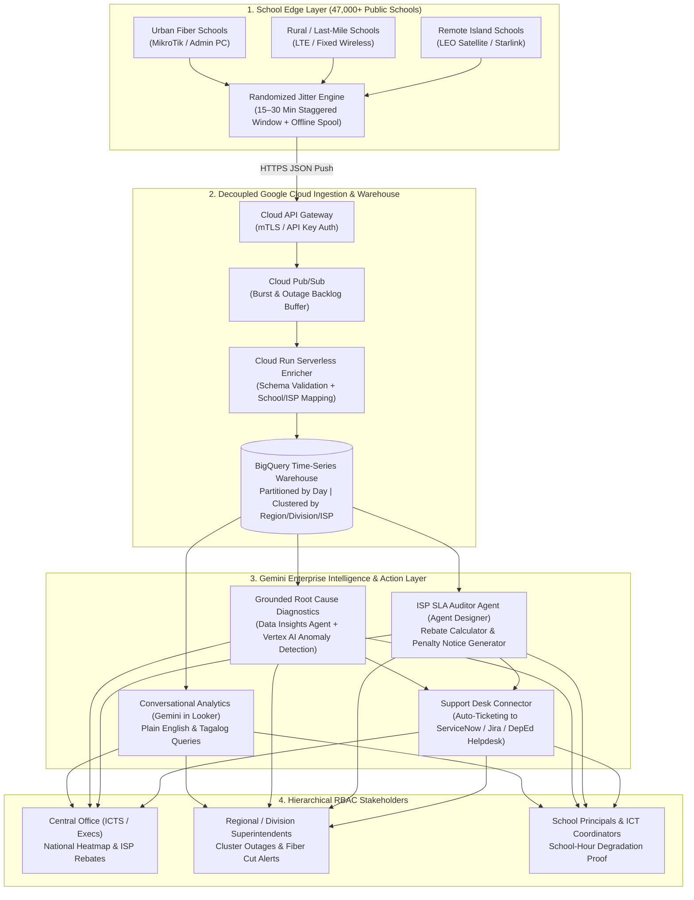
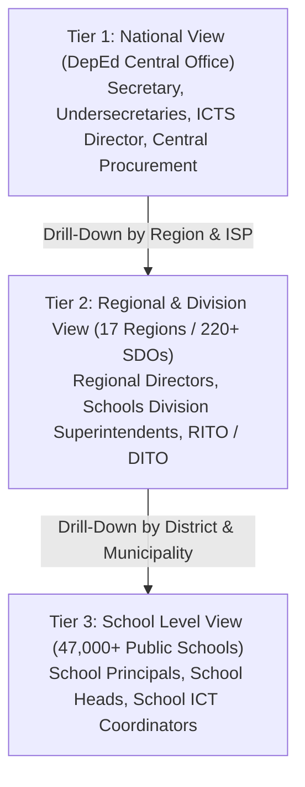

# BUSINESS REQUIREMENTS DOCUMENT (BRD)
## DepEd National Network Speed Tracker & Autonomous ISP SLA Governance Platform
### Decoupled Push-Based Edge Telemetry across 47,000+ Public Schools Powered by Google Cloud & Gemini Enterprise

**Document Reference:** DEPED-ICTS-BRD-NST-2026-v1.0  
**Project Code:** PROJECT-BAYANIHAN-NETPULSE  
**Client / Agency:** Department of Education (DepEd) – Republic of the Philippines  
**Operating Unit:** Information and Communications Technology Service (ICTS) – Technology Infrastructure Division (TID)  
**Coverage Scope:** ~47,000 Public Elementary and Secondary Schools | 17 Regions | 220+ Schools Division Offices (SDOs)  
**Target Platform:** Google Cloud Platform (Pub/Sub, Cloud Run, BigQuery, Looker) & Gemini Enterprise  
**Security Classification:** OFFICIAL – Government Infrastructure & Telecommunications Governance  

---

### Table of Contents
1. [Document Control & Institutional Sign-Off](#1-document-control--institutional-sign-off)
2. [Executive Summary & Statutory Mandate](#2-executive-summary--statutory-mandate)
3. [Business Problem Statement & Operational Bottlenecks](#3-business-problem-statement--operational-bottlenecks)
4. [Strategic Acceleration with Gemini Enterprise](#4-strategic-acceleration-with-gemini-enterprise)
5. [Project Objectives & Quantifiable Success Metrics (KPIs)](#5-project-objectives--quantifiable-success-metrics-kpis)
6. [Stakeholder Analysis, RBAC Hierarchy & User Personas](#6-stakeholder-analysis-rbac-hierarchy--user-personas)
7. [Project Scope: In-Scope vs. Out-of-Scope](#7-project-scope-in-scope-vs-out-of-scope)
8. [Business Use Cases & End-to-End Operational Workflows](#8-business-use-cases--end-to-end-operational-workflows)
9. [Detailed Functional Requirements (FRs)](#9-detailed-functional-requirements-frs)
10. [Non-Functional Requirements (NFRs)](#10-non-functional-requirements-nfrs)
11. [ISP SLA Penalty, Rebate Governance & Auditability Framework](#11-isp-sla-penalty-rebate-governance--auditability-framework)
12. [Risk Management & Phased Implementation Roadmap](#12-risk-management--phased-implementation-roadmap)

---

### 1. Document Control & Institutional Sign-Off

#### 1.1 Document Revision History
| Version | Date | Author / Role | Summary of Changes |
| :--- | :--- | :--- | :--- |
| **0.1** | 2026-10-01 | Lead Cloud & AI Solutions Architect | Initial architecture concept for 47,000-school push-based telemetry |
| **0.5** | 2026-10-04 | Enterprise Data & Network Specialist | Added Locust GKE simulation specs, jitter modeling, and SLA penalty rules |
| **1.0** | 2026-10-06 | Lead Enterprise AI Architect | Integrated Gemini Enterprise capabilities: Conversational Analytics, ISP SLA Auditor Agent, Grounded Diagnostics, RBAC, and Agent Identity Auditability |

#### 1.2 Institutional Stakeholders & Approvals
| Role | Title / Office | Agency / Organization | Status |
| :--- | :--- | :--- | :--- |
| **Executive Sponsor** | Undersecretary for Administration & ICT | DepEd Central Office | Pending Review |
| **Business Owner** | Director IV, ICTS | DepEd ICTS | Pending Review |
| **Technical Authority** | Chief, Technology Infrastructure Division (TID) | DepEd ICTS | Pending Review |
| **Field Operations Lead** | Regional IT Officers (RITO) & Division IT Officers (DITO) | DepEd Regional / Division Offices | Consulted |
| **Cloud & AI Architect** | Principal Solutions Architect | Google Cloud Public Sector | Approved |

---

### 2. Executive Summary & Statutory Mandate

#### 2.1 Executive Summary
The **Department of Education (DepEd)** oversees more than **47,000 public elementary and secondary schools** distributed across over 7,600 islands in the Philippines. Under the **DepEd Computerization Program (DCP)** and national digital learning initiatives, DepEd contracts multiple telecommunications providers (Fiber, Fixed Wireless, LTE/5G, and LEO Satellite/Starlink) to deliver school internet connectivity.

However, verifying whether these Internet Service Providers (ISPs) actually deliver the bandwidth paid for by the Philippine government—and diagnosing connectivity outages across 47,000 dispersed sites—presents a massive engineering and administrative challenge:
1. **Centralized Polling Fails at National Scale:** Attempting to centrally ping or initiate speed tests from the DepEd Central Office toward 47,000 school routers saturates central bandwidth, yields inaccurate latency measurements, and triggers automated ISP Distributed Denial-of-Service (DDoS) mitigation blocks.
2. **Data Overload vs. Actionable Insight:** Collecting millions of daily speed test records is useless if non-technical school principals, division superintendents, and procurement officers cannot interpret raw networking metrics (`jitter`, `packet loss`, `ICMP ping`) or translate sustained bandwidth shortfalls into legally enforceable ISP rebate deductions.

**PROJECT-BAYANIHAN-NETPULSE (DepEd Network Speed Tracker)** solves both challenges by combining:
- **A Decoupled, Push-Based Edge Telemetry Pipeline on Google Cloud:** Lightweight edge agents deployed at the school level (on MikroTik routers, Raspberry Pis, or administrative PCs) execute randomized, jitter-staggered speed tests (`iperf3` / `Ookla Speedtest CLI`) and push JSON payloads outward through **Google Cloud API Gateway** and **Cloud Pub/Sub** into serverless **Cloud Run** validators and **BigQuery**.
- **An Intelligent Operational Layer Powered by Gemini Enterprise:** Transforming raw time-series telemetry into a **Conversational Analytics** partner (in plain English and Tagalog via **Gemini in Looker**), an **Autonomous ISP SLA Auditor Agent** (built via **Gemini Enterprise Agent Designer**), a **Grounded Root Cause Diagnostic Engine**, and an automated **Support Desk Ticketing Connector**.



#### 2.2 Statutory & Regulatory Framework
This initiative directly supports and enforces the following Philippine laws, executive issuances, and audit mandates:
1. **Republic Act No. 10929 (Free Internet Access in Public Places Act):** Mandates reliable internet connectivity across public basic education institutions and coordination with DICT.
2. **DepEd Computerization Program (DCP) — DepEd Order No. 78, s. 2010 (and subsequent guidelines):** Mandates the provision of ICT packages, network infrastructure, and verifiable connectivity to public schools.
3. **Republic Act No. 12009 (New Government Procurement Act / NGPA) & COA Circulars:** Requires strict contract management, verifiable Certificate of Acceptance / Service Level Agreement (SLA) verification prior to disbursement of public funds, and mandatory liquidated damages/rebates for underperforming telecommunications contractors.
4. **Republic Act No. 10173 (Data Privacy Act of 2012):** Governs the protection of government institutional metadata and strict Role-Based Access Control (RBAC) over administrative identities.
5. **DICT Cloud First Policy (Department Circular No. 010, s. 2020):** Adopts cloud computing and sovereign data governance as the preferred deployment model for government agencies.

---

### 3. Business Problem Statement & Operational Bottlenecks

#### 3.1 Problem 1: The Architectural Failure of Centralized Network Polling
Attempting to monitor 47,000 schools by having a central server at the DepEd Central Office ping or run bandwidth tests against every school endpoint fails due to three physics and networking constraints:
- **ISP DDoS Mitigation Triggers:** Generating 47,000+ concurrent inbound probing streams from a single central IP block resembles a volumetric network scan or DDoS attack, causing domestic telcos and school CGNAT firewalls to drop or rate-limit packets.
- **Central Bandwidth Bottlenecks:** A central hub cannot simultaneously sustain 47,000 high-throughput download/upload streams without saturating its own upstream links, thereby measuring the central office's bottleneck rather than the school's last-mile connection.
- **CGNAT & Dynamic IP Unreachability:** Thousands of rural schools using LTE, 5G, or satellite connections sit behind Carrier-Grade NAT (CGNAT) without public static IPv4 addresses, making inbound polling impossible without complex VPN meshes.

#### 3.2 Problem 2: The "Thundering Herd" Routing Congestion
Even with school-initiated (push-based) testing, if all 47,000 schools execute a cron job at the exact top of the hour (e.g., `08:00:00 AM`), 47,000 concurrent bandwidth saturation tests will artificially congest municipal cell towers, satellite beams, and regional ISP backbones—producing false-negative speed readings and disrupting live classroom instruction.

#### 3.3 Problem 3: Unverifiable ISP SLA Compliance & Revenue Leakage
DepEd invests billions of pesos annually in recurring ISP subscriptions. Field reports frequently cite schools paying for **100 Mbps Fiber** or **50 Mbps Satellite** links while experiencing actual daytime speeds below **5 Mbps** or multi-day outages. Without an immutable, auditable, time-series ledger of speed tests tied to each school's contracted baseline, DepEd ICTS and Finance officers lack the forensic evidence required by the Commission on Audit (COA) to compute and deduct mandatory **SLA rebates** from monthly ISP billings.

#### 3.4 Problem 4: The Technical Literacy Gap at the School & Division Level
With 47,000 schools generating hundreds of thousands of telemetry rows daily:
- **Flat Dashboards Are Unusable:** A single table or complex network engineering console overwhelms non-technical users.
- **Raw Metrics Confuse Non-Technical Staff:** A school principal or administrative officer seeing `Latency: 640ms | Jitter: 85ms | Packet Loss: 14%` does not know whether to reboot the school's local Wi-Fi router, replace a damaged LAN cable, or escalate a regional fiber cut to the ISP.
- **BI Query Bottlenecks:** Division Superintendents and Central Office executives often wait days for data analysts to write SQL queries to answer basic operational questions.

---

### 4. Strategic Acceleration with Gemini Enterprise

While standard cloud infrastructure (Pub/Sub, BigQuery, Looker) handles the ingestion and storage of telemetry at scale, **Gemini Enterprise** (encompassing the Gemini Enterprise application, Agent Platform, Agent Designer, and embedded Gemini assistance in BigQuery and Looker) bridges the gap between raw networking data and decisive administrative action.

```
+---------------------------------------------------------------------------------------------------+
|                        RAW TELEMETRY vs. GEMINI ENTERPRISE OPERATIONALIZATION                      |
+---------------------------------------------------------------------------------------------------+
| Standard Telemetry Pipeline:                                                                      |
|   School Edge Agent -> Pub/Sub -> BigQuery -> Static Charts (Requires Technical Analyst Review)   |
|                                                                                                   |
| Gemini Enterprise Accelerated Pipeline:                                                           |
|   BigQuery Telemetry -> [1] Conversational Analytics (Plain English/Tagalog Self-Service BI)      |
|                      -> [2] ISP SLA Auditor Agent (Auto Rebate Calculation & Demand Letters)      |
|                      -> [3] Grounded Diagnostic Agent (Plain-Language Root Cause & Fiber Cut ID)  |
|                      -> [4] Support Desk Connector (Zero-Touch Ticketing with RBAC Audit Trail)   |
+---------------------------------------------------------------------------------------------------+
```

#### 4.1 Pillar 1: Democratizing Data Access via Conversational Analytics (Gemini in Looker)
Non-technical staff—including School Principals, Division Superintendents, and Central Office Executives—do not need to learn SQL or navigate complex multi-filter BI dashboards. Using **Conversational Analytics (Gemini in Looker)**, authorized personnel can query the telemetry warehouse in plain **English, Tagalog, or Taglish**:
- *Central Office Query:* `"Which ISPs have the highest SLA violation rate across Mindanao this month, and what is our total eligible rebate?"`
- *Division Superintendent Query:* `"Which schools in Region IV-A have been 50% below their contracted speed this week?"` or `"Aling mga paaralan sa Dibisyon ng Cavite ang walang internet nang tatlong araw?"`
- *School Principal Query:* `"Show me the latency and download speed trend for Iloilo Central Elementary School over the last 30 days between 8 AM and 4 PM."`

Gemini interprets the natural language intent, generates governed BigQuery SQL against the semantic model, and renders the appropriate time-series chart, heatmap, or summary table immediately.

#### 4.2 Pillar 2: Custom "Agentic" Workflows for Operationalization (Agent Designer)
Rather than relying on manual human review of dashboard alerts, DepEd utilizes **Gemini Enterprise Agent Designer** to deploy specialized autonomous agents grounded on DepEd's ISP contracts and live BigQuery telemetry:
1. **Autonomous ISP SLA Auditor Agent:**
   - Runs continuously on scheduled and event-driven triggers against BigQuery.
   - Identifies schools experiencing sustained SLA breaches (e.g., average download speed $<50\%$ of contracted bandwidth for **3 consecutive days**, or unplanned outage $>24$ hours).
   - Cross-references the school's specific **ISP Contract Tier & SLA Rebate Schedule**, calculates the exact peso rebate credit owed to DepEd, synthesizes a forensic violation report, and drafts a formal **Notice of SLA Breach & Billing Deduction** for ICTS/Finance sign-off.
2. **Support Desk Connector:**
   - Leveraging pre-built Gemini Enterprise connectors (to **ServiceNow, Jira, or the DepEd ICTS Helpdesk API**), the platform automatically creates, enriches, and tracks trouble tickets whenever a threshold violation occurs or when an administrator commands: *"File a high-priority ticket with PLDT Enterprise for the cluster outage in Leyte Division."*

#### 4.3 Pillar 3: Advanced Grounded Root Cause Diagnostics (Gemini + Vertex AI)
When a school or district triggers a performance alert, raw telemetry (`packet_loss_pct`, `jitter_ms`, `ping_ms`, `download_mbps`) is piped into **Gemini Enterprise** alongside historical baselines stored in BigQuery (via the **Data Insights Agent**) and **Vertex AI Anomaly Detection**:
- **Contextual Cluster Correlation:** Instead of rigid static rules (e.g., *"Alert if speed < 10 Mbps"*), Vertex AI and Gemini evaluate whether an anomaly is isolated to a single school or simultaneous across 40+ schools sharing a provincial node.
- **Plain-Language Diagnostic Output:**
  - *Scenario A (Regional Backbone Cut):* `"18 schools in Sorsogon Division dropped offline within a 90-second window at 10:14 AM. This matches a regional fiber backbone cut on ISP-B rather than local school power or router failures. A consolidated Master Trouble Ticket has been filed."`
  - *Scenario B (School-Hour Congestion / Throttling):* `"School ID 109234 connection is active, but download speeds consistently drop by 72% between 10:00 AM and 2:00 PM over the past 5 school days while ping remains stable. This indicates ISP contention ratio oversubscription during school hours."`
  - *Scenario C (Physical Line Degradation):* `"The connection is active, but 14.5% packet loss and 68ms jitter indicate physical last-mile line degradation. Advise contacting the ISP to inspect the local fiber termination box."`

#### 4.4 Pillar 4: Enterprise-Grade Security, RBAC & Agent Auditability
As a national government system handling contract enforcement across 47,000 public facilities, security and governance are non-negotiable:
- **End-to-End Role-Based Access Control (RBAC):** Gemini Enterprise enforces the exact row-level and dataset-level permissions of the underlying BigQuery data warehouse:
  - A **School Principal** querying the AI can only access telemetry for their assigned `school_id`.
  - A **Schools Division Superintendent (SDS)** can query across all schools within their `division_id`.
  - **DepEd Central Office (ICTS / OUA)** has full national visibility across all 17 regions.
- **Strict Data Sovereignty:** All DepEd school telemetry, network topology, and proprietary ISP contract terms remain strictly within DepEd's sovereign Google Cloud tenant. Google does not use government telemetry or contract data to train foundation models.
- **Agent Identity & Immutable Audit Trails:** Every autonomous action—whether an AI agent calculates an SLA penalty rebate, generates a root-cause verdict, or dispatches a trouble ticket—is logged with a distinct **Agent Identity** separate from human administrators, ensuring full Commission on Audit (COA) and internal audit traceability.

#### 4.5 Pillar 5: Accelerating Simulation, Load Testing & BigQuery Optimization
- **Synthetic Scenario Generation (Gemini via Vertex AI):** Before rolling out edge scripts to 47,000 schools, developers use Gemini to generate thousands of realistic, edge-case JSON telemetry profiles—such as rural island schools on LEO satellite experiencing monsoon rain fade ($600\text{ms}+$ latency, high jitter), peak-hour congestion profiles, and simulated regional typhoon blackouts—to stress-test the ingestion pipeline using distributed **Locust on GKE**.
- **Assisted BigQuery Optimization (Gemini in BigQuery):** As the telemetry table scales to tens of millions of rows per month, **Gemini in BigQuery** continuously recommends optimal partitioning (`DATE(timestamp)`), hierarchical clustering (`region_id, division_id, isp_id, school_id`), and materialized view strategies to keep dashboard queries sub-second and minimize cloud compute spend.

---

### 5. Project Objectives & Quantifiable Success Metrics (KPIs)

| Objective ID | Strategic Objective | Target Key Performance Indicator (KPI) | Target Baseline |
| :--- | :--- | :--- | :--- |
| **OBJ-01** | **National Telemetry Coverage** | Percentage of active DCP-connected public schools pushing daily telemetry | **$\ge 98\%$ of connected schools** (scaling to 47,000 endpoints) |
| **OBJ-02** | **Zero Network Bottlenecking** | Elimination of top-of-the-hour routing spikes via randomized jitter | **100% staggered distribution** across 15–30 min windows |
| **OBJ-03** | **Zero Telemetry Loss During Outages** | Offline local spooling and exponential backoff delivery upon reconnection | **$\ge 99.9\%$ payload persistence** across 72-hour link drops |
| **OBJ-04** | **Automated SLA Enforcement** | Detection and rebate calculation for 3-day $<50\%$ bandwidth violations | **100% automated detection** within 1 hour of threshold breach |
| **OBJ-05** | **Self-Service Analytics Adoption** | Reduction in ad-hoc BI report turnaround time for Superintendents & Principals | From **3–5 days (manual SQL)** to **$< 10\text{ seconds}$ (Conversational AI)** |
| **OBJ-06** | **Mean Time to Identify (MTTI)** | Time to isolate local school equipment fault vs. regional ISP backbone cut | Reduced from **48+ hours** to **$< 15\text{ minutes}$** via Grounded Diagnostics |

---

### 6. Stakeholder Analysis, RBAC Hierarchy & User Personas



| Tier | Persona | Core Operational Needs | RBAC Scope (`BigQuery RLS`) | Gemini Enterprise Interaction |
| :--- | :--- | :--- | :--- | :--- |
| **Tier 1: National** | **DepEd Central Office (ICTS / Finance / Execs)** | - Philippines GIS Heatmap of regional connectivity health.<br/>- National actual vs. contracted bandwidth ratio.<br/>- Total offline schools count.<br/>- National ISP SLA compliance scorecards & rebate recovery ledger. | `ALL_REGIONS` (`*`) | Queries national trends, reviews ISP SLA Auditor rebate reports, approves formal ISP penalty deductions. |
| **Tier 2: Regional / Division** | **Regional Directors, Division Superintendents (SDS), RITO/DITO** | - Filtered provincial/division map.<br/>- Cluster failure detection (identifying cut fiber backbones affecting multiple districts).<br/>- Underperforming district watchlists & automated escalation tickets. | `region_id = USER_REGION` or `division_id = USER_DIVISION` | Uses Conversational Analytics in English/Tagalog to spot district outages; triggers consolidated regional ISP trouble tickets. |
| **Tier 3: School Level** | **School Principals & School ICT Coordinators** | - Simple "Traffic Light" connectivity status.<br/>- 24-hour & 30-day historical speed line charts proving daytime bandwidth drops ($10\text{ AM} - 2\text{ PM}$).<br/>- Plain-language troubleshooting guidance. | `school_id = USER_SCHOOL_ID` | Reads plain-English/Tagalog root-cause summaries; downloads verified speed test certificates to show local ISP technicians. |

---

### 7. Project Scope: In-Scope vs. Out-of-Scope

#### 7.1 In-Scope
1. **Lightweight Edge Telemetry Agents:** Cross-platform collection scripts (Python, Go, Bash cron, and MikroTik RouterOS native scripts) supporting randomized jitter ($1 - 900\text{s}$), standardized CLI execution (`Ookla Speedtest CLI` / `iperf3`), and offline local retry queues.
2. **High-Concurrency Cloud Ingestion Pipeline:** Google Cloud API Gateway, Cloud Pub/Sub message buffering, and Cloud Run serverless validation/enrichment functions.
3. **Time-Series Data Warehouse:** BigQuery partitioned and clustered schema storing raw telemetry, school master metadata, ISP contract baselines, and SLA violation ledgers.
4. **3-Tier Role-Based Hierarchical Dashboard:** Interactive National, Regional/Division, and School-level visualizations with GIS heatmaps and historical performance curves.
5. **Gemini Enterprise Integration:**
   - Conversational Analytics (natural language querying in English and Tagalog).
   - Custom **ISP SLA Auditor Agent** and **Support Desk Ticketing Connector**.
   - **Grounded Root Cause Diagnostic Engine** and **Vertex AI Anomaly Detection**.
6. **47,000-Endpoint Distributed Simulation Suite:** Locust on GKE/Cloud Run load generator and Gemini synthetic telemetry generator to validate scale and edge cases.

#### 7.2 Out-of-Scope
1. Procurement of physical routers, Raspberry Pi hardware, or physical last-mile telecommunication links (covered separately under DCP hardware contracts).
2. Deep Packet Inspection (DPI) or monitoring of student/teacher browsing content or personal identifiable student data (strictly network performance telemetry only).
3. Automated financial disbursement execution in government accounting systems (the system calculates and drafts SLA rebate deduction vouchers for human Finance sign-off).

---

### 8. Business Use Cases & End-to-End Operational Workflows

#### 8.1 Use Case 1: Staggered Daily School Telemetry Collection & Offline Recovery
1. **Trigger:** Scheduled testing window opens (e.g., 4 times daily during school hours: `08:00`, `10:30`, `13:30`, `16:00`).
2. **Jitter Execution:** The edge agent on School `104512` (MikroTik router or Admin PC) wakes up at `10:30:00` and computes a cryptographic random delay between `1` and `900` seconds (e.g., `412s`).
3. **Measurement:** At `10:36:52`, the agent executes the standardized speed test against the nearest regional test node, capturing `download_mbps`, `upload_mbps`, `ping_ms`, `jitter_ms`, `packet_loss_pct`, `local_timestamp`, and `school_id`.
4. **Offline Spooling (If Link Down):** If the school's internet is completely down, the agent records an `OFFLINE_FAILURE` event with timestamp in its local ring buffer and schedules an exponential backoff retry. Once connectivity returns, all queued historical events are flushed to Cloud Pub/Sub with their original `measured_at` timestamps preserved.

#### 8.2 Use Case 2: Automated 3-Day SLA Breach Detection, Ticket Creation & Rebate Calculation
1. **Trigger:** A public high school contracted for **100 Mbps Fiber** records average download speeds of **34 Mbps**, **29 Mbps**, and **38 Mbps** across three consecutive days ($<50\%$ of contracted rate).
2. **Autonomous Audit:** The **ISP SLA Auditor Agent** in Gemini Enterprise detects the 3-day consecutive breach in BigQuery.
3. **Grounded Diagnosis:** The **Grounded Diagnostic Agent** analyzes the school's metrics (low packet loss, normal ping, severe download cap between `09:00 AM` and `03:00 PM`) and determines the root cause: *ISP bandwidth throttling / oversubscribed local distribution node during school hours*.
4. **Action Execution:**
   - Automatically invokes the **Support Desk Connector** to open a trouble ticket with the ISP's enterprise NOC, attaching the 72-hour telemetry proof.
   - Computes the contract SLA rebate penalty and logs an auditable entry in the `sla_violation_ledger` for DepEd ICTS contract management.

#### 8.3 Use Case 3: Regional Typhoon / Fiber Backbone Cut Cluster Detection
1. **Trigger:** 65 schools across Leyte Division fail to report telemetry within a 30-minute window, while 12 neighboring schools on Starlink continue reporting normal speeds.
2. **Cluster Correlation:** Vertex AI Anomaly Detection flags a geographically correlated drop restricted to terrestrial fiber ISPs in Leyte.
3. **Executive Alert & Conversational Query:** The Regional Director asks Gemini in Looker: *"Ano ang status ng connectivity sa Region VIII ngayon?"* Gemini responds in Tagalog/English, highlighting the 65-school terrestrial fiber cluster outage vs. operational satellite sites, suppressing 65 duplicate individual router tickets in favor of a single **Master Regional Backbone Outage Ticket**.

---

### 9. Detailed Functional Requirements (FRs)

| Req ID | Module | Functional Requirement Description | Priority |
| :--- | :--- | :--- | :--- |
| **FR-EDGE-01** | Edge Agent | The edge agent MUST execute on existing school hardware (MikroTik RouterOS, Raspberry Pi Linux, or Windows/Linux Admin PC) with minimal CPU/RAM footprint. | **P0 (Critical)** |
| **FR-EDGE-02** | Edge Agent | The edge agent MUST implement randomized jitter ($1 - 900\text{s}$ or configurable $15 - 30\text{ min}$ window) prior to initiating any network test to prevent synchronized routing congestion. | **P0 (Critical)** |
| **FR-EDGE-03** | Edge Agent | The edge agent MUST capture `school_id` (6-digit DepEd BEIS ID), `measured_at` (ISO-8601 local/UTC timestamp), `download_mbps`, `upload_mbps`, `ping_ms`, `jitter_ms`, and `packet_loss_pct`. | **P0 (Critical)** |
| **FR-EDGE-04** | Edge Agent | When offline, the edge agent MUST spool failed test attempts locally and flush backlogged payloads using exponential backoff once connectivity is restored. | **P0 (Critical)** |
| **FR-ING-01** | Ingestion | The ingestion API MUST decouple incoming HTTPS requests from database writes using **Google Cloud Pub/Sub** to absorb post-outage reconnect bursts from thousands of schools simultaneously. | **P0 (Critical)** |
| **FR-ING-02** | Enrichment | Serverless functions (**Cloud Run**) MUST validate payload integrity, reject malformed/spoofed requests, and enrich each record with `region_id`, `division_id`, `district`, `isp_name`, `connection_type`, and `contracted_mbps`. | **P0 (Critical)** |
| **FR-DW-01** | Data Warehouse | Telemetry MUST be stored in **BigQuery** using daily time-unit partitioning on `measured_at` and clustering on `region_id, division_id, isp_id, school_id` to handle out-of-order historical flushes and fast aggregations. | **P0 (Critical)** |
| **FR-UI-01** | Dashboard | The **National View** MUST display a Philippines regional heatmap, total offline schools, national average bandwidth vs. contracted bandwidth, and ISP SLA compliance scores. | **P0 (Critical)** |
| **FR-UI-02** | Dashboard | The **Regional/Division View** MUST filter metrics for Division Superintendents, highlighting localized outages, provincial cluster failures, and underperforming districts. | **P0 (Critical)** |
| **FR-UI-03** | Dashboard | The **School View** MUST provide historical daily/hourly line charts allowing Principals and school IT staff to prove daytime bandwidth degradation ($10\text{ AM} - 2\text{ PM}$) to ISPs. | **P0 (Critical)** |
| **FR-AI-01** | Gemini Enterprise | The system MUST provide **Conversational Analytics** allowing users to ask natural language questions in **English and Tagalog/Taglish** and receive instant charts and tables. | **P0 (Critical)** |
| **FR-AI-02** | Gemini Enterprise | The **ISP SLA Auditor Agent** MUST automatically flag schools reporting speeds $<50\%$ of contracted bandwidth for 3 consecutive days (or total offline status), calculate SLA penalty rebates, and draft ISP dispute notices. | **P0 (Critical)** |
| **FR-AI-03** | Gemini Enterprise | The **Grounded Diagnostic Engine** MUST translate raw anomalies (`jitter`, `packet loss`, `ping`) into plain-English and Filipino actionable advice for non-technical school staff. | **P0 (Critical)** |
| **FR-AI-04** | Gemini Enterprise | The **Support Desk Connector** MUST automatically create and update trouble tickets in external ITSM systems (ServiceNow, Jira, or DepEd Helpdesk) upon verified SLA breach. | **P1 (High)** |
| **FR-SIM-01** | Simulation | The platform MUST include a distributed load simulator (**Locust on GKE/Cloud Run**) and **Gemini Synthetic Scenario Generator** capable of emulating 47,000 school agents with realistic jitter, satellite latency, and $5\%$ outage backlogs. | **P0 (Critical)** |

---

### 10. Non-Functional Requirements (NFRs)

| NFR ID | Category | Specification & Target Metric |
| :--- | :--- | :--- |
| **NFR-SCALE-01** | **Concurrency & Throughput** | The ingestion pipeline (API Gateway + Pub/Sub) must sustain burst peaks of **15,000+ requests per minute** (e.g., when a regional power grid restores power to thousands of schools simultaneously) with zero dropped messages. |
| **NFR-PERF-01** | **Query Latency** | Aggregated National and Regional dashboard queries across 100M+ historical telemetry rows in BigQuery must return in **$< 2.5\text{ seconds}$ (P95)** using BI Engine / Materialized Views. |
| **NFR-SEC-01** | **Hierarchical RBAC & RLS** | BigQuery Row-Level Security (RLS) and Looker/Gemini Enterprise permissions must strictly isolate data by role (`Principal` $\rightarrow$ 1 School; `Superintendent` $\rightarrow$ 1 Division; `Central Office` $\rightarrow$ National). |
| **NFR-SEC-02** | **Data Sovereignty & Privacy** | Zero PII of students or teachers shall be collected. All telemetry and ISP contract data remains strictly owned by DepEd and is never used to train external foundation models. |
| **NFR-AUDIT-01** | **Agent Identity Traceability** | All automated actions executed by Gemini Enterprise agents (ticket creation, SLA rebate calculation) must record an immutable `actor_type = AGENT`, `agent_id`, `model_version`, and `reasoning_trace` for COA auditability. |
| **NFR-AVAIL-01** | **High Availability** | Cloud ingestion pipeline must maintain **99.95% uptime**. Database maintenance or downstream dashboard downtime must never cause edge telemetry loss (guaranteed via Cloud Pub/Sub 7-day message retention). |

---

### 11. ISP SLA Penalty, Rebate Governance & Auditability Framework

To operationalize Section 4 of the architectural strategy (*"automatically calculate SLA penalties, demanding rebates from ISPs that fail to deliver the bandwidth paid for by the government"*), the system enforces a standardized, COA-auditable SLA Governance Matrix monitored continuously by the **ISP SLA Auditor Agent**:

#### 11.1 Standard SLA Breach Triggers
1. **Chronic Speed Degradation Breach:** School's daily school-hour ($07:00\text{ AM} - 05:00\text{ PM}$) average download or upload speed falls below **50% of Contracted Committed Information Rate (CIR)** for **3 or more consecutive days**.
2. **High Packet Loss / Unusable Link Breach:** Link appears "online" by ICMP ping, but packet loss exceeds **5%** or jitter exceeds **100ms** (for terrestrial fiber) for **3 consecutive days**, rendering video conferencing and LMS access unusable.
3. **Extended Outage Breach:** School records zero successful heartbeats / speed tests across a continuous **24-hour window** (excluding verified local power outages reported via school status metadata).

#### 11.2 Rebate Calculation Formula
For each verified monthly SLA violation per school account, the **ISP SLA Auditor Agent** computes the statutory rebate credit:

$$\text{Monthly SLA Rebate (PHP)} = \text{Monthly ContractedMRC} \times \text{Rebate Tier \%} \times \left( \frac{\text{Verified Degraded / Offline Days}}{\text{Billing Days in Month}} \right)$$

| Monthly Service Availability / Effective Speed Compliance | SLA Compliance Status | Mandatory Rebate Credit (% of Monthly Recurring Charge) | Automated Agent Action |
| :--- | :--- | :--- | :--- |
| **$\ge 99.5\%$ Uptime & $\ge 80\%$ Contracted Speed** | **COMPLIANT (Green)** | `0%` (Full Payment Authorized) | Auto-generates Certificate of SLA Compliance for Monthly Billing. |
| **$95.0\% - 99.4\%$ Uptime OR $50\% - 79\%$ Speed (3+ Days)** | **MINOR BREACH (Amber)** | `10%` of Monthly Recurring Charge | Files Warning Ticket + Logs 10% Rebate Credit in Division Ledger. |
| **$90.0\% - 94.9\%$ Uptime OR $< 50\%$ Speed (3–7 Days)** | **MAJOR BREACH (Red)** | `25%` of Monthly Recurring Charge | Files High-Priority NOC Ticket + Drafts Formal Rebate Deduction Memo. |
| **$< 90.0\%$ Uptime OR $< 50\%$ Speed ($> 7$ Days)** | **CRITICAL BREACH (Black)** | `50% - 100%` of Monthly Charge | Escalates to DepEd Central Office Legal/Procurement + Freezes Full Invoice. |

---

### 12. Risk Management & Phased Implementation Roadmap

#### 12.1 Key Operational Risks & Mitigations
| Risk ID | Risk Description | Likelihood | Impact | Architectural Mitigation |
| :--- | :--- | :--- | :--- | :--- |
| **RSK-01** | **False SLA Violations Due to Local School Power Outages** (Router powered off by staff or local electric coop brownout). | High | High | Edge agent logs system uptime/boot counter (`uptime_seconds`) and last-gasp power events; Vertex AI correlates neighboring schools on the same electric cooperative grid vs. ISP topology. |
| **RSK-02** | **LAN Wi-Fi Bottlenecks vs. WAN ISP Speed** (Testing over congested classroom Wi-Fi under-reports actual ISP speed). | Medium | High | Edge agent runs directly on the school gateway router (MikroTik) or wired Ethernet administrative host (`eth0`), measuring true WAN demarc throughput. |
| **RSK-03** | **Spoofed Telemetry Payloads** (Malicious actor attempting to inject fake speed test results). | Low | High | Each school edge agent is provisioned with a unique cryptographic device token/HMAC key verified by Cloud Run against the School Master Registry. |

#### 12.2 Phased National Implementation Roadmap
- **Phase 1: Simulation, Core Pipeline & Gemini Enterprise Prototype (Weeks 1–4)**
  - Provision Cloud Pub/Sub, Cloud Run Enricher, and BigQuery Partitioned/Clustered tables.
  - Execute 47,000-node simulation using **Gemini Synthetic Scenario Generation** and **Locust on GKE** to validate ingestion and out-of-order time-series resilience.
  - Configure Looker 3-Tier Hierarchical Dashboard and Gemini Enterprise **ISP SLA Auditor** & **Grounded Diagnostic Agents**.
- **Phase 2: Pilot Rollout — 1,000 Schools Across Diverse Geographies (Weeks 5–8)**
  - Deploy edge agents across NCR (Urban Fiber), Region IV-A (Suburban Mixed), and Region VIII / BARMM (Rural LTE & Starlink Satellite).
  - Validate SLA rebate calculations against live telco billing cycles.
- **Phase 3: National Scale Rollout — 47,000 Public Schools (Weeks 9–20)**
  - Automated over-the-air script push to DCP-managed MikroTik routers and division-assisted rollout to school admin PCs.
  - Full operationalization of Conversational Analytics for all 220+ Schools Division Superintendents and 47,000 School Principals.
