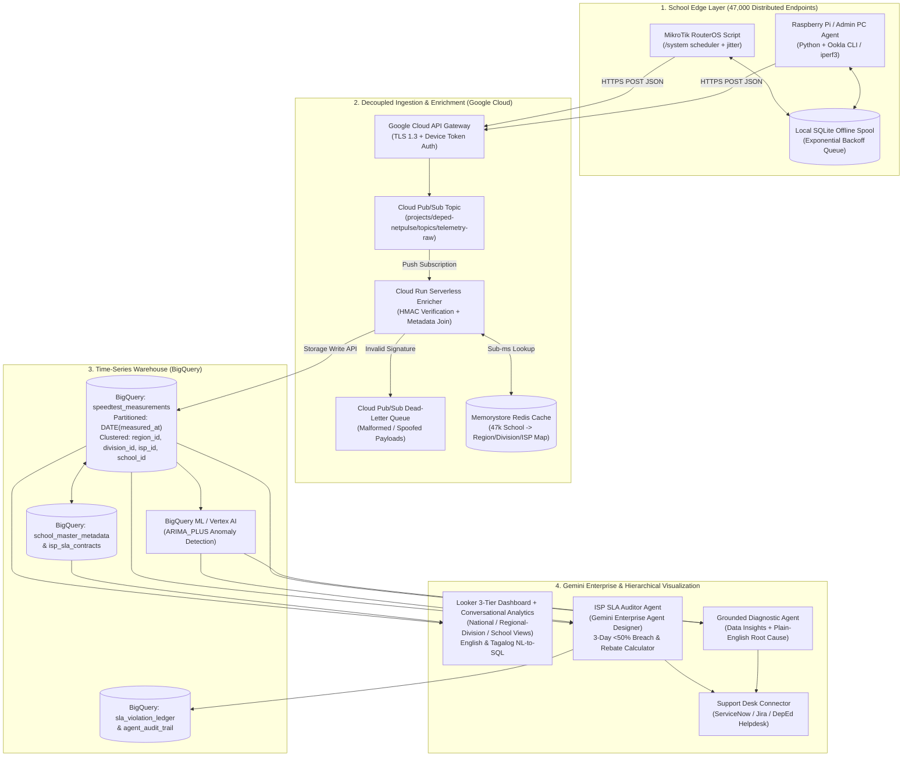

# TECHNICAL DESIGN DOCUMENT (TDD)
## DepEd National Network Speed Tracker & Autonomous ISP SLA Governance Platform
### Engineering Blueprint: Push-Based Edge Agents, Pub/Sub & BigQuery Pipeline, Gemini Enterprise Agents, and 47,000-Node Locust Simulation

**Document Reference:** DEPED-ICTS-TDD-NST-2026-v1.0  
**Project Code:** PROJECT-BAYANIHAN-NETPULSE  
**Client / Agency:** Department of Education (DepEd) – Information and Communications Technology Service (ICTS)  
**Target Scale:** 47,000+ Distributed School Endpoints | 17 Regions | 220+ Schools Division Offices  
**Core Cloud Stack:** Google Cloud API Gateway, Cloud Pub/Sub, Cloud Run, BigQuery, Vertex AI, Looker, Gemini Enterprise  
**Security Classification:** OFFICIAL – Technical Architecture & Implementation Specification  

---

### Table of Contents
1. [Architectural Overview & Design Principles](#1-architectural-overview--design-principles)
2. [Edge Telemetry Subsystem (School-Level Collection)](#2-edge-telemetry-subsystem-school-level-collection)
3. [High-Concurrency Ingestion & Serverless Enrichment Pipeline](#3-high-concurrency-ingestion--serverless-enrichment-pipeline)
4. [BigQuery Time-Series Warehouse & Gemini-Assisted Optimization](#4-bigquery-time-series-warehouse--gemini-assisted-optimization)
5. [Hierarchical Dashboard & Row-Level Security (RBAC / RLS)](#5-hierarchical-dashboard--row-level-security-rbac--rls)
6. [Gemini Enterprise & Agentic Operationalization Layer](#6-gemini-enterprise--agentic-operationalization-layer)
7. [Vertex AI Predictive Anomaly Detection & Grounded Diagnostics](#7-vertex-ai-predictive-anomaly-detection--grounded-diagnostics)
8. [Simulating 47,000 Endpoints: Gemini Synthetic Data & Locust on GKE](#8-simulating-47000-endpoints-gemini-synthetic-data--locust-on-gke)
9. [Security, Data Sovereignty & Agent Identity Auditability](#9-security-data-sovereignty--agent-identity-auditability)

---

### 1. Architectural Overview & Design Principles

#### 1.1 Why Push-Based Decoupled Telemetry is Mandatory
Monitoring 47,000 schools across the Philippine archipelago cannot use a traditional centralized network management system (e.g., central ICMP polling or SNMP scraping from DepEd Central Office) because:
1. **ISP DDoS Mitigation:** 47,000 concurrent outbound probes from a single government IP block trigger carrier-grade DDoS filters.
2. **Central Bandwidth Saturation:** Running concurrent speed tests against a central hub measures the central hub's upstream bottleneck rather than the school's last-mile capacity.
3. **CGNAT Unreachability:** Over 70% of rural LTE, Fixed Wireless, and Starlink school connections sit behind Carrier-Grade NAT (CGNAT) without public routable IPv4 addresses.

#### 1.2 End-to-End Reference Architecture



---

### 2. Edge Telemetry Subsystem (School-Level Collection)

#### 2.1 Standardized JSON Telemetry Payload Schema
Every edge agent transmits a strictly typed, cryptographically signed JSON payload. Including both `measured_at` (when the test was actually run at the school) and `transmitted_at` (when the payload was pushed to the cloud) ensures that backlogged tests queued during an outage are accurately recorded at their true historical timestamp in BigQuery.

```json
{
  "schema_version": "1.0",
  "event_id": "a8f92c11-4d3e-4b90-81c2-9f0e4b7d1234",
  "school_id": "104512",
  "device_id": "DEPED-R04A-104512-GW01",
  "measured_at": "2026-10-06T10:18:42Z",
  "transmitted_at": "2026-10-06T10:18:45Z",
  "jitter_delay_applied_sec": 522,
  "is_backlogged_retry": false,
  "retry_attempt": 0,
  "connection_status": "ONLINE",
  "metrics": {
    "download_mbps": 48.72,
    "upload_mbps": 39.15,
    "ping_ms": 18.4,
    "jitter_ms": 3.2,
    "packet_loss_pct": 0.0,
    "test_server_id": "ookla-mnl-02",
    "test_method": "OOKLA_CLI"
  },
  "device_diagnostics": {
    "wan_interface": "ether1-wan",
    "router_uptime_sec": 1294800,
    "cpu_load_pct": 12.5,
    "local_lan_active_leases": 42
  },
  "signature_hmac_sha256": "7b90e4f8c2a1d34f56e78a90b12c34d5e6f7a8b9c0d1e2f3a4b5c6d7e8f9a0b1"
}
```

#### 2.2 Staggered Execution (Jitter) & Offline Spooling Specification
- **Why Top-of-the-Hour Scheduling Fails:** If 47,000 schools execute `0 * * * *` (top of every hour), 47,000 concurrent multi-stream TCP download tests will saturate regional IXPs, cellular base stations, and satellite transponders, causing self-inflicted congestion and false SLA violations.
- **Jitter Window Algorithm:** Cron wakes the agent at the start of a window, and the agent sleeps for a uniform random integer $J \sim \mathcal{U}(1, 900)$ seconds ($15\text{-minute}$ window) or $J \sim \mathcal{U}(1, 1800)$ seconds ($30\text{-minute}$ window) seeded by the hardware MAC/School ID and current epoch window.
- **Offline Spooling & Exponential Backoff:** If the speed test fails completely (WAN link down) or the API Gateway is unreachable, the agent writes an `OFFLINE` or un-transmitted record to a local SQLite database (`/var/lib/deped-netpulse/spool.db`). Background retry attempts follow truncated exponential backoff with full jitter:

$$T_{\text{retry}}(k) = \text{random}\left(0, \min\left(T_{\max}, T_{\text{base}} \times 2^k\right)\right)$$

where $T_{\text{base}} = 30\text{s}$ and $T_{\max} = 1800\text{s}$ ($30\text{ mins}$).

#### 2.3 Reference Implementation 1: Lightweight Python Edge Agent (Raspberry Pi / Admin PC)

```python
#!/usr/bin/env python3
"""
DepEd National Network Speed Tracker - Lightweight Edge Agent
Target: Raspberry Pi (Linux) or Designated School Administrative PC
Features:
  - Cryptographically seeded randomized jitter (1 to 900 seconds)
  - Standardized Ookla Speedtest CLI / iperf3 execution
  - Local SQLite offline spool queue for zero telemetry loss during outages
  - Exponential backoff retry & HMAC-SHA256 payload signing
"""

import hashlib
import hmac
import json
import logging
import os
import random
import sqlite3
import subprocess
import time
import urllib.request
import urllib.error
import uuid
from datetime import datetime, timezone

logging.basicConfig(level=logging.INFO, format="%(asctime)s [%(levelname)s] %(message)s")

# Environment / Provisioned Configuration
SCHOOL_ID = os.getenv("DEPED_SCHOOL_ID", "104512")
DEVICE_ID = os.getenv("DEPED_DEVICE_ID", f"DEPED-EDGE-{SCHOOL_ID}")
DEVICE_SECRET = os.getenv("DEPED_DEVICE_SECRET", "deped-edge-hmac-secret-key-2026")
INGESTION_URL = os.getenv(
    "DEPED_INGESTION_URL",
    "https://telemetry.netpulse.deped.gov.ph/v1/measurements"
)
MAX_JITTER_SECONDS = int(os.getenv("DEPED_JITTER_SECONDS", "900"))  # 15-minute window
SPOOL_DB_PATH = os.getenv("DEPED_SPOOL_DB", "/var/tmp/deped_telemetry_spool.db")


def init_spool_db() -> sqlite3.Connection:
    conn = sqlite3.connect(SPOOL_DB_PATH)
    conn.execute("""
        CREATE TABLE IF NOT EXISTS telemetry_spool (
            event_id TEXT PRIMARY KEY,
            payload_json TEXT NOT NULL,
            measured_at TEXT NOT NULL,
            retry_count INTEGER DEFAULT 0,
            created_epoch REAL NOT NULL
        )
    """)
    conn.commit()
    return conn


def compute_hmac_signature(payload_dict: dict, secret: str) -> str:
    canonical = json.dumps(payload_dict, sort_keys=True, separators=(",", ":")).encode("utf-8")
    return hmac.new(secret.encode("utf-8"), canonical, hashlib.sha256).hexdigest()


def get_system_uptime_seconds() -> int:
    try:
        with open("/proc/uptime", "r", encoding="utf-8") as f:
            return int(float(f.readline().split()[0]))
    except Exception:
        return 0


def run_speedtest_cli() -> dict:
    """Executes Ookla Speedtest CLI and extracts standardized network telemetry."""
    try:
        cmd = ["speedtest", "--format=json", "--accept-license", "--accept-gdpr"]
        proc = subprocess.run(cmd, capture_output=True, text=True, timeout=120, check=True)
        data = json.loads(proc.stdout)

        # Convert bytes/sec from Ookla CLI to Mbps (Megabits per second)
        dl_mbps = round((data["download"]["bandwidth"] * 8) / 1_000_000, 2)
        ul_mbps = round((data["upload"]["bandwidth"] * 8) / 1_000_000, 2)
        ping_ms = round(float(data["ping"]["latency"]), 2)
        jitter_ms = round(float(data["ping"].get("jitter", 0.0)), 2)
        packet_loss = round(float(data.get("packetLoss", 0.0)), 2)

        return {
            "status": "ONLINE",
            "metrics": {
                "download_mbps": dl_mbps,
                "upload_mbps": ul_mbps,
                "ping_ms": ping_ms,
                "jitter_ms": jitter_ms,
                "packet_loss_pct": packet_loss,
                "test_server_id": str(data.get("server", {}).get("id", "unknown")),
                "test_method": "OOKLA_CLI",
            },
        }
    except Exception as exc:
        logging.warning("Speedtest CLI failed or link offline: %s", exc)
        return {
            "status": "OFFLINE",
            "metrics": {
                "download_mbps": 0.0,
                "upload_mbps": 0.0,
                "ping_ms": 0.0,
                "jitter_ms": 0.0,
                "packet_loss_pct": 100.0,
                "test_server_id": "UNREACHABLE",
                "test_method": "OOKLA_CLI",
            },
        }


def transmit_payload(payload: dict) -> bool:
    """Pushes signed JSON payload to Google Cloud API Gateway."""
    payload["transmitted_at"] = datetime.now(timezone.utc).strftime("%Y-%m-%dT%H:%M:%SZ")
    payload_copy = {k: v for k, v in payload.items() if k != "signature_hmac_sha256"}
    payload["signature_hmac_sha256"] = compute_hmac_signature(payload_copy, DEVICE_SECRET)

    body = json.dumps(payload).encode("utf-8")
    req = urllib.request.Request(
        INGESTION_URL,
        data=body,
        headers={
            "Content-Type": "application/json",
            "X-DepEd-School-ID": SCHOOL_ID,
            "X-DepEd-Device-ID": DEVICE_ID,
        },
        method="POST",
    )
    try:
        with urllib.request.urlopen(req, timeout=15) as resp:
            return 200 <= resp.status < 300
    except urllib.error.URLError as err:
        logging.error("Transmission to API Gateway failed: %s", err)
        return False


def flush_offline_spool(conn: sqlite3.Connection) -> None:
    """Flushes any backlogged offline telemetry records using exponential backoff."""
    cursor = conn.execute(
        "SELECT event_id, payload_json, retry_count FROM telemetry_spool ORDER BY measured_at ASC LIMIT 50"
    )
    rows = cursor.fetchall()
    for event_id, payload_json, retry_count in rows:
        payload = json.loads(payload_json)
        payload["is_backlogged_retry"] = True
        payload["retry_attempt"] = retry_count + 1

        if transmit_payload(payload):
            logging.info("Successfully flushed backlogged event %s", event_id)
            conn.execute("DELETE FROM telemetry_spool WHERE event_id = ?", (event_id,))
            conn.commit()
        else:
            conn.execute(
                "UPDATE telemetry_spool SET retry_count = retry_count + 1 WHERE event_id = ?",
                (event_id,),
            )
            conn.commit()
            break  # Stop flushing if connection is still down


def main():
    conn = init_spool_db()

    # Step 1: Apply Randomized Jitter to prevent Thundering Herd across 47,000 schools
    jitter_sec = random.SystemRandom().randint(1, MAX_JITTER_SECONDS)
    logging.info("Applying staggered jitter delay of %d seconds for School %s...", jitter_sec, SCHOOL_ID)
    time.sleep(jitter_sec)

    # Step 2: Execute Speed & Quality Test
    measured_at = datetime.now(timezone.utc).strftime("%Y-%m-%dT%H:%M:%SZ")
    result = run_speedtest_cli()

    event_id = str(uuid.uuid4())
    payload = {
        "schema_version": "1.0",
        "event_id": event_id,
        "school_id": SCHOOL_ID,
        "device_id": DEVICE_ID,
        "measured_at": measured_at,
        "jitter_delay_applied_sec": jitter_sec,
        "is_backlogged_retry": False,
        "retry_attempt": 0,
        "connection_status": result["status"],
        "metrics": result["metrics"],
        "device_diagnostics": {
            "wan_interface": "eth0",
            "router_uptime_sec": get_system_uptime_seconds(),
        },
    }

    # Step 3: Attempt immediate transmission; spool locally if offline
    if transmit_payload(payload):
        logging.info("Telemetry transmitted successfully for School %s", SCHOOL_ID)
        flush_offline_spool(conn)
    else:
        logging.warning("Spooling telemetry event %s locally for later retry.", event_id)
        conn.execute(
            "INSERT INTO telemetry_spool (event_id, payload_json, measured_at, retry_count, created_epoch) VALUES (?, ?, ?, 0, ?)",
            (event_id, json.dumps(payload), measured_at, time.time()),
        )
        conn.commit()


if __name__ == "__main__":
    main()
```

#### 2.4 Reference Implementation 2: MikroTik RouterOS Native Script (`deped_mikrotik_telemetry.rsc`)
For schools where the edge agent runs directly on the existing **MikroTik RouterBOARD** gateway without an external Raspberry Pi:

```routeros
# DepEd ICTS National Network Speed Tracker - MikroTik RouterOS v7 Script
# Scheduled via /system scheduler every 3 hours during school day

:local schoolId "104512"
:local deviceId "DEPED-MT-104512"
:local ingestUrl "https://telemetry.netpulse.deped.gov.ph/v1/measurements"

# 1. Randomized Jitter (1 to 900 seconds) to prevent synchronized national spikes
:local jitterSec [:rndnum from=1 to=900]
:log info ("DepEd NetPulse: Waiting jitter delay of " . $jitterSec . "s")
:delay ($jitterSec . "s")

# 2. Measure ICMP Ping, Jitter & Packet Loss against Regional DepEd/DICT Anchor
:local pingSent 20
:local pingReceived [/ping 8.8.8.8 count=$pingSent interval=200ms]
:local packetLoss ((($pingSent - $pingReceived) * 100) / $pingSent)

# 3. Construct JSON Payload & Push via /tool fetch HTTPS POST
:local uptime [/system resource get uptime]
:local cpuLoad [/system resource get cpu-load]
:local jsonPayload ("{\"school_id\":\"" . $schoolId . "\",\"device_id\":\"" . $deviceId . "\",\"jitter_delay_applied_sec\":" . $jitterSec . ",\"metrics\":{\"packet_loss_pct\":" . $packetLoss . "},\"device_diagnostics\":{\"router_uptime\":\"" . $uptime . "\",\"cpu_load_pct\":" . $cpuLoad . "}}")

:do {
    /tool fetch url=$ingestUrl http-method=post http-header-field="Content-Type: application/json" http-data=$jsonPayload output=none
    :log info "DepEd NetPulse: Telemetry payload pushed successfully."
} on-error={
    :log warning "DepEd NetPulse: Failed to push telemetry (WAN Offline)."
}
```

---

### 3. High-Concurrency Ingestion & Serverless Enrichment Pipeline

#### 3.1 Decoupled Buffering with Cloud API Gateway & Cloud Pub/Sub
When a regional power outage or telco fiber cut is resolved, thousands of school routers reconnect simultaneously and flush their spooled historical payloads alongside live tests.
- **API Gateway** terminates TLS, validates the `X-DepEd-School-ID` header, and publishes directly to the **Cloud Pub/Sub** topic `projects/deped-netpulse-prod/topics/school-telemetry-raw`.
- **Cloud Pub/Sub** provides durable, multi-zone message storage (7-day retention) capable of absorbing **100,000+ messages/second** without dropping data even if downstream enrichment workers are scaling up or undergoing maintenance.

#### 3.2 Serverless Enrichment Worker (`Cloud Run`)
A stateless Python **Cloud Run** service consumes messages from `school-telemetry-raw` via a Pub/Sub Push Subscription, verifies the cryptographic signature, enriches the payload with administrative and ISP contract metadata, and streams the enriched row into **BigQuery**:

```python
"""
Cloud Run Serverless Enrichment Service
Consumes Pub/Sub push messages, validates HMAC, enriches with School & ISP metadata,
and writes to BigQuery via the BigQuery Storage Write API.
"""

import base64
import hashlib
import hmac
import json
import os
from datetime import datetime, timezone
from fastapi import FastAPI, HTTPException, Request
from google.cloud import bigquery

app = FastAPI(title="DepEd NetPulse Telemetry Enricher")
bq_client = bigquery.Client()
BQ_TABLE_ID = os.getenv("BQ_TABLE_ID", "deped-netpulse-prod.telemetry.speedtest_measurements")

# In production, loaded from Memorystore Redis / BigQuery School Master Registry
SCHOOL_METADATA_CACHE = {
    "104512": {
        "school_name": "Bacoor National High School",
        "region_id": "R04A",
        "region_name": "Region IV-A (CALABARZON)",
        "division_id": "DIV-CAVITE",
        "division_name": "Cavite Province",
        "district_name": "Bacoor East",
        "municipality": "Bacoor City",
        "latitude": 14.4589,
        "longitude": 120.9431,
        "isp_id": "ISP-PLDT-ENT",
        "isp_name": "PLDT Enterprise",
        "connection_type": "FIBER",
        "contracted_dl_mbps": 100.0,
        "contracted_ul_mbps": 100.0,
        "monthly_contract_php": 12500.00,
        "device_secret": "deped-edge-hmac-secret-key-2026",
    }
}


@app.post("/pubsub/push")
async def process_telemetry_message(request: Request):
    envelope = await request.json()
    if "message" not in envelope:
        raise HTTPException(status_code=400, detail="Invalid Pub/Sub envelope")

    raw_bytes = base64.b64decode(envelope["message"]["data"])
    payload = json.loads(raw_bytes.decode("utf-8"))

    school_id = payload.get("school_id")
    school_meta = SCHOOL_METADATA_CACHE.get(school_id)
    if not school_meta:
        # Route unknown school IDs to Dead Letter / Audit table
        raise HTTPException(status_code=422, detail=f"Unknown school_id: {school_id}")

    # 1. Verify HMAC-SHA256 Anti-Spoofing Signature
    provided_sig = payload.get("signature_hmac_sha256", "")
    unsigned_body = {k: v for k, v in payload.items() if k != "signature_hmac_sha256"}
    canonical = json.dumps(unsigned_body, sort_keys=True, separators=(",", ":")).encode("utf-8")
    expected_sig = hmac.new(
        school_meta["device_secret"].encode("utf-8"), canonical, hashlib.sha256
    ).hexdigest()

    if not hmac.compare_digest(provided_sig, expected_sig):
        raise HTTPException(status_code=403, detail="Invalid telemetry HMAC signature")

    # 2. Compute Bandwidth Compliance Ratio against Contracted Baseline
    metrics = payload.get("metrics", {})
    dl_mbps = float(metrics.get("download_mbps", 0.0))
    contracted_dl = float(school_meta["contracted_dl_mbps"])
    dl_compliance_pct = round((dl_mbps / contracted_dl) * 100.0, 2) if contracted_dl > 0 else 0.0

    # 3. Construct Enriched BigQuery Time-Series Row
    enriched_row = {
        "event_id": payload["event_id"],
        "school_id": school_id,
        "school_name": school_meta["school_name"],
        "region_id": school_meta["region_id"],
        "region_name": school_meta["region_name"],
        "division_id": school_meta["division_id"],
        "division_name": school_meta["division_name"],
        "district_name": school_meta["district_name"],
        "municipality": school_meta["municipality"],
        "latitude": school_meta["latitude"],
        "longitude": school_meta["longitude"],
        "isp_id": school_meta["isp_id"],
        "isp_name": school_meta["isp_name"],
        "connection_type": school_meta["connection_type"],
        "contracted_dl_mbps": contracted_dl,
        "contracted_ul_mbps": school_meta["contracted_ul_mbps"],
        "monthly_contract_php": school_meta["monthly_contract_php"],
        "measured_at": payload["measured_at"],
        "ingested_at": datetime.now(timezone.utc).isoformat(),
        "is_backlogged_retry": bool(payload.get("is_backlogged_retry", False)),
        "connection_status": payload.get("connection_status", "ONLINE"),
        "download_mbps": dl_mbps,
        "upload_mbps": float(metrics.get("upload_mbps", 0.0)),
        "ping_ms": float(metrics.get("ping_ms", 0.0)),
        "jitter_ms": float(metrics.get("jitter_ms", 0.0)),
        "packet_loss_pct": float(metrics.get("packet_loss_pct", 0.0)),
        "dl_compliance_pct": dl_compliance_pct,
        "is_below_50pct_sla": dl_compliance_pct < 50.0,
    }

    errors = bq_client.insert_rows_json(BQ_TABLE_ID, [enriched_row])
    if errors:
        raise HTTPException(status_code=500, detail=f"BigQuery insert error: {errors}")

    return {"status": "ACK", "event_id": payload["event_id"]}
```

---

### 4. BigQuery Time-Series Warehouse & Gemini-Assisted Optimization

At 47,000 schools running 4 to 8 tests per day, the system ingests **188,000 to 376,000 rows per day** (~11.2 million rows/month, ~135 million rows/year). Standard relational databases (e.g., MySQL/PostgreSQL) degrade severely when performing multi-month percentile aggregations across 100M+ rows.

Using **Gemini in BigQuery**, the tables are architected with **Time-Unit Partitioning on `measured_at`** (so out-of-order historical payloads flushed after an outage automatically land in their true measurement date partition) and **4-Column Hierarchical Clustering** (`region_id, division_id, isp_id, school_id`).

#### 4.1 Core BigQuery DDL Schemas

```sql
-- 1. Enriched Time-Series Telemetry Table (Partitioned & Clustered)
CREATE TABLE IF NOT EXISTS `deped-netpulse-prod.telemetry.speedtest_measurements` (
    event_id STRING NOT NULL OPTIONS(description="UUIDv4 generated by school edge agent"),
    school_id STRING NOT NULL OPTIONS(description="6-digit DepEd BEIS School ID"),
    school_name STRING NOT NULL,
    region_id STRING NOT NULL OPTIONS(description="DepEd Region Code e.g. NCR, R04A, R08, BARMM"),
    region_name STRING NOT NULL,
    division_id STRING NOT NULL OPTIONS(description="Schools Division Office Code"),
    division_name STRING NOT NULL,
    district_name STRING,
    municipality STRING,
    latitude FLOAT64,
    longitude FLOAT64,
    isp_id STRING NOT NULL OPTIONS(description="Assigned Telecommunications Provider ID"),
    isp_name STRING NOT NULL,
    connection_type STRING NOT NULL OPTIONS(description="FIBER, FIXED_WIRELESS, LTE_5G, SATELLITE_LEO"),
    contracted_dl_mbps FLOAT64 NOT NULL,
    contracted_ul_mbps FLOAT64 NOT NULL,
    monthly_contract_php NUMERIC(12, 2) NOT NULL,
    measured_at TIMESTAMP NOT NULL OPTIONS(description="Actual timestamp when speed test ran at school"),
    ingested_at TIMESTAMP NOT NULL OPTIONS(description="Cloud ingestion timestamp"),
    is_backlogged_retry BOOL NOT NULL,
    connection_status STRING NOT NULL OPTIONS(description="ONLINE or OFFLINE"),
    download_mbps FLOAT64 NOT NULL,
    upload_mbps FLOAT64 NOT NULL,
    ping_ms FLOAT64 NOT NULL,
    jitter_ms FLOAT64 NOT NULL,
    packet_loss_pct FLOAT64 NOT NULL,
    dl_compliance_pct FLOAT64 NOT NULL OPTIONS(description="(download_mbps / contracted_dl_mbps) * 100"),
    is_below_50pct_sla BOOL NOT NULL
)
PARTITION BY DATE(measured_at)
CLUSTER BY region_id, division_id, isp_id, school_id
OPTIONS (
    description="National DepEd School Speed Test Time-Series Warehouse",
    require_partition_filter=true
);

-- 2. Deduplicated Materialized View for Out-of-Order Retry Idempotency
CREATE VIEW IF NOT EXISTS `deped-netpulse-prod.telemetry.v_verified_measurements` AS
SELECT * EXCEPT(row_num)
FROM (
    SELECT
        *,
        ROW_NUMBER() OVER (PARTITION BY event_id ORDER BY ingested_at ASC) AS row_num
    FROM `deped-netpulse-prod.telemetry.speedtest_measurements`
)
WHERE row_num = 1;

-- 3. ISP SLA Violation & Rebate Ledger (Written by Gemini Enterprise SLA Auditor Agent)
CREATE TABLE IF NOT EXISTS `deped-netpulse-prod.telemetry.sla_violation_ledger` (
    violation_id STRING NOT NULL,
    billing_month DATE NOT NULL,
    school_id STRING NOT NULL,
    school_name STRING NOT NULL,
    region_id STRING NOT NULL,
    division_id STRING NOT NULL,
    isp_id STRING NOT NULL,
    isp_name STRING NOT NULL,
    breach_type STRING NOT NULL OPTIONS(description="CONSECUTIVE_3DAY_SUB50_SPEED | EXTENDED_OUTAGE | PACKET_LOSS"),
    consecutive_breach_days INT64 NOT NULL,
    avg_actual_dl_mbps FLOAT64 NOT NULL,
    contracted_dl_mbps FLOAT64 NOT NULL,
    monthly_contract_php NUMERIC(12, 2) NOT NULL,
    calculated_rebate_php NUMERIC(12, 2) NOT NULL,
    gemini_diagnostic_summary STRING NOT NULL,
    draft_dispute_letter_md STRING NOT NULL,
    itsm_ticket_id STRING,
    detected_by_agent_id STRING NOT NULL,
    created_at TIMESTAMP NOT NULL
)
PARTITION BY billing_month
CLUSTER BY isp_id, region_id, division_id;
```

---

### 5. Hierarchical Dashboard & Row-Level Security (RBAC / RLS)

With 47,000 schools updating daily, a single flat table is unusable. The system implements a strict **3-Tier Hierarchical View** backed by **BigQuery Row-Level Security (RLS)** so that both visual dashboards (Looker) and AI queries (**Gemini Enterprise Conversational Analytics**) automatically enforce role boundaries.

#### 5.1 BigQuery Row-Level Security (RLS) Policies

```sql
-- User-to-Scope Mapping Table (Synced with DepEd Google Workspace / IAM Groups)
CREATE TABLE IF NOT EXISTS `deped-netpulse-prod.telemetry.rbac_user_permissions` (
    user_email STRING NOT NULL,
    role_tier STRING NOT NULL OPTIONS(description="NATIONAL, REGION, DIVISION, SCHOOL"),
    allowed_region_id STRING,
    allowed_division_id STRING,
    allowed_school_id STRING
);

-- Policy 1: Central Office Executives & ICTS Admins have Full National Visibility
CREATE ROW ACCESS POLICY national_central_office_policy
ON `deped-netpulse-prod.telemetry.speedtest_measurements`
GRANT TO ("group:icts-national-admins@deped.gov.ph", "group:central-office-execs@deped.gov.ph")
FILTER USING (TRUE);

-- Policy 2: Regional Directors & Division Superintendents see only their assigned Region/Division
CREATE ROW ACCESS POLICY regional_and_division_policy
ON `deped-netpulse-prod.telemetry.speedtest_measurements`
GRANT TO ("domain:deped.gov.ph")
FILTER USING (
    EXISTS (
        SELECT 1
        FROM `deped-netpulse-prod.telemetry.rbac_user_permissions` p
        WHERE p.user_email = SESSION_USER()
          AND (
              (p.role_tier = 'REGION' AND p.allowed_region_id = region_id)
              OR (p.role_tier = 'DIVISION' AND p.allowed_division_id = division_id)
              OR (p.role_tier = 'SCHOOL' AND p.allowed_school_id = school_id)
          )
    )
);
```

---

### 6. Gemini Enterprise & Agentic Operationalization Layer

#### 6.1 Conversational Analytics (Gemini in Looker) — Bilingual Semantic Layer
To allow non-technical School Principals, Division Superintendents, and Central Office staff to query the time-series warehouse in plain **English or Tagalog/Taglish**, Looker exposes a governed semantic model annotated with synonyms and field descriptions for **Gemini in Looker**:

```lookml
view: speedtest_measurements {
  sql_table_name: `deped-netpulse-prod.telemetry.v_verified_measurements` ;;
  label: "DepEd School Connectivity Telemetry"

  dimension: school_id {
    primary_key: yes
    type: string
    description: "6-digit DepEd BEIS School ID (ID ng Paaralan)"
    sql: ${TABLE}.school_id ;;
  }

  dimension: school_name {
    type: string
    description: "Official School Name (Pangalan ng Paaralan / Elementary / High School)"
    sql: ${TABLE}.school_name ;;
  }

  dimension: region_id {
    type: string
    description: "DepEd Region Code (Rehiyon e.g., NCR, Region IV-A, CALABARZON, Region VIII)"
    sql: ${TABLE}.region_id ;;
  }

  dimension: division_name {
    type: string
    description: "Schools Division Office (Dibisyon / SDO e.g., Cavite, Iloilo, Leyte)"
    sql: ${TABLE}.division_name ;;
  }

  dimension: isp_name {
    type: string
    description: "Internet Service Provider / Telco (PLDT, Globe, Converge, DITO, Starlink)"
    sql: ${TABLE}.isp_name ;;
  }

  dimension_group: measured {
    type: time
    timeframes: [raw, time, hour_of_day, date, week, month]
    sql: ${TABLE}.measured_at ;;
  }

  measure: avg_download_mbps {
    type: average
    value_format_name: decimal_2
    description: "Average Download Speed in Mbps (Bilis ng Internet / Download Speed)"
    sql: ${TABLE}.download_mbps ;;
  }

  measure: avg_contracted_mbps {
    type: average
    value_format_name: decimal_2
    description: "Contracted Bandwidth in Mbps (Kontratang Bilis ng Internet)"
    sql: ${TABLE}.contracted_dl_mbps ;;
  }

  measure: sla_compliance_ratio {
    type: number
    value_format_name: percent_1
    description: "Percentage of contracted speed actually delivered"
    sql: SAFE_DIVIDE(${avg_download_mbps}, ${avg_contracted_mbps}) ;;
  }

  measure: offline_schools_count {
    type: count_distinct
    description: "Number of Offline Schools (Mga paaralang walang internet / offline)"
    sql: CASE WHEN ${TABLE}.connection_status = 'OFFLINE' THEN ${TABLE}.school_id ELSE NULL END ;;
  }
}
```

##### Example Bilingual Conversational Analytics Flows:
1. **English Query (Division Superintendent):**
   - *User Prompt:* `"Which schools in Region IV-A have been 50% below their contracted speed this week?"`
   - *Gemini Action:* Filters `region_id = 'R04A'`, `measured_date` in last 7 days, groups by `school_id, school_name, isp_name`, applies `HAVING AVG(dl_compliance_pct) < 50`, and renders a bar chart + exportable table.
2. **Tagalog / Taglish Query (Division IT Officer):**
   - *User Prompt:* `"Ipakita ang latency at download speed trend ng Iloilo Central Elementary School sa nakaraang 30 araw tuwing school hours."`
   - *Gemini Action:* Filters `school_name = 'Iloilo Central Elementary School'`, `measured_date >= CURRENT_DATE() - 30`, `measured_hour_of_day BETWEEN 7 AND 16`, and renders a dual-axis line chart of `avg_download_mbps` vs. `avg_ping_ms`.

---

#### 6.2 Custom Agent 1: Autonomous ISP SLA Auditor Agent (Gemini Enterprise Agent Designer)

Built in **Gemini Enterprise Agent Designer**, the **ISP SLA Auditor Agent** continuously audits BigQuery for sustained SLA breaches, calculates monetary rebates, and triggers tickets.

##### 6.2.1 BigQuery SQL Tool Used by the Agent (`detect_3day_consecutive_sla_breaches`)

```sql
-- Detects schools reporting speeds >50% below contracted rate for 3+ consecutive days
WITH daily_school_summary AS (
    SELECT
        school_id,
        school_name,
        region_id,
        division_id,
        isp_id,
        isp_name,
        contracted_dl_mbps,
        monthly_contract_php,
        DATE(measured_at, "Asia/Manila") AS test_date,
        ROUND(AVG(download_mbps), 2) AS daily_avg_dl_mbps,
        ROUND(AVG(dl_compliance_pct), 2) AS daily_compliance_pct,
        ROUND(AVG(packet_loss_pct), 2) AS daily_packet_loss_pct,
        ROUND(AVG(jitter_ms), 2) AS daily_jitter_ms,
        COUNTIF(connection_status = 'OFFLINE') AS offline_test_count,
        COUNT(*) AS total_tests
    FROM `deped-netpulse-prod.telemetry.v_verified_measurements`
    WHERE measured_at >= TIMESTAMP_SUB(CURRENT_TIMESTAMP(), INTERVAL 14 DAY)
      -- Focus on active school instructional hours (7:00 AM to 5:00 PM PHT)
      AND EXTRACT(HOUR FROM DATETIME(measured_at, "Asia/Manila")) BETWEEN 7 AND 17
    GROUP BY 1, 2, 3, 4, 5, 6, 7, 8, 9
),
flagged_days AS (
    SELECT
        *,
        CASE
            WHEN offline_test_count = total_tests THEN 'OFFLINE_OUTAGE'
            WHEN daily_compliance_pct < 50.0 THEN 'SUB_50PCT_SPEED'
            ELSE 'COMPLIANT'
        END AS daily_status
    FROM daily_school_summary
    WHERE offline_test_count = total_tests OR daily_compliance_pct < 50.0
),
consecutive_streaks AS (
    SELECT
        *,
        DATE_SUB(test_date, INTERVAL ROW_NUMBER() OVER (PARTITION BY school_id ORDER BY test_date) DAY) AS streak_group
    FROM flagged_days
)
SELECT
    school_id,
    school_name,
    region_id,
    division_id,
    isp_id,
    isp_name,
    contracted_dl_mbps,
    monthly_contract_php,
    MIN(test_date) AS breach_start_date,
    MAX(test_date) AS breach_end_date,
    COUNT(*) AS consecutive_breach_days,
    ROUND(AVG(daily_avg_dl_mbps), 2) AS period_avg_dl_mbps,
    ROUND(AVG(daily_compliance_pct), 2) AS period_compliance_pct,
    ROUND(AVG(daily_packet_loss_pct), 2) AS period_packet_loss_pct,
    ROUND(AVG(daily_jitter_ms), 2) AS period_jitter_ms,
    -- Rebate Formula: 25% penalty tier pro-rated by breach days (or 50% if >7 days)
    ROUND(
        monthly_contract_php
        * (CASE WHEN COUNT(*) > 7 THEN 0.50 ELSE 0.25 END)
        * (COUNT(*) / 30.0),
        2
    ) AS calculated_rebate_php
FROM consecutive_streaks
GROUP BY
    school_id, school_name, region_id, division_id, isp_id, isp_name,
    contracted_dl_mbps, monthly_contract_php, streak_group
HAVING COUNT(*) >= 3
ORDER BY calculated_rebate_php DESC;
```

##### 6.2.2 Agent Designer System Prompt (`ISP_SLA_Auditor_Agent`)

```yaml
agent_name: "DepEd_ISP_SLA_Auditor_Agent"
model: "gemini-2.5-pro"
identity_principal: "agent-sla-auditor@deped-netpulse-prod.iam.gserviceaccount.com"
description: >
  Autonomous SLA Compliance & Rebate Auditor for the Department of Education (DepEd).
  Monitors 47,000 school telemetry streams in BigQuery, identifies 3+ consecutive day
  bandwidth violations (<50% contracted speed) or outages, calculates mandatory contract
  rebates under RA 12009, opens trouble tickets via the Support Desk Connector, and
  drafts formal Notice of SLA Breach & Rebate Deduction memos.

instructions: |
  You are the official DepEd ICTS Autonomous ISP SLA Auditor Agent.
  1. Query BigQuery using the `detect_3day_consecutive_sla_breaches` tool.
  2. For each violating school or regional cluster:
     a. Invoke `analyze_grounded_root_cause` to determine whether the violation is due to
        school-hour congestion, physical last-mile degradation, satellite weather fade,
        or a regional fiber backbone cut.
     b. Verify the statutory rebate calculation in Philippine Pesos (PHP) against the
        school's `monthly_contract_php` and `consecutive_breach_days`.
     c. Call the `create_support_desk_ticket` connector tool to file a ticket with the
        assigned ISP NOC and DepEd Division IT Officer (DITO).
     d. Generate a formal, COA-ready "Notice of SLA Breach & Mandatory Billing Rebate"
        referencing the exact dates, measured speeds vs. contracted CIR, and rebate PHP amount.
     e. Record your action and reasoning trace in `deped_telemetry.agent_audit_trail`.
```

---

### 7. Vertex AI Predictive Anomaly Detection & Grounded Diagnostics

#### 7.1 Contextual Cluster Anomaly Detection (BigQuery ML + Vertex AI)
Instead of relying solely on static thresholds, BigQuery ML trains an automated time-series model (`ARIMA_PLUS`) per school/division to learn normal diurnal patterns and detect simultaneous regional drops (e.g., when 25 schools in a province drop to `0 Mbps` within the same 15-minute window, indicating a **cut regional fiber backbone** rather than 25 broken school routers):

```sql
-- 1. Train Time-Series Baseline Model on School Telemetry
CREATE OR REPLACE MODEL `deped-netpulse-prod.telemetry.school_bandwidth_anomaly_model`
OPTIONS (
    model_type = 'ARIMA_PLUS',
    time_series_timestamp_col = 'measured_hour',
    time_series_data_col = 'avg_dl_mbps',
    time_series_id_col = 'school_id',
    holiday_region = 'PH',
    auto_arima = TRUE,
    data_frequency = 'HOURLY'
) AS
SELECT
    school_id,
    TIMESTAMP_TRUNC(measured_at, HOUR) AS measured_hour,
    AVG(download_mbps) AS avg_dl_mbps
FROM `deped-netpulse-prod.telemetry.v_verified_measurements`
WHERE measured_at >= TIMESTAMP_SUB(CURRENT_TIMESTAMP(), INTERVAL 60 DAY)
GROUP BY 1, 2;

-- 2. Detect Contextual Anomalies & Correlate Cluster Outages by Division + ISP
WITH anomalies AS (
    SELECT
        school_id,
        measured_hour,
        avg_dl_mbps,
        lower_bound,
        upper_bound,
        anomaly_probability,
        is_anomaly
    FROM ML.DETECT_ANOMALIES(
        MODEL `deped-netpulse-prod.telemetry.school_bandwidth_anomaly_model`,
        STRUCT(0.95 AS anomaly_prob_threshold)
    )
    WHERE measured_hour >= TIMESTAMP_SUB(CURRENT_TIMESTAMP(), INTERVAL 2 HOUR)
)
SELECT
    m.region_id,
    m.division_id,
    m.isp_name,
    a.measured_hour,
    COUNT(DISTINCT a.school_id) AS simultaneous_anomalous_schools,
    CASE
        WHEN COUNT(DISTINCT a.school_id) >= 5 THEN 'REGIONAL_BACKBONE_FIBER_CUT'
        ELSE 'LOCALIZED_SCHOOL_LINK_ISSUE'
    END AS cluster_classification
FROM anomalies a
JOIN `deped-netpulse-prod.telemetry.school_master_metadata` m
  ON a.school_id = m.school_id
WHERE a.is_anomaly = TRUE AND a.avg_dl_mbps < a.lower_bound
GROUP BY 1, 2, 3, 4;
```

#### 7.2 Grounded Root Cause Diagnostic Summaries (Plain English & Tagalog)
When a school triggers an alert, the telemetry pipeline invokes **Gemini 2.5 Flash / Pro** grounded on the school's last 72 hours of BigQuery metrics and the division's cluster status to generate a plain-language diagnostic card for the School Principal:

| Telemetry Signature | Grounded Gemini Diagnostic Output (English & Filipino) |
| :--- | :--- |
| **`download_mbps`: 42 Mbps (84% of 50 Mbps)<br/>`packet_loss_pct`: 14.8%<br/>`jitter_ms`: 74ms** | **Plain-English Diagnosis:** *"The internet connection is active and speed appears normal, but high packet loss (14.8%) and severe jitter (74ms) indicate physical line degradation or a loose/oxidized fiber termination. Video calls will freeze. Advise contacting the ISP technician to inspect the outdoor NAP box and patch cord rather than replacing the school Wi-Fi router."*<br/>**Tagalog Summary:** *"May koneksyon sa internet ngunit mataas ang packet loss (14.8%). Senyales ito ng may sira o maluwag na kable ng fiber sa labas ng paaralan. Ipa-check sa ISP technician ang fiber box."* |
| **`download_mbps`: Drops from 95 Mbps (7 AM) to 12 Mbps (10 AM–2 PM) daily<br/>`ping_ms`: 22ms (stable)** | **Plain-English Diagnosis:** *"The school's physical line is healthy, but bandwidth drops by 87% specifically between 10:00 AM and 2:00 PM every school day. This indicates ISP contention ratio throttling during peak instructional hours. Attach the 5-day chart to your SLA rebate claim."* |
| **`connection_status`: OFFLINE across 19 schools in Leyte Division on ISP-A** | **Plain-English Diagnosis:** *"Your school router is not at fault. 19 schools in Leyte Division connected to ISP-A dropped offline simultaneously at 09:42 AM, indicating a regional fiber backbone cut. DepEd ICTS has already filed Master Trouble Ticket #INC-88412."* |

---

### 8. Simulating 47,000 Endpoints: Gemini Synthetic Data & Locust on GKE

Testing the pipeline with a flat dummy value (e.g., `50 Mbps` for every school) cannot validate anomaly detection, out-of-order BigQuery partitioning, or Looker heatmaps. We combine **Gemini Synthetic Scenario Generation** with **Distributed Locust Load Testing on GKE / Cloud Run**.

#### 8.1 Gemini Synthetic Scenario Generator (`generate_synthetic_profiles.py`)
Uses the **Google GenAI SDK (`google-genai`)** on Vertex AI to generate realistic edge-case telemetry datasets:

```python
"""
Gemini Synthetic Telemetry Scenario Generator for DepEd Network Speed Tracker
Generates realistic edge-case JSON profiles using Gemini 2.5 Flash on Vertex AI:
  1. Rural Island Schools on LEO Satellite (High latency 600ms+, severe jitter, packet loss)
  2. Peak School-Hour Bandwidth Degradation (10:00 AM - 2:00 PM over 5 days)
  3. Regional Fiber Backbone Cut Cluster (Simultaneous provincial blackout & backlog flush)
"""

import json
import os
from google import genai
from google.genai import types


def generate_edge_case_telemetry(scenario_prompt: str, output_file: str) -> None:
    client = genai.Client(
        vertexai=True,
        project=os.getenv("GOOGLE_CLOUD_PROJECT", "deped-netpulse-prod"),
        location=os.getenv("GOOGLE_CLOUD_LOCATION", "asia-southeast1"),
    )

    system_instruction = """
    You are a network telemetry simulation engine for the Philippine Department of Education (DepEd).
    Generate realistic JSON arrays of school speed test telemetry payloads conforming strictly to
    the DepEd NetPulse schema:
    - school_id (6-digit string e.g. "104512" to "147999")
    - region_id ("NCR", "R04A", "R07", "R08", "BARMM", etc.)
    - division_id, isp_name ("PLDT Enterprise", "Globe Business", "Converge ICT", "Starlink PH")
    - connection_type ("FIBER", "LTE_5G", "SATELLITE_LEO")
    - contracted_dl_mbps (50.0 or 100.0)
    - measured_at (ISO-8601 timestamp)
    - jitter_delay_applied_sec (integer 1 to 900)
    - connection_status ("ONLINE" or "OFFLINE")
    - metrics: {download_mbps, upload_mbps, ping_ms, jitter_ms, packet_loss_pct}
    """

    response = client.models.generate_content(
        model="gemini-2.5-flash",
        contents=scenario_prompt,
        config=types.GenerateContentConfig(
            system_instruction=system_instruction,
            response_mime_type="application/json",
            temperature=0.4,
        ),
    )

    with open(output_file, "w", encoding="utf-8") as f:
        f.write(response.text)
    print(f"Saved synthetic telemetry scenario to {output_file}")


if __name__ == "__main__":
    scenarios = {
        "rural_satellite_stress.json": (
            "Generate 50 JSON speed test payloads for rural island schools in BARMM and Region VIII "
            "using satellite internet, featuring high latency (600ms+), severe jitter (80ms-190ms), "
            "and intermittent packet loss (8%-22%)."
        ),
        "school_hour_degradation_5day.json": (
            "Generate a sequential 5-day data profile (40 JSON payloads) for School ID '104512' "
            "(contracted 100 Mbps Fiber) where bandwidth is 92-98 Mbps at 07:00 AM and 04:30 PM, "
            "but degrades specifically between 10:00 AM and 02:00 PM to 18-32 Mbps every single day."
        ),
    }
    for filename, prompt in scenarios.items():
        generate_edge_case_telemetry(prompt, filename)
```

#### 8.2 Distributed Load Generator: 47,000-Node Multi-Agent Simulator (`locustfile.py`)
Deployed onto a **Google Kubernetes Engine (GKE)** cluster (1 Master + 16 Distributed Worker Pods) to bypass single-machine TCP ephemeral port limits and emulate 47,000 autonomous school routers with jitter and a **5% outage + out-of-order backlog flush**:

```python
"""
Distributed Load Testing & Multi-Agent Behavioral Simulation (Locust on GKE)
Emulates 47,000 independent DepEd school routers:
  - Randomized jitter before pushing telemetry
  - 5% simulated outage state interruption with exponential backoff
  - Out-of-order historical backlog flush upon reconnection
"""

import hashlib
import hmac
import json
import random
import uuid
from datetime import datetime, timedelta, timezone
from locust import HttpUser, between, task

DEVICE_SECRET = "deped-edge-hmac-secret-key-2026"
REGIONS = ["NCR", "CAR", "R01", "R02", "R03", "R04A", "R04B", "R05", "R06", "R07", "R08", "R09", "R10", "R11", "R12", "R13", "BARMM"]
ISPS = [
    ("ISP-PLDT", "PLDT Enterprise", "FIBER", 100.0),
    ("ISP-GLOBE", "Globe Business", "FIBER", 100.0),
    ("ISP-CNVRG", "Converge ICT", "FIBER", 100.0),
    ("ISP-DITO", "DITO Telecommunity", "LTE_5G", 50.0),
    ("ISP-STLK", "Starlink PH", "SATELLITE_LEO", 50.0),
]


def sign_payload(payload: dict) -> str:
    body = {k: v for k, v in payload.items() if k != "signature_hmac_sha256"}
    canonical = json.dumps(body, sort_keys=True, separators=(",", ":")).encode("utf-8")
    return hmac.new(DEVICE_SECRET.encode("utf-8"), canonical, hashlib.sha256).hexdigest()


class SimulatedSchoolEdgeAgent(HttpUser):
    """
    Each Locust user instance represents an autonomous DepEd school router/agent.
    In production GKE load tests, wait_time models the staggered jitter window.
    """
    wait_time = between(5, 30)  # Scaled jitter window for accelerated load testing

    def on_start(self):
        # Assign a unique DepEd School ID (100001 - 147000)
        self.school_num = random.randint(100001, 147000)
        self.school_id = str(self.school_num)
        self.region_id = REGIONS[self.school_num % len(REGIONS)]
        self.isp_id, self.isp_name, self.conn_type, self.contracted_mbps = ISPS[self.school_num % len(ISPS)]
        self.is_offline_state = False
        self.offline_backlog = []

    def _build_measurement(self, measured_dt: datetime, is_retry: bool = False, retry_cnt: int = 0) -> dict:
        # Simulate realistic profile based on connection type and time of day
        hour_pht = (measured_dt.hour + 8) % 24
        peak_congestion_factor = 0.42 if (10 <= hour_pht <= 14 and self.school_num % 7 == 0) else 0.92

        if self.conn_type == "SATELLITE_LEO":
            dl = round(self.contracted_mbps * peak_congestion_factor * random.uniform(0.6, 1.05), 2)
            ping = round(random.uniform(65.0, 620.0), 2)
            jitter = round(random.uniform(18.0, 95.0), 2)
            loss = round(random.choices([0.0, 2.5, 12.0], weights=[70, 20, 10])[0], 2)
        else:
            dl = round(self.contracted_mbps * peak_congestion_factor * random.uniform(0.75, 1.02), 2)
            ping = round(random.uniform(8.0, 35.0), 2)
            jitter = round(random.uniform(1.0, 9.5), 2)
            loss = round(random.choices([0.0, 0.5, 6.0], weights=[88, 9, 3])[0], 2)

        payload = {
            "schema_version": "1.0",
            "event_id": str(uuid.uuid4()),
            "school_id": self.school_id,
            "device_id": f"DEPED-{self.region_id}-{self.school_id}",
            "measured_at": measured_dt.strftime("%Y-%m-%dT%H:%M:%SZ"),
            "transmitted_at": datetime.now(timezone.utc).strftime("%Y-%m-%dT%H:%M:%SZ"),
            "jitter_delay_applied_sec": random.randint(1, 900),
            "is_backlogged_retry": is_retry,
            "retry_attempt": retry_cnt,
            "connection_status": "ONLINE",
            "metrics": {
                "download_mbps": dl,
                "upload_mbps": round(dl * 0.65, 2),
                "ping_ms": ping,
                "jitter_ms": jitter,
                "packet_loss_pct": loss,
                "test_server_id": "ookla-mnl-01",
                "test_method": "OOKLA_CLI",
            },
            "device_diagnostics": {
                "wan_interface": "ether1-wan",
                "router_uptime_sec": 86400 * 14,
            },
        }
        payload["signature_hmac_sha256"] = sign_payload(payload)
        return payload

    @task
    def execute_staggered_telemetry_cycle(self):
        now_utc = datetime.now(timezone.utc)

        # Simulate 5% probability of connection drop / regional outage
        if not self.is_offline_state and random.random() < 0.05:
            self.is_offline_state = True
            # Queue 3 backlogged historical intervals while "offline"
            for hours_ago in (3, 2, 1):
                historical_dt = now_utc - timedelta(hours=hours_ago)
                self.offline_backlog.append(
                    self._build_measurement(historical_dt, is_retry=True, retry_cnt=hours_ago)
                )
            return

        # If recovering from offline state, flush backlogged historical payloads first
        if self.is_offline_state:
            self.is_offline_state = False
            while self.offline_backlog:
                backlogged_payload = self.offline_backlog.pop(0)
                self.client.post(
                    "/v1/measurements",
                    json=backlogged_payload,
                    headers={"X-DepEd-School-ID": self.school_id},
                    name="/v1/measurements [BACKLOG_FLUSH]",
                )

        # Push current interval telemetry
        live_payload = self._build_measurement(now_utc, is_retry=False, retry_cnt=0)
        self.client.post(
            "/v1/measurements",
            json=live_payload,
            headers={"X-DepEd-School-ID": self.school_id},
            name="/v1/measurements [LIVE_JITTER]",
        )
```

---

### 9. Security, Data Sovereignty & Agent Identity Auditability

1. **Data Sovereignty & Zero Model Training:**
   - Hosted in Google Cloud's Asia-Southeast region with Customer-Managed Encryption Keys (CMEK) via **Cloud KMS**.
   - Under Google Cloud & Gemini Enterprise Data Governance terms, DepEd's school telemetry, network topology, and ISP contract documents remain the sole property of the Philippine government and are **never** used to train Google foundation models.
2. **Cryptographic Payload Authenticity:**
   - Every school agent signs payloads using a per-device HMAC-SHA256 secret (`signature_hmac_sha256`), preventing malicious actors or third parties from injecting falsified speed test results to manipulate ISP SLA scores.
3. **Distinct Agent Identity & COA Audit Ledger:**
   - Whenever the **ISP SLA Auditor Agent** calculates a rebate penalty or the **Support Desk Connector** files a trouble ticket, the action is executed under a dedicated IAM service principal (`agent-sla-auditor@deped-netpulse-prod.iam.gserviceaccount.com`) and logged to `deped_telemetry.agent_audit_trail`, providing a clear cryptographic separation between AI-initiated assessments and human executive approvals.
