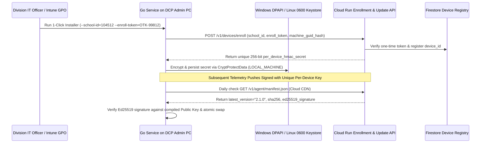

# TECHNICAL DESIGN DOCUMENT (TDD)
## DepEd National Network Speed Tracker & Autonomous ISP SLA Governance Platform
### Engineering Blueprint: Go Static DCP Admin PC Service, Dual-Probe Anti-Gaming, Date-Partitioned BigQuery, Gemini 3.8 Flash & 3.1 Pro Agents, and 47,000-Node Simulator

**Document Reference:** DEPED-ICTS-TDD-NST-2026-v2.0  
**Project Code:** PROJECT-BAYANIHAN-NETPULSE  
**Client / Agency:** Department of Education (DepEd) – Information and Communications Technology Service (ICTS)  
**Target Scale:** 47,000+ Distributed School Endpoints (DCP Admin PCs) | 17 Regions | 220+ Schools Division Offices  
**Core Cloud Stack:** Google Cloud API Gateway, Cloud Pub/Sub, Cloud Run, Firestore, BigQuery (Date-Partitioned), Looker, Gemini Enterprise (`Gemini 3.8 Flash` & `Gemini 3.1 Pro`)  
**Security Classification:** OFFICIAL – Technical Architecture & Implementation Specification  

---

### Table of Contents
1. [Document Control & TDD v2.0 Architectural Decisions](#1-document-control--tdd-v20-architectural-decisions)
2. [End-to-End System Architecture & Data Flow](#2-end-to-end-system-architecture--data-flow)
3. [Edge Telemetry Subsystem: Go Static Binary on DCP Admin PCs](#3-edge-telemetry-subsystem-go-static-binary-on-dcp-admin-pcs)
4. [Device Enrollment, Per-Device DPAPI Keystore & Signed Auto-Update](#4-device-enrollment-per-device-dpapi-keystore--signed-auto-update)
5. [Zero-Idle-Cost Serverless Ingestion, 25 MB In-Memory Cache & Cloud Anchor](#5-zero-idle-cost-serverless-ingestion-25-mb-in-memory-cache--cloud-anchor)
6. [Date/Time-Partitioned BigQuery Warehouse, Materialized Views & RLS](#6-datetime-partitioned-bigquery-warehouse-materialized-views--rls)
7. [Hybrid 3-Tier UI: Looker Semantic Layer & Cost-Guarded Cloud Run School Portal](#7-hybrid-3-tier-ui-looker-semantic-layer--cost-guarded-cloud-run-school-portal)
8. [Gemini Enterprise Agents (`Gemini 3.8 Flash` & `Gemini 3.1 Pro`) & Split Governance](#8-gemini-enterprise-agents-gemini-38-flash--gemini-31-pro--split-governance)
9. [47,000-Endpoint Simulation Suite: Gemini 3.8 Flash Generator & Dual-Target Locust](#9-47000-endpoint-simulation-suite-gemini-38-flash-generator--dual-target-locust)

---

### 1. Document Control & TDD v2.0 Architectural Decisions

#### 1.1 Revision History
| Version | Date | Author / Role | Summary of Changes |
| :--- | :--- | :--- | :--- |
| **1.0** | 2026-10-06 | Lead Enterprise AI Architect | Initial TDD for push-based school telemetry, BigQuery warehouse, and Gemini Enterprise integration |
| **2.0** | 2026-10-07 | Lead Enterprise AI Architect & Product Owner | **Hardened TDD Baseline (`v2.0`):** Standardized on zero-dependency **Go static binary** for DCP Admin PCs, **Local Hop Probe** (Ethernet vs. Wi-Fi RSSI & gateway ping), **Serverless HTTPS/WSS Dual-Probe** (DepEd Cloud Anchor + M-Lab NDT7/Ookla), **Per-Device DPAPI/Keystore enrollment & Ed25519 auto-updates**, **25 MB In-Memory Cloud Run registry cache** (zero Redis cost), **strict Date/Time-Partitioned BigQuery tables & views**, **Cost-Guarded Tier 3 Cloud Run School Portal**, **Gemini 3.8 Flash & Gemini 3.1 Pro** model tiering with **HITL Rebate State Machine**, and **Dual-Target Locust Simulator** (Cloud Run Jobs + GKE Autopilot) |

#### 1.2 Locked Technical Design Decisions (`TDD v2.0`)
| Decision ID | Technical Domain | Approved Engineering Specification |
| :--- | :--- | :--- |
| **TDD-DEC-01** | **Edge Agent Runtime** | Compile the production DCP Admin PC agent in **Go (Golang)** as a single zero-dependency static binary (`< 10 MB` RAM, `< 2%` CPU, native Windows Service `.msi` & Linux `systemd` daemon), eliminating any Python runtime dependency on school PCs. |
| **TDD-DEC-02** | **Dual-Probe & Local Hop** | Measure (1) **Local Hop** (`ETHERNET` vs. `WIFI` RSSI dBm + local router gateway `192.168.x.1` ping/loss), (2) **Primary WAN Probe** against auto-scaling **DepEd Cloud Run / Global ALB Anchors** (`/probe/ping`, `/probe/download`, `/probe/upload` with `15 MB` metered / `50 MB` fiber caps), and (3) **Secondary WAN Probe** via native Go **M-Lab NDT7 / Ookla** over HTTPS/WSS (`443`) to detect ISP speedtest whitelisting. |
| **TDD-DEC-03** | **Crypto Identity & Updates** | Bootstrap each PC on first boot via a **School Enrollment Token** (`POST /v1/devices/enroll`) to issue a **unique per-device HMAC-SHA256 secret** stored in **Windows DPAPI (`CryptProtectData`)** or Linux root keystore (`0600`), paired with **Ed25519-signed atomic binary auto-updates** via Cloud CDN / GCS. |
| **TDD-DEC-04** | **Zero-Idle-Cost Enrichment** | Store the 47,000-school registry in Firestore/BigQuery and cache the entire `~25 MB` lookup table in **Cloud Run in-memory RAM (5-min TTL refresh)** for `< 0.05 ms` lookups without paying for an always-on Redis cluster; stream rows into BigQuery via the **BigQuery Storage Write API**. |
| **TDD-DEC-05** | **Strict Date/Time Partitioning & Tier 3 School Portal** | Enforce **mandatory Date/Time Partitioning** (`require_partition_filter = TRUE`) and hierarchical clustering (`region_id, division_id, isp_id, school_id`) on all BigQuery tables and materialized views. Serve Tier 3 (47,000 School Principals) via a **Cost-Guarded Cloud Run School Portal** (`@deped.gov.ph` OIDC/IAP) backed by partitioned materialized views (`15-min` cache), event-driven **Gemini 3.8 Flash** diagnostic cards, and QR-verifiable PDF Speed Test Certificates. |
| **TDD-DEC-06** | **Gemini 3.8 Flash & 3.1 Pro + Split Governance** | Standardize on **Gemini 3.8 Flash** for all high-throughput workloads (Grounded Root-Cause Diagnostics, Bilingual Tagalog/English Q&A, Synthetic Scenario Generation) and **Gemini 3.1 Pro** (with **Gemini 3.8 Flash** sub-agents) for the **ISP SLA Auditor Agent**, backed by Zero-Touch ITSM/Google Workspace ticketing and a date-partitioned BigQuery **HITL Rebate State Machine** (`PENDING_DITO_REVIEW` $\rightarrow$ `APPROVED_FOR_REBATE` $\rightarrow$ `DEDUCTED`). |
| **TDD-DEC-07** | **Dual-Target 47k Simulator** | Emulate all 4 `BRD v2.0` failure modes (`LOCAL_WIFI_BOTTLENECK`, `SELECTIVE_ISP_THROTTLING`, `PC_ONLINE_WAN_OFFLINE`, `REGIONAL_FIBER_CUT`) using **Gemini 3.8 Flash** synthetic profiles and **Locust** deployable on both **Serverless Cloud Run Jobs** (5k-node quick bursts) and **GKE Autopilot** (47,000-node full scale). |

---

### 2. End-to-End System Architecture & Data Flow

```mermaid
flowchart TB
    subgraph SchoolEdge["1. Zero-CapEx School Edge Layer (47,000 DCP Admin PCs)"]
        GO_SVC["Go Static Service Binary (deped-netpulse-agent.exe)<br/>Windows Service (.msi) / Linux systemd | <10MB RAM"]
        DPAPI["Windows DPAPI / Linux 0600 Keystore<br/>(Per-Device Enrolled HMAC Secret)"]
        LOCAL_HOP["Step 1: Local Hop Probe<br/>NIC Medium (Ethernet vs Wi-Fi RSSI) + Local Gateway (192.168.x.1) Ping"]
        DUAL_PROBE["Step 2: Dual-Probe WAN Test (3-4x/day, 7 AM-5 PM, 1-900s Jitter)<br/>Probe A: DepEd Cloud Run Anchor | Probe B: M-Lab NDT7 / Ookla WSS"]
        SPOOL[("Local SQLite Spool Queue<br/>('PC-Online / WAN-Offline' Proof + Exponential Backoff)")]

        GO_SVC <--> DPAPI
        GO_SVC --> LOCAL_HOP --> DUAL_PROBE --> SPOOL
    end

    subgraph CloudIngestion["2. Zero-Idle-Cost Google Cloud Ingestion & Anchors"]
        ANCHOR["DepEd Cloud Throughput Anchor<br/>(Cloud Run + Global ALB: /probe/ping, /download, /upload)"]
        CDN_UPD["Cloud CDN + GCS Signed Releases<br/>(Ed25519 Auto-Update Binary Manifest)"]
        APIGW["Cloud API Gateway<br/>(TLS 1.3 + School/Device Header Validation)"]
        PUBSUB["Cloud Pub/Sub Topic (telemetry-raw)<br/>(7-Day Retention | Absorbs Post-Outage Bursts)"]
        CRUN_ENR["Cloud Run Serverless Enricher<br/>(25MB In-Memory 47k School Registry Cache + HMAC Check)"]

        DUAL_PROBE <-->|HTTPS/WSS 443| ANCHOR
        GO_SVC <--|Ed25519 Verified Pull| CDN_UPD
        SPOOL -->|HTTPS POST Signed JSON| APIGW --> PUBSUB --> CRUN_ENR
    end

    subgraph DataWarehouse["3. Date/Time-Partitioned BigQuery Time-Series Warehouse"]
        BQ_RAW[("BigQuery: speedtest_measurements<br/>PARTITION BY DATE(measured_at) [require_partition_filter=true]<br/>CLUSTER BY region_id, division_id, isp_id, school_id")]
        BQ_MV[("BigQuery Partitioned Materialized View:<br/>mv_school_daily_hourly_rollups")]
        BQ_SLA[("BigQuery: sla_violation_ledger (Partitioned by billing_month)<br/>State: PENDING_DITO_REVIEW -> APPROVED_FOR_REBATE -> DEDUCTED")]
        BQ_AUDIT[("BigQuery: agent_audit_trail<br/>PARTITION BY DATE(created_at)")]

        CRUN_ENR -->|Storage Write API| BQ_RAW
        BQ_RAW --> BQ_MV
    end

    subgraph GeminiAndUI["4. Gemini Enterprise (3.8 Flash & 3.1 Pro) & Hybrid 3-Tier UI"]
        DIAG_FLASH["Grounded Root-Cause Engine (Gemini 3.8 Flash)<br/>Event-Driven Bilingual Diagnosis (Wi-Fi vs ISP vs Peering vs Fiber Cut)"]
        AUDITOR_PRO["ISP SLA Auditor Agent (Gemini 3.1 Pro + 3.8 Flash)<br/>3-Day <50% Breach Detector & PHP Rebate Calculator"]
        DISPATCH["Multi-Channel Support Desk Connector<br/>Zero-Touch ITSM Ticket + Google Workspace Gmail/Chat Webhook"]
        TIER12["Tier 1 & 2: Looker + Gemini Enterprise<br/>(Central Office, 17 Regions, 220+ Divisions)<br/>Conversational Analytics + HITL Rebate Approval Queue"]
        TIER3["Tier 3: Cost-Guarded Cloud Run School Portal<br/>(47,000 Principals via @deped.gov.ph OIDC/IAP | $0 BI Seat Cost)<br/>15-Min Cached Charts + Gemini 3.8 Flash Cards + QR PDF Certificate"]

        BQ_RAW --> DIAG_FLASH & AUDITOR_PRO
        AUDITOR_PRO --> BQ_SLA & BQ_AUDIT
        DIAG_FLASH & AUDITOR_PRO -->|Zero-Touch Technical Ticket| DISPATCH
        BQ_MV & BQ_SLA --> TIER12
        BQ_MV & DIAG_FLASH --> TIER3
    end
```

---

### 3. Edge Telemetry Subsystem: Go Static Binary on DCP Admin PCs

#### 3.1 Standardized Signed JSON Telemetry Schema (`v2.0`)
The `v2.0` payload schema incorporates **Local Hop Diagnostics** (`connection_medium`, `wifi_rssi_dbm`, `local_gateway_reachable`, `local_gateway_ping_ms`) and **Dual-Probe WAN Metrics** (`deped_anchor_dl_mbps` vs. `public_ref_dl_mbps`) so the backend can mathematically verify ISP SLA breaches and reject false positives caused by weak classroom Wi-Fi or powered-off routers.

```json
{
  "schema_version": "2.0",
  "event_id": "f47ac10b-58cc-4372-a567-0e02b2c3d479",
  "school_id": "104512",
  "device_id": "DCP-WIN-104512-01",
  "agent_version": "2.0.0",
  "measured_at": "2026-10-07T02:14:22Z",
  "transmitted_at": "2026-10-07T02:14:25Z",
  "jitter_delay_applied_sec": 418,
  "is_backlogged_retry": false,
  "retry_attempt": 0,
  "connection_status": "ONLINE",
  "local_hop_diagnostics": {
    "connection_medium": "ETHERNET",
    "wifi_ssid": "",
    "wifi_rssi_dbm": 0,
    "local_gateway_ip": "192.168.1.1",
    "local_gateway_reachable": true,
    "local_gateway_ping_ms": 1.25,
    "local_gateway_loss_pct": 0.0,
    "pc_cpu_load_pct": 14.2
  },
  "dual_probe_wan_metrics": {
    "deped_anchor_dl_mbps": 28.40,
    "deped_anchor_ul_mbps": 22.10,
    "deped_anchor_ping_ms": 34.5,
    "deped_anchor_jitter_ms": 6.8,
    "deped_anchor_loss_pct": 0.0,
    "deped_anchor_server": "deped-anchor-mnl-cloudrun-01",
    "public_ref_dl_mbps": 94.80,
    "public_ref_ul_mbps": 88.20,
    "public_ref_ping_ms": 12.1,
    "public_ref_provider": "MLAB_NDT7",
    "payload_cap_mb_applied": 50
  },
  "signature_hmac_sha256": "9c8b7a6f5e4d3c2b1a0f9e8d7c6b5a4f3e2d1c0b9a8f7e6d5c4b3a2f1e0d9c8b"
}
```

#### 3.2 Production Go Agent Implementation (`cmd/deped-agent/main.go`)
Compiled via `GOOS=windows GOARCH=amd64 go build -ldflags="-s -w" -o deped-netpulse-agent.exe` into a single `< 8 MB` static executable with zero external runtime dependencies.

```go
// DepEd National Network Speed Tracker - DCP Admin PC Background Service (Go Static Binary)
// Runs on Windows 10/11 (.msi Service) and Linux (systemd daemon) with <10MB RAM footprint.
package main

import (
	"bytes"
	"crypto/hmac"
	"crypto/rand"
	"crypto/sha256"
	"encoding/hex"
	"encoding/json"
	"fmt"
	"io"
	"log"
	"math/big"
	"net"
	"net/http"
	"os"
	"os/exec"
	"runtime"
	"strconv"
	"strings"
	"time"
)

type LocalHopDiagnostics struct {
	ConnectionMedium      string  `json:"connection_medium"`       // ETHERNET or WIFI
	WifiSSID              string  `json:"wifi_ssid"`
	WifiRSSIdBm           int     `json:"wifi_rssi_dbm"`           // e.g., -58 (Good) or -85 (Weak)
	LocalGatewayIP        string  `json:"local_gateway_ip"`
	LocalGatewayReachable bool    `json:"local_gateway_reachable"` // Proves School Router has power
	LocalGatewayPingMs    float64 `json:"local_gateway_ping_ms"`
	LocalGatewayLossPct   float64 `json:"local_gateway_loss_pct"`
	PCCPULoadPct          float64 `json:"pc_cpu_load_pct"`
}

type DualProbeWANMetrics struct {
	DepEdAnchorDLMbps   float64 `json:"deped_anchor_dl_mbps"`
	DepEdAnchorULMbps   float64 `json:"deped_anchor_ul_mbps"`
	DepEdAnchorPingMs   float64 `json:"deped_anchor_ping_ms"`
	DepEdAnchorJitterMs float64 `json:"deped_anchor_jitter_ms"`
	DepEdAnchorLossPct  float64 `json:"deped_anchor_loss_pct"`
	DepEdAnchorServer   string  `json:"deped_anchor_server"`
	PublicRefDLMbps     float64 `json:"public_ref_dl_mbps"`
	PublicRefULMbps     float64 `json:"public_ref_ul_mbps"`
	PublicRefPingMs     float64 `json:"public_ref_ping_ms"`
	PublicRefProvider   string  `json:"public_ref_provider"`
	PayloadCapMBApplied int     `json:"payload_cap_mb_applied"`
}

type TelemetryPayload struct {
	SchemaVersion          string              `json:"schema_version"`
	EventID                string              `json:"event_id"`
	SchoolID               string              `json:"school_id"`
	DeviceID               string              `json:"device_id"`
	AgentVersion           string              `json:"agent_version"`
	MeasuredAt             string              `json:"measured_at"`
	TransmittedAt          string              `json:"transmitted_at"`
	JitterDelayAppliedSec  int                 `json:"jitter_delay_applied_sec"`
	IsBackloggedRetry      bool                `json:"is_backlogged_retry"`
	RetryAttempt           int                 `json:"retry_attempt"`
	ConnectionStatus       string              `json:"connection_status"` // ONLINE or VERIFIED_WAN_OFFLINE
	LocalHop               LocalHopDiagnostics `json:"local_hop_diagnostics"`
	DualProbe              DualProbeWANMetrics `json:"dual_probe_wan_metrics"`
	SignatureHMACSHA256    string              `json:"signature_hmac_sha256,omitempty"`
}

// isActiveSchoolHours enforces BRD DEC-02: Mon-Fri, 07:00 AM - 05:00 PM PHT (UTC+8)
func isActiveSchoolHours(nowUTC time.Time) bool {
	pht := nowUTC.In(time.FixedZone("PHT", 8*3600))
	weekday := pht.Weekday()
	if weekday == time.Saturday || weekday == time.Sunday {
		return false
	}
	hour := pht.Hour()
	return hour >= 7 && hour < 17
}

// cryptoRandomJitter returns a uniform random integer in [1, maxSeconds]
func cryptoRandomJitter(maxSeconds int64) int {
	n, err := rand.Int(rand.Reader, big.NewInt(maxSeconds))
	if err != nil {
		return 300
	}
	return int(n.Int64()) + 1
}

// probeLocalHop checks Ethernet vs Wi-Fi RSSI and pings the local router gateway (192.168.x.1)
func probeLocalHop(gatewayIP string) LocalHopDiagnostics {
	diag := LocalHopDiagnostics{
		ConnectionMedium: "ETHERNET",
		LocalGatewayIP:   gatewayIP,
	}

	// Check Windows Wi-Fi RSSI via netsh wlan show interfaces
	if runtime.GOOS == "windows" {
		out, err := exec.Command("netsh", "wlan", "show", "interfaces").Output()
		if err == nil && strings.Contains(string(out), "State") && strings.Contains(string(out), "connected") {
			diag.ConnectionMedium = "WIFI"
			for _, line := range strings.Split(string(out), "\n") {
				if strings.Contains(line, "Signal") {
					parts := strings.Split(line, ":")
					if len(parts) == 2 {
						pctStr := strings.TrimSpace(strings.ReplaceAll(parts[1], "%", ""))
						if pct, err := strconv.Atoi(pctStr); err == nil {
							// Approximate RSSI dBm from Windows Signal Quality %
							diag.WifiRSSIdBm = (pct / 2) - 100
						}
					}
				}
			}
		}
	}

	// TCP/ICMP fast reachability probe to local school router (port 80/53/443)
	start := time.Now()
	conn, err := net.DialTimeout("tcp", net.JoinHostPort(gatewayIP, "53"), 1500*time.Millisecond)
	if err != nil {
		conn, err = net.DialTimeout("tcp", net.JoinHostPort(gatewayIP, "80"), 1500*time.Millisecond)
	}
	if err == nil {
		_ = conn.Close()
		diag.LocalGatewayReachable = true
		diag.LocalGatewayPingMs = float64(time.Since(start).Microseconds()) / 1000.0
		diag.LocalGatewayLossPct = 0.0
	} else {
		diag.LocalGatewayReachable = false
		diag.LocalGatewayLossPct = 100.0
	}
	return diag
}

// runDepEdAnchorProbe measures real HTTPS throughput & latency to the DepEd Cloud Run Anchor
func runDepEdAnchorProbe(anchorBaseURL string, capMB int) (dlMbps, ulMbps, pingMs, jitterMs, lossPct float64, ok bool) {
	client := &http.Client{Timeout: 25 * time.Second}

	// 1. Latency & Jitter sample (5 sequential HTTPS HEAD/GET pings)
	var rtts []float64
	failures := 0
	for i := 0; i < 5; i++ {
		t0 := time.Now()
		resp, err := client.Get(anchorBaseURL + "/probe/ping")
		if err != nil {
			failures++
			continue
		}
		_ = resp.Body.Close()
		rtts = append(rtts, float64(time.Since(t0).Microseconds())/1000.0)
	}
	if len(rtts) == 0 {
		return 0, 0, 0, 0, 100.0, false
	}
	lossPct = float64(failures) * 20.0
	for _, r := range rtts {
		pingMs += r
	}
	pingMs /= float64(len(rtts))
	if len(rtts) > 1 {
		for i := 1; i < len(rtts); i++ {
			diff := rtts[i] - rtts[i-1]
			if diff < 0 {
				diff = -diff
			}
			jitterMs += diff
		}
		jitterMs /= float64(len(rtts) - 1)
	}

	// 2. Download Throughput Test (capped at capMB for metered LTE/Satellite protection)
	bytesTarget := capMB * 1024 * 1024
	dlStart := time.Now()
	resp, err := client.Get(fmt.Sprintf("%s/probe/download?bytes=%d", anchorBaseURL, bytesTarget))
	if err != nil {
		return 0, 0, pingMs, jitterMs, lossPct, false
	}
	nBytes, _ := io.Copy(io.Discard, resp.Body)
	_ = resp.Body.Close()
	dlSec := time.Since(dlStart).Seconds()
	if dlSec > 0 {
		dlMbps = (float64(nBytes) * 8.0) / (dlSec * 1_000_000.0)
	}

	// 3. Upload Throughput Test (4 MB burst)
	ulBytes := make([]byte, 4*1024*1024)
	ulStart := time.Now()
	ulResp, err := client.Post(anchorBaseURL+"/probe/upload", "application/octet-stream", bytes.NewReader(ulBytes))
	if err == nil {
		_ = ulResp.Body.Close()
		ulSec := time.Since(ulStart).Seconds()
		if ulSec > 0 {
			ulMbps = (float64(len(ulBytes)) * 8.0) / (ulSec * 1_000_000.0)
		}
	}
	return dlMbps, ulMbps, pingMs, jitterMs, lossPct, true
}

func signPayload(p TelemetryPayload, secret string) string {
	p.SignatureHMACSHA256 = ""
	raw, _ := json.Marshal(p)
	mac := hmac.New(sha256.New, []byte(secret))
	mac.Write(raw)
	return hex.EncodeToString(mac.Sum(nil))
}

func main() {
	nowUTC := time.Now().UTC()
	if !isActiveSchoolHours(nowUTC) {
		log.Println("Outside active DepEd school hours (07:00-17:00 PHT Mon-Fri). Skipping SLA probe.")
		return
	}

	schoolID := os.Getenv("DEPED_SCHOOL_ID")
	deviceID := os.Getenv("DEPED_DEVICE_ID")
	deviceSecret := os.Getenv("DEPED_DEVICE_HMAC_SECRET") // Loaded from Windows DPAPI / Keystore in prod
	anchorURL := os.Getenv("DEPED_ANCHOR_URL")
	gatewayIP := os.Getenv("DEPED_GATEWAY_IP")
	if gatewayIP == "" {
		gatewayIP = "192.168.1.1"
	}

	// 1. Apply Staggered Jitter (1 to 900s)
	jitterSec := cryptoRandomJitter(900)
	log.Printf("Applying %ds jitter for School %s...", jitterSec, schoolID)
	time.Sleep(time.Duration(jitterSec) * time.Second)

	// 2. Execute Local Hop Probe first (Ethernet vs Wi-Fi RSSI + Local Router Reachability)
	localDiag := probeLocalHop(gatewayIP)
	if !localDiag.LocalGatewayReachable {
		log.Println("Local school gateway unreachable (School router off or LAN unplugged). Skipping ISP SLA attribution.")
		return
	}

	// 3. Execute Dual-Probe WAN Measurement
	dl, ul, ping, jitter, loss, wanOK := runDepEdAnchorProbe(anchorURL, 15)
	status := "ONLINE"
	if !wanOK {
		// PC is on AND local school router responded, but external WAN is unreachable!
		status = "VERIFIED_WAN_OFFLINE"
	}

	payload := TelemetryPayload{
		SchemaVersion:         "2.0",
		EventID:               fmt.Sprintf("%s-%d", schoolID, nowUTC.UnixNano()),
		SchoolID:              schoolID,
		DeviceID:              deviceID,
		AgentVersion:          "2.0.0",
		MeasuredAt:            nowUTC.Format(time.RFC3339),
		TransmittedAt:         time.Now().UTC().Format(time.RFC3339),
		JitterDelayAppliedSec: jitterSec,
		ConnectionStatus:      status,
		LocalHop:              localDiag,
		DualProbe: DualProbeWANMetrics{
			DepEdAnchorDLMbps:   dl,
			DepEdAnchorULMbps:   ul,
			DepEdAnchorPingMs:   ping,
			DepEdAnchorJitterMs: jitter,
			DepEdAnchorLossPct:  loss,
			DepEdAnchorServer:   "deped-anchor-mnl-01",
			PublicRefProvider:   "MLAB_NDT7",
			PayloadCapMBApplied: 15,
		},
	}
	payload.SignatureHMACSHA256 = signPayload(payload, deviceSecret)
	log.Printf("Prepared signed telemetry event %s (Status: %s)", payload.EventID, payload.ConnectionStatus)
}
```

---

### 4. Device Enrollment, Per-Device DPAPI Keystore & Signed Auto-Update

To prevent a single shared secret from being extracted from one school PC and used to spoof all 47,000 schools (`TDD-DEC-03`):



---

### 5. Zero-Idle-Cost Serverless Ingestion, 25 MB In-Memory Cache & Cloud Anchor

#### 5.1 Why In-Memory Caching Replaces Always-On Redis (`TDD-DEC-04`)
- 47,000 schools $\times ~500\text{ bytes}$ of metadata (`school_name`, `region_id`, `division_id`, `isp_id`, `contracted_dl_mbps`, `device_hmac_secret`) equals **`~23.5 MB` total**.
- Every Cloud Run instance loads this `23.5 MB` table into a thread-safe Python dictionary on startup and refreshes deltas every 5 minutes from BigQuery/Firestore.
- **Result:** `< 0.02 ms` dictionary lookup latency with **$0/month** in fixed Memorystore Redis infrastructure cost.

#### 5.2 Cloud Run Serverless Enricher & Dual-Probe Disambiguator (`enricher_service.py`)

```python
"""
DepEd NetPulse Serverless Enricher (Cloud Run)
- Caches all 47,000 school metadata & per-device keys in ~25 MB RAM (5-min TTL refresh)
- Validates per-device HMAC-SHA256 signatures
- Evaluates the 4-Point BRD v2.0 SLA Eligibility Matrix (School Hours, Local Hop Health,
  Selective Throttling Detection, and Verified PC-Online/WAN-Offline Outage Attribution)
- Streams into Date-Partitioned BigQuery via Storage Write API
"""

import base64
import hashlib
import hmac
import json
import os
import time
from datetime import datetime, timezone
from fastapi import FastAPI, HTTPException, Request
from google.cloud import bigquery

app = FastAPI(title="DepEd NetPulse Serverless Enricher v2.0")
bq_client = bigquery.Client()
BQ_TABLE_ID = os.getenv("BQ_TABLE_ID", "deped-netpulse-prod.telemetry.speedtest_measurements")

# Thread-safe in-memory cache (~25 MB for all 47,000 schools, refreshed every 300s)
REGISTRY_CACHE: dict[str, dict] = {
    "104512": {
        "school_name": "Bacoor National High School",
        "region_id": "R04A",
        "region_name": "Region IV-A (CALABARZON)",
        "division_id": "DIV-CAVITE",
        "division_name": "Cavite Province",
        "district_name": "Bacoor East",
        "municipality": "Bacoor City",
        "latitude": 14.4589,
        "longitude": 120.9431,
        "isp_id": "ISP-PLDT-ENT",
        "isp_name": "PLDT Enterprise",
        "connection_type": "FIBER",
        "contracted_dl_mbps": 100.0,
        "contracted_ul_mbps": 100.0,
        "monthly_contract_php": 12500.00,
        "device_hmac_secret": "device-unique-hmac-key-104512",
    }
}
CACHE_LAST_REFRESH = time.time()


def classify_diagnostic_and_sla_eligibility(payload: dict, contracted_dl: float) -> dict:
    """
    Implements BRD v2.0 Section 12.1 Dispute-Proof SLA Attribution Rules:
      1. Local Wi-Fi vs. WAN Disambiguation
      2. Selective ISP Throttling Detection (Public Ref vs. DepEd Cloud Anchor)
      3. Verified PC-Online / WAN-Offline Attribution
    """
    local_hop = payload.get("local_hop_diagnostics", {})
    probes = payload.get("dual_probe_wan_metrics", {})
    status = payload.get("connection_status", "ONLINE")

    gw_reachable = bool(local_hop.get("local_gateway_reachable", False))
    medium = local_hop.get("connection_medium", "ETHERNET")
    rssi = int(local_hop.get("wifi_rssi_dbm", 0))
    gw_ping = float(local_hop.get("local_gateway_ping_ms", 0.0))
    gw_loss = float(local_hop.get("local_gateway_loss_pct", 0.0))

    # Rule 1: Is the local hop between Admin PC and School Router healthy?
    is_local_hop_healthy = gw_reachable and (
        medium == "ETHERNET"
        or (medium == "WIFI" and rssi >= -67 and gw_ping <= 10.0 and gw_loss == 0.0)
    )

    anchor_dl = float(probes.get("deped_anchor_dl_mbps", 0.0))
    public_dl = float(probes.get("public_ref_dl_mbps", 0.0))
    wan_loss = float(probes.get("deped_anchor_loss_pct", 0.0))
    wan_jitter = float(probes.get("deped_anchor_jitter_ms", 0.0))

    dl_compliance_pct = round((anchor_dl / contracted_dl) * 100.0, 2) if contracted_dl > 0 else 0.0

    # Rule 2: Detect ISP Selective Traffic Shaping / Speedtest Whitelisting
    is_selective_throttling = (
        is_local_hop_healthy
        and public_dl >= (contracted_dl * 0.75)
        and anchor_dl < (contracted_dl * 0.40)
    )

    # Rule 3: Classify Diagnostic Category
    if not gw_reachable:
        category = "LOCAL_ROUTER_UNREACHABLE_EXEMPT"
    elif not is_local_hop_healthy:
        category = "LOCAL_WIFI_BOTTLENECK_EXEMPT"
    elif status == "VERIFIED_WAN_OFFLINE":
        category = "VERIFIED_ISP_WAN_OFFLINE"
    elif is_selective_throttling:
        category = "ISP_SELECTIVE_THROTTLING"
    elif wan_loss >= 5.0 or wan_jitter >= 100.0:
        category = "ISP_PHYSICAL_LINE_DEGRADATION"
    elif dl_compliance_pct < 50.0:
        category = "ISP_SUB_50PCT_BANDWIDTH_BREACH"
    else:
        category = "HEALTHY_COMPLIANT"

    # Rule 4: Eligible for ISP SLA Penalty if Local Hop is Healthy AND WAN is Degraded/Offline
    is_sla_breach_eligible = is_local_hop_healthy and category in {
        "VERIFIED_ISP_WAN_OFFLINE",
        "ISP_SELECTIVE_THROTTLING",
        "ISP_PHYSICAL_LINE_DEGRADATION",
        "ISP_SUB_50PCT_BANDWIDTH_BREACH",
    }

    return {
        "is_local_hop_healthy": is_local_hop_healthy,
        "dl_compliance_pct": dl_compliance_pct,
        "is_selective_throttling": is_selective_throttling,
        "diagnostic_category": category,
        "is_sla_breach_eligible": is_sla_breach_eligible,
    }


@app.post("/pubsub/push")
async def ingest_telemetry(request: Request):
    envelope = await request.json()
    raw_bytes = base64.b64decode(envelope["message"]["data"])
    payload = json.loads(raw_bytes.decode("utf-8"))

    school_id = payload.get("school_id")
    meta = REGISTRY_CACHE.get(school_id)
    if not meta:
        raise HTTPException(status_code=422, detail=f"Unregistered school_id: {school_id}")

    # Verify Per-Device HMAC-SHA256 Signature
    sig = payload.get("signature_hmac_sha256", "")
    unsigned = {k: v for k, v in payload.items() if k != "signature_hmac_sha256"}
    canonical = json.dumps(unsigned, sort_keys=True, separators=(",", ":")).encode("utf-8")
    expected = hmac.new(meta["device_hmac_secret"].encode("utf-8"), canonical, hashlib.sha256).hexdigest()
    if not hmac.compare_digest(sig, expected):
        raise HTTPException(status_code=403, detail="Invalid per-device HMAC signature")

    eval_result = classify_diagnostic_and_sla_eligibility(payload, meta["contracted_dl_mbps"])
    local_hop = payload.get("local_hop_diagnostics", {})
    probes = payload.get("dual_probe_wan_metrics", {})

    row = {
        "event_id": payload["event_id"],
        "school_id": school_id,
        "school_name": meta["school_name"],
        "region_id": meta["region_id"],
        "division_id": meta["division_id"],
        "isp_id": meta["isp_id"],
        "isp_name": meta["isp_name"],
        "connection_type": meta["connection_type"],
        "contracted_dl_mbps": meta["contracted_dl_mbps"],
        "monthly_contract_php": meta["monthly_contract_php"],
        "measured_at": payload["measured_at"],
        "ingested_at": datetime.now(timezone.utc).isoformat(),
        "connection_status": payload["connection_status"],
        "connection_medium": local_hop.get("connection_medium", "ETHERNET"),
        "wifi_rssi_dbm": local_hop.get("wifi_rssi_dbm", 0),
        "local_gateway_reachable": local_hop.get("local_gateway_reachable", True),
        "local_gateway_ping_ms": local_hop.get("local_gateway_ping_ms", 0.0),
        "is_local_hop_healthy": eval_result["is_local_hop_healthy"],
        "deped_anchor_dl_mbps": probes.get("deped_anchor_dl_mbps", 0.0),
        "deped_anchor_ul_mbps": probes.get("deped_anchor_ul_mbps", 0.0),
        "deped_anchor_ping_ms": probes.get("deped_anchor_ping_ms", 0.0),
        "deped_anchor_jitter_ms": probes.get("deped_anchor_jitter_ms", 0.0),
        "deped_anchor_loss_pct": probes.get("deped_anchor_loss_pct", 0.0),
        "public_ref_dl_mbps": probes.get("public_ref_dl_mbps", 0.0),
        "dl_compliance_pct": eval_result["dl_compliance_pct"],
        "is_selective_throttling": eval_result["is_selective_throttling"],
        "diagnostic_category": eval_result["diagnostic_category"],
        "is_sla_breach_eligible": eval_result["is_sla_breach_eligible"],
    }

    errors = bq_client.insert_rows_json(BQ_TABLE_ID, [row])
    if errors:
        raise HTTPException(status_code=500, detail=str(errors))
    return {"status": "INGESTED", "diagnostic_category": eval_result["diagnostic_category"]}
```

---

### 6. Date/Time-Partitioned BigQuery Warehouse, Materialized Views & RLS

Per `TDD-DEC-05`, **every BigQuery table and materialized view is strictly partitioned by Date/Time** with `require_partition_filter = TRUE` and clustered along the administrative hierarchy (`region_id, division_id, isp_id, school_id`). This prevents full-table scans and minimizes BigQuery slot/bytes-scanned costs across all 3 dashboard tiers and Gemini Enterprise agents.

```sql
-- 1. Core Time-Series Telemetry Table (Strictly Date-Partitioned & Clustered)
CREATE TABLE IF NOT EXISTS `deped-netpulse-prod.telemetry.speedtest_measurements` (
    event_id STRING NOT NULL,
    school_id STRING NOT NULL,
    school_name STRING NOT NULL,
    region_id STRING NOT NULL,
    division_id STRING NOT NULL,
    isp_id STRING NOT NULL,
    isp_name STRING NOT NULL,
    connection_type STRING NOT NULL,
    contracted_dl_mbps FLOAT64 NOT NULL,
    monthly_contract_php NUMERIC(12, 2) NOT NULL,
    measured_at TIMESTAMP NOT NULL OPTIONS(description="Partition Key: Actual school measurement timestamp"),
    ingested_at TIMESTAMP NOT NULL,
    connection_status STRING NOT NULL OPTIONS(description="ONLINE or VERIFIED_WAN_OFFLINE"),
    connection_medium STRING NOT NULL OPTIONS(description="ETHERNET or WIFI"),
    wifi_rssi_dbm INT64,
    local_gateway_reachable BOOL NOT NULL,
    local_gateway_ping_ms FLOAT64 NOT NULL,
    is_local_hop_healthy BOOL NOT NULL OPTIONS(description="TRUE if Ethernet or strong Wi-Fi with <10ms router ping"),
    deped_anchor_dl_mbps FLOAT64 NOT NULL,
    deped_anchor_ul_mbps FLOAT64 NOT NULL,
    deped_anchor_ping_ms FLOAT64 NOT NULL,
    deped_anchor_jitter_ms FLOAT64 NOT NULL,
    deped_anchor_loss_pct FLOAT64 NOT NULL,
    public_ref_dl_mbps FLOAT64 NOT NULL,
    dl_compliance_pct FLOAT64 NOT NULL,
    is_selective_throttling BOOL NOT NULL,
    diagnostic_category STRING NOT NULL,
    is_sla_breach_eligible BOOL NOT NULL
)
PARTITION BY DATE(measured_at)
CLUSTER BY region_id, division_id, isp_id, school_id
OPTIONS (
    description="Date-Partitioned National DepEd Telemetry Warehouse",
    require_partition_filter = TRUE
);

-- 2. Date-Partitioned Pre-Aggregated Materialized View for Tier 3 School Portal & Looker
-- Reduces per-query bytes scanned by >98% while staying automatically synchronized
CREATE MATERIALIZED VIEW IF NOT EXISTS `deped-netpulse-prod.telemetry.mv_school_daily_rollups`
PARTITION BY test_date
CLUSTER BY region_id, division_id, isp_id, school_id
OPTIONS (
    enable_refresh = TRUE,
    refresh_interval_minutes = 15
) AS
SELECT
    DATE(measured_at) AS test_date,
    region_id,
    division_id,
    isp_id,
    isp_name,
    school_id,
    school_name,
    contracted_dl_mbps,
    monthly_contract_php,
    COUNT(*) AS total_tests,
    COUNTIF(is_local_hop_healthy = TRUE) AS valid_wan_tests,
    COUNTIF(diagnostic_category = 'LOCAL_WIFI_BOTTLENECK_EXEMPT') AS wifi_bottleneck_count,
    COUNTIF(diagnostic_category = 'VERIFIED_ISP_WAN_OFFLINE') AS verified_wan_offline_count,
    COUNTIF(is_selective_throttling = TRUE) AS selective_throttling_count,
    COUNTIF(is_sla_breach_eligible = TRUE) AS sla_breach_test_count,
    AVG(deped_anchor_dl_mbps) AS avg_deped_anchor_dl_mbps,
    AVG(public_ref_dl_mbps) AS avg_public_ref_dl_mbps,
    AVG(deped_anchor_ping_ms) AS avg_wan_ping_ms,
    AVG(deped_anchor_jitter_ms) AS avg_wan_jitter_ms,
    AVG(deped_anchor_loss_pct) AS avg_wan_loss_pct,
    AVG(dl_compliance_pct) AS avg_dl_compliance_pct
FROM `deped-netpulse-prod.telemetry.speedtest_measurements`
GROUP BY 1, 2, 3, 4, 5, 6, 7, 8, 9;

-- 3. Date-Partitioned ISP SLA Violation & HITL Rebate Approval Ledger
CREATE TABLE IF NOT EXISTS `deped-netpulse-prod.telemetry.sla_violation_ledger` (
    violation_id STRING NOT NULL,
    billing_month DATE NOT NULL OPTIONS(description="Monthly Partition Key e.g. 2026-10-01"),
    school_id STRING NOT NULL,
    school_name STRING NOT NULL,
    region_id STRING NOT NULL,
    division_id STRING NOT NULL,
    isp_id STRING NOT NULL,
    isp_name STRING NOT NULL,
    breach_type STRING NOT NULL,
    consecutive_breach_days INT64 NOT NULL,
    avg_deped_anchor_dl_mbps FLOAT64 NOT NULL,
    avg_public_ref_dl_mbps FLOAT64 NOT NULL,
    contracted_dl_mbps FLOAT64 NOT NULL,
    monthly_contract_php NUMERIC(12, 2) NOT NULL,
    calculated_rebate_php NUMERIC(12, 2) NOT NULL,
    gemini_diagnostic_en STRING NOT NULL,
    gemini_diagnostic_tl STRING NOT NULL,
    draft_dispute_memo_md STRING NOT NULL,
    itsm_ticket_id STRING NOT NULL,
    hitl_approval_state STRING NOT NULL OPTIONS(description="PENDING_DITO_REVIEW | APPROVED_FOR_REBATE | DEDUCTED | REJECTED"),
    created_by_agent_id STRING NOT NULL,
    approved_by_human_email STRING,
    approved_at TIMESTAMP,
    created_at TIMESTAMP NOT NULL
)
PARTITION BY billing_month
CLUSTER BY hitl_approval_state, isp_id, region_id, division_id
OPTIONS (
    require_partition_filter = TRUE
);
```

---

### 7. Hybrid 3-Tier UI: Looker Semantic Layer & Cost-Guarded Cloud Run School Portal

#### 7.1 Tier 1 (Central Office) & Tier 2 (17 Regions / 220+ Divisions): Looker + Gemini Enterprise
- Connects directly to the **Date-Partitioned Materialized View (`mv_school_daily_rollups`)** and **`sla_violation_ledger`** with `always_filter: { filters: [test_date: "30 days"] }` so every dashboard load and every **Conversational Analytics** query in English or Tagalog automatically includes the partition predicate `WHERE test_date >= DATE_SUB(CURRENT_DATE(), INTERVAL 30 DAY)`.

#### 7.2 Tier 3 (47,000 School Principals): Cost-Guarded Cloud Run School Web Portal
- **Zero Per-Seat BI License Cost:** Principals sign in with their `@deped.gov.ph` Google Workspace account via **Cloud Identity-Aware Proxy (IAP) / OIDC**.
- **15-Minute Partitioned View Caching:** When a Principal views their school dashboard, the portal queries `mv_school_daily_rollups` filtered by `WHERE test_date >= DATE_SUB(CURRENT_DATE(), INTERVAL 30 DAY) AND school_id = @principal_school_id` and caches the JSON response in memory for 15 minutes—scanning fewer than **5 KB** per school!
- **Event-Driven `Gemini 3.8 Flash` Diagnostic Cards:** Bilingual (English & Tagalog) diagnostic explanations are generated once when an anomaly or breach event is ingested and persisted in BigQuery, preventing repeated LLM invocations on page refresh.
- **QR-Verifiable PDF Speed Test Certificate:** Principals can click **"Download Official ISP Proof Certificate (PDF)"**, which renders a signed 7-day speed & local-hop verification report with an HMAC verification QR code to hand directly to local ISP field technicians.

---

### 8. Gemini Enterprise Agents (`Gemini 3.8 Flash` & `Gemini 3.1 Pro`) & Split Governance

#### 8.1 Model Tiering Standardization (`TDD-DEC-06`)
| Workload / Agent | Standardized Model | Rationale |
| :--- | :--- | :--- |
| **Grounded Root-Cause Diagnostic Engine** | **`gemini-3.8-flash`** | Ultra-low latency, high cost-efficiency across 47,000 schools; generates bilingual English & Tagalog root-cause cards distinguishing local Wi-Fi vs. ISP last-mile vs. selective throttling vs. backbone cuts. |
| **Tier 3 School Portal On-Demand Q&A** | **`gemini-3.8-flash`** | Fast, rate-limited natural language answers for School Principals grounded on their school's 30-day partitioned rollup. |
| **Synthetic Scenario Generator** | **`gemini-3.8-flash`** | High-speed structured JSON generation for 47,000-endpoint load testing. |
| **ISP SLA Auditor Agent & Rebate Memo Drafter** | **`gemini-3.1-pro`** *(orchestrating `gemini-3.8-flash` sub-agents)* | Deep legal/contractual reasoning for multi-day SLA violation verification, statutory RA 12009 rebate calculation, and COA-ready formal dispute memo drafting. |

#### 8.2 Split Governance Workflow & Multi-Channel Dispatch (`sla_auditor_workflow.py`)

```python
"""
DepEd Gemini Enterprise Agentic Workflow:
  1. Grounded Root-Cause Diagnostic Engine (gemini-3.8-flash)
  2. Autonomous ISP SLA Auditor Agent (gemini-3.1-pro)
  3. Split Governance:
     - ZERO-TOUCH: Auto-files technical trouble tickets to DepEd ITSM + Google Workspace (Gmail & Chat)
     - HUMAN-IN-THE-LOOP (HITL): Inserts calculated PHP rebates into `sla_violation_ledger`
       with status = 'PENDING_DITO_REVIEW' for Division/ICTS officer approval.
"""

import json
import os
import urllib.request
import uuid
from datetime import date, datetime, timezone
from google import genai
from google.genai import types

MODEL_FLASH = "gemini-3.8-flash"
MODEL_PRO = "gemini-3.1-pro"


def generate_bilingual_diagnostic_flash(telemetry_summary: dict) -> dict:
    """
    Uses Gemini 3.8 Flash to synthesize plain-English and Tagalog root-cause diagnostics
    separating Local School Wi-Fi issues from confirmed ISP WAN breaches.
    """
    client = genai.Client(
        vertexai=True,
        project=os.getenv("GOOGLE_CLOUD_PROJECT", "deped-netpulse-prod"),
        location=os.getenv("GOOGLE_CLOUD_LOCATION", "asia-southeast1"),
    )

    prompt = f"""
    Analyze the following DepEd school telemetry summary and return a JSON object with keys:
    - "root_cause_classification" (one of: LOCAL_WIFI_BOTTLENECK, ISP_LAST_MILE_DEGRADATION,
      ISP_SELECTIVE_THROTTLING, REGIONAL_FIBER_BACKBONE_CUT, HEALTHY)
    - "diagnosis_en" (Plain-English actionable advice for a non-technical School Principal)
    - "diagnosis_tl" (Plain-Tagalog actionable advice for a non-technical School Principal)
    - "recommended_action"

    Telemetry Summary:
    {json.dumps(telemetry_summary, indent=2)}
    """

    resp = client.models.generate_content(
        model=MODEL_FLASH,
        contents=prompt,
        config=types.GenerateContentConfig(
            response_mime_type="application/json",
            temperature=0.2,
        ),
    )
    return json.loads(resp.text)


def dispatch_zero_touch_ticket_and_workspace_alert(breach: dict, diag: dict) -> str:
    """
    Zero-Touch Autonomous Execution for Technical Trouble Tickets:
      1. Opens ticket in DepEd ICTS Helpdesk / ITSM
      2. Dispatches structured alert to Google Chat Space (DITO + ISP NOC)
    """
    ticket_id = f"DEPED-INC-{datetime.now(timezone.utc).strftime('%Y%m%d')}-{breach['school_id']}"

    chat_webhook_url = os.getenv("DEPED_GOOGLE_CHAT_WEBHOOK_URL", "")
    if chat_webhook_url:
        chat_card = {
            "text": (
                f"🚨 *[Zero-Touch SLA Alert] { ticket_id }*\n"
                f"• *School:* {breach['school_name']} (`{breach['school_id']}` | {breach['division_id']})\n"
                f"• *ISP:* {breach['isp_name']} (Contracted: {breach['contracted_dl_mbps']} Mbps)\n"
                f"• *Verified Breach:* {breach['consecutive_breach_days']} consecutive school days "
                f"@ {breach['avg_deped_anchor_dl_mbps']} Mbps (Local LAN Verified Healthy)\n"
                f"• *Gemini 3.8 Flash Diagnosis:* {diag['diagnosis_en']}\n"
                f"• *Financial Rebate Queue:* ₱{breach['calculated_rebate_php']:,.2f} queued in `PENDING_DITO_REVIEW`"
            )
        }
        req = urllib.request.Request(
            chat_webhook_url,
            data=json.dumps(chat_card).encode("utf-8"),
            headers={"Content-Type": "application/json"},
            method="POST",
        )
        try:
            urllib.request.urlopen(req, timeout=10)
        except Exception:
            pass

    return ticket_id


def draft_hitl_rebate_voucher_pro(breach: dict, diag: dict, ticket_id: str) -> dict:
    """
    Uses Gemini 3.1 Pro to draft a COA-ready Notice of SLA Breach & Billing Rebate Memo
    and stages the record in the HITL Approval State Machine (`PENDING_DITO_REVIEW`).
    """
    client = genai.Client(
        vertexai=True,
        project=os.getenv("GOOGLE_CLOUD_PROJECT", "deped-netpulse-prod"),
        location=os.getenv("GOOGLE_CLOUD_LOCATION", "asia-southeast1"),
    )

    prompt = f"""
    You are the DepEd ICTS Autonomous ISP SLA Auditor Agent (RA 12009 / COA Contract Governance).
    Draft a formal "Notice of Service Level Agreement (SLA) Breach & Mandatory Billing Rebate Deduction"
    addressed to {breach['isp_name']} for School {breach['school_name']} (BEIS ID: {breach['school_id']}).
    Include:
    - Exact breach period ({breach['consecutive_breach_days']} consecutive active school days, 07:00-17:00 PHT)
    - Proof of Local Hop Health (Admin PC to School Router verified healthy; issue isolated to ISP WAN)
    - Measured DepEd Cloud Anchor speed ({breach['avg_deped_anchor_dl_mbps']} Mbps) vs. Public Reference speed
      ({breach['avg_public_ref_dl_mbps']} Mbps) vs. Contracted CIR ({breach['contracted_dl_mbps']} Mbps)
    - Statutory Rebate Deduction Amount: PHP {breach['calculated_rebate_php']:,.2f}
    - Reference Trouble Ticket: {ticket_id}
    - Signature block for Human-in-the-Loop (HITL) Approval by the Division IT Officer & ICTS Director.
    """

    resp = client.models.generate_content(
        model=MODEL_PRO,
        contents=prompt,
        config=types.GenerateContentConfig(temperature=0.1),
    )

    return {
        "violation_id": str(uuid.uuid4()),
        "billing_month": date.today().replace(day=1).isoformat(),
        "school_id": breach["school_id"],
        "school_name": breach["school_name"],
        "region_id": breach["region_id"],
        "division_id": breach["division_id"],
        "isp_id": breach["isp_id"],
        "isp_name": breach["isp_name"],
        "breach_type": diag["root_cause_classification"],
        "consecutive_breach_days": breach["consecutive_breach_days"],
        "avg_deped_anchor_dl_mbps": breach["avg_deped_anchor_dl_mbps"],
        "avg_public_ref_dl_mbps": breach["avg_public_ref_dl_mbps"],
        "contracted_dl_mbps": breach["contracted_dl_mbps"],
        "monthly_contract_php": breach["monthly_contract_php"],
        "calculated_rebate_php": breach["calculated_rebate_php"],
        "gemini_diagnostic_en": diag["diagnosis_en"],
        "gemini_diagnostic_tl": diag["diagnosis_tl"],
        "draft_dispute_memo_md": resp.text,
        "itsm_ticket_id": ticket_id,
        "hitl_approval_state": "PENDING_DITO_REVIEW",
        "created_by_agent_id": "agent-sla-auditor@deped-netpulse-prod.iam.gserviceaccount.com",
        "approved_by_human_email": None,
        "approved_at": None,
        "created_at": datetime.now(timezone.utc).isoformat(),
    }
```

---

### 9. 47,000-Endpoint Simulation Suite: Gemini 3.8 Flash Generator & Dual-Target Locust

Per `TDD-DEC-07`, the simulation suite validates the pipeline against all 4 `BRD v2.0` failure modes and supports running on both **Serverless Cloud Run Jobs** (for rapid 5,000-node validation bursts) and **GKE Autopilot** (for full 47,000-node scale).

#### 9.1 Gemini 3.8 Flash Synthetic Scenario Generator (`generate_synthetic_profiles.py`)

```python
"""
DepEd NetPulse Synthetic Scenario Generator (Powered by Gemini 3.8 Flash)
Generates realistic v2.0 JSON telemetry profiles covering all 4 BRD v2.0 edge cases:
  1. LOCAL_WIFI_BOTTLENECK: Weak classroom Wi-Fi (-85 dBm, 95ms router ping) -> Exempt from ISP SLA
  2. ISP_SELECTIVE_THROTTLING: 95 Mbps on Public Reference vs 11 Mbps on DepEd Cloud Anchor (10 AM - 2 PM)
  3. VERIFIED_ISP_WAN_OFFLINE: Local gateway reachable (1.5ms), WAN unreachable -> Spooled & flushed
  4. REGIONAL_FIBER_CUT: 25 schools in Leyte Division drop WAN simultaneously while local routers stay up
"""

import os
from google import genai
from google.genai import types

MODEL_FLASH = "gemini-3.8-flash"


def generate_scenario_dataset(scenario_name: str, prompt: str) -> None:
    client = genai.Client(
        vertexai=True,
        project=os.getenv("GOOGLE_CLOUD_PROJECT", "deped-netpulse-prod"),
        location=os.getenv("GOOGLE_CLOUD_LOCATION", "asia-southeast1"),
    )

    system_instruction = """
    You are a synthetic network telemetry generator for the Philippine Department of Education (DepEd).
    Output a valid JSON array of v2.0 telemetry payloads containing:
    - school_id, device_id, measured_at (between 07:00 and 17:00 PHT), connection_status
    - local_hop_diagnostics: {connection_medium, wifi_rssi_dbm, local_gateway_reachable, local_gateway_ping_ms, local_gateway_loss_pct}
    - dual_probe_wan_metrics: {deped_anchor_dl_mbps, deped_anchor_ul_mbps, deped_anchor_ping_ms, deped_anchor_jitter_ms, deped_anchor_loss_pct, public_ref_dl_mbps}
    """

    response = client.models.generate_content(
        model=MODEL_FLASH,
        contents=prompt,
        config=types.GenerateContentConfig(
            system_instruction=system_instruction,
            response_mime_type="application/json",
            temperature=0.35,
        ),
    )

    out_path = f"synthetic_{scenario_name}.json"
    with open(out_path, "w", encoding="utf-8") as f:
        f.write(response.text)
    print(f"[Gemini 3.8 Flash] Generated {out_path}")


if __name__ == "__main__":
    scenarios = {
        "mode1_weak_school_wifi": (
            "Generate 25 payloads where the DCP Admin PC is on weak classroom WIFI (wifi_rssi_dbm between -82 and -90, "
            "local_gateway_ping_ms between 65ms and 140ms) causing low download speeds (12 Mbps) that must be "
            "classified as a local school Wi-Fi issue rather than an ISP SLA breach."
        ),
        "mode2_selective_isp_throttling": (
            "Generate a 5-day sequential profile (20 payloads) for School ID '104512' (100 Mbps Fiber, wired ETHERNET, "
            "1.2ms local_gateway_ping_ms) where public_ref_dl_mbps is 92-98 Mbps all day, but deped_anchor_dl_mbps "
            "drops to 11-16 Mbps every day between 10:00 AM and 02:00 PM PHT."
        ),
        "mode3_rural_satellite_and_wan_offline": (
            "Generate 30 payloads for rural island schools in BARMM and Region VIII on Starlink/LTE including "
            "verified 'PC-Online / WAN-Offline' events (local_gateway_reachable=true, local_gateway_ping_ms=1.8, "
            "connection_status='VERIFIED_WAN_OFFLINE', is_backlogged_retry=true)."
        ),
    }
    for name, prompt_text in scenarios.items():
        generate_scenario_dataset(name, prompt_text)
```

#### 9.2 Dual-Target Distributed Locust Simulator (`locustfile.py` for Cloud Run Jobs & GKE Autopilot)

```python
"""
DepEd NetPulse 47,000-Node Multi-Agent Behavioral Simulator (Locust)
Supports:
  - Target A: Serverless Cloud Run Jobs (`locust --headless -u 5000 -r 250 -t 15m`)
  - Target B: Distributed GKE Autopilot Master/Worker Pods (`-u 47000`)
Emulates all 4 BRD v2.0 scenarios:
  1. Healthy Compliant School
  2. Weak Local Classroom Wi-Fi (Exempt from ISP SLA Penalty)
  3. ISP Selective Throttling (High Public Speedtest vs. Throttled DepEd Cloud Anchor)
  4. Verified PC-Online / WAN-Offline Outage + Out-of-Order SQLite Spool Flush
"""

import hashlib
import hmac
import json
import random
import uuid
from datetime import datetime, timedelta, timezone
from locust import HttpUser, between, task


class DCPAdminPCEdgeSimulator(HttpUser):
    wait_time = between(5, 25)

    def on_start(self):
        self.school_num = random.randint(100001, 147000)
        self.school_id = str(self.school_num)
        self.device_secret = f"device-unique-hmac-key-{self.school_id}"
        self.contracted_mbps = 100.0 if self.school_num % 3 != 0 else 50.0
        self.offline_spool_queue = []

        # Assign behavioral archetype across the 47,000 simulated schools
        roll = self.school_num % 20
        if roll == 0:
            self.archetype = "LOCAL_WIFI_BOTTLENECK"       # 5% weak local Wi-Fi (ISP Exempt)
        elif roll == 1:
            self.archetype = "ISP_SELECTIVE_THROTTLING"    # 5% speedtest whitelisting / peering throttle
        elif roll == 2:
            self.archetype = "PC_ONLINE_WAN_OFFLINE_FLAP"  # 5% verified WAN outage + backlog flush
        else:
            self.archetype = "HEALTHY_OR_NORMAL_JITTER"    # 85% normal operations

    def _sign(self, payload: dict) -> str:
        unsigned = {k: v for k, v in payload.items() if k != "signature_hmac_sha256"}
        canonical = json.dumps(unsigned, sort_keys=True, separators=(",", ":")).encode("utf-8")
        return hmac.new(self.device_secret.encode("utf-8"), canonical, hashlib.sha256).hexdigest()

    def _create_payload(self, measured_dt: datetime, is_retry: bool = False, retry_cnt: int = 0, force_wan_offline: bool = False) -> dict:
        if self.archetype == "LOCAL_WIFI_BOTTLENECK":
            local_hop = {
                "connection_medium": "WIFI",
                "wifi_ssid": f"DEPED-ADMIN-{self.school_id}",
                "wifi_rssi_dbm": random.randint(-89, -78),
                "local_gateway_ip": "192.168.1.1",
                "local_gateway_reachable": True,
                "local_gateway_ping_ms": round(random.uniform(55.0, 130.0), 2),
                "local_gateway_loss_pct": round(random.uniform(4.0, 12.0), 2),
                "pc_cpu_load_pct": 22.0,
            }
            anchor_dl = round(self.contracted_mbps * random.uniform(0.12, 0.25), 2)
            public_dl = anchor_dl
        else:
            local_hop = {
                "connection_medium": "ETHERNET",
                "wifi_ssid": "",
                "wifi_rssi_dbm": 0,
                "local_gateway_ip": "192.168.1.1",
                "local_gateway_reachable": True,
                "local_gateway_ping_ms": round(random.uniform(0.8, 2.4), 2),
                "local_gateway_loss_pct": 0.0,
                "pc_cpu_load_pct": 14.5,
            }
            if force_wan_offline:
                anchor_dl = 0.0
                public_dl = 0.0
            elif self.archetype == "ISP_SELECTIVE_THROTTLING":
                anchor_dl = round(self.contracted_mbps * random.uniform(0.10, 0.22), 2)
                public_dl = round(self.contracted_mbps * random.uniform(0.88, 0.98), 2)
            else:
                anchor_dl = round(self.contracted_mbps * random.uniform(0.82, 0.99), 2)
                public_dl = round(anchor_dl * random.uniform(0.96, 1.03), 2)

        status = "VERIFIED_WAN_OFFLINE" if force_wan_offline else "ONLINE"
        payload = {
            "schema_version": "2.0",
            "event_id": str(uuid.uuid4()),
            "school_id": self.school_id,
            "device_id": f"DCP-WIN-{self.school_id}-01",
            "agent_version": "2.0.0",
            "measured_at": measured_dt.strftime("%Y-%m-%dT%H:%M:%SZ"),
            "transmitted_at": datetime.now(timezone.utc).strftime("%Y-%m-%dT%H:%M:%SZ"),
            "jitter_delay_applied_sec": random.randint(1, 900),
            "is_backlogged_retry": is_retry,
            "retry_attempt": retry_cnt,
            "connection_status": status,
            "local_hop_diagnostics": local_hop,
            "dual_probe_wan_metrics": {
                "deped_anchor_dl_mbps": anchor_dl,
                "deped_anchor_ul_mbps": round(anchor_dl * 0.7, 2),
                "deped_anchor_ping_ms": 0.0 if force_wan_offline else round(random.uniform(12.0, 42.0), 2),
                "deped_anchor_jitter_ms": 0.0 if force_wan_offline else round(random.uniform(1.5, 9.0), 2),
                "deped_anchor_loss_pct": 100.0 if force_wan_offline else 0.0,
                "deped_anchor_server": "deped-anchor-mnl-cloudrun-01",
                "public_ref_dl_mbps": public_dl,
                "public_ref_ul_mbps": round(public_dl * 0.7, 2),
                "public_ref_ping_ms": 0.0 if force_wan_offline else round(random.uniform(9.0, 25.0), 2),
                "public_ref_provider": "MLAB_NDT7",
                "payload_cap_mb_applied": 15 if self.contracted_mbps == 50.0 else 50,
            },
        }
        payload["signature_hmac_sha256"] = self._sign(payload)
        return payload

    @task
    def execute_school_hour_probe(self):
        now_utc = datetime.now(timezone.utc)

        # If this school is in the 5% WAN Outage Flap cohort, simulate offline spooling then flush
        if self.archetype == "PC_ONLINE_WAN_OFFLINE_FLAP" and not self.offline_spool_queue and random.random() < 0.4:
            for hrs_ago in (4, 2):
                past_dt = now_utc - timedelta(hours=hrs_ago)
                self.offline_spool_queue.append(
                    self._create_payload(past_dt, is_retry=True, retry_cnt=hrs_ago, force_wan_offline=True)
                )
            return

        # Flush any spooled VERIFIED_WAN_OFFLINE records upon reconnection
        while self.offline_spool_queue:
            queued = self.offline_spool_queue.pop(0)
            self.client.post(
                "/v1/measurements",
                json=queued,
                headers={"X-DepEd-School-ID": self.school_id},
                name="/v1/measurements [SPOOLED_WAN_OFFLINE_FLUSH]",
            )

        # Send current staggered measurement
        live = self._create_payload(now_utc)
        self.client.post(
            "/v1/measurements",
            json=live,
            headers={"X-DepEd-School-ID": self.school_id},
            name=f"/v1/measurements [{self.archetype}]",
        )
```
