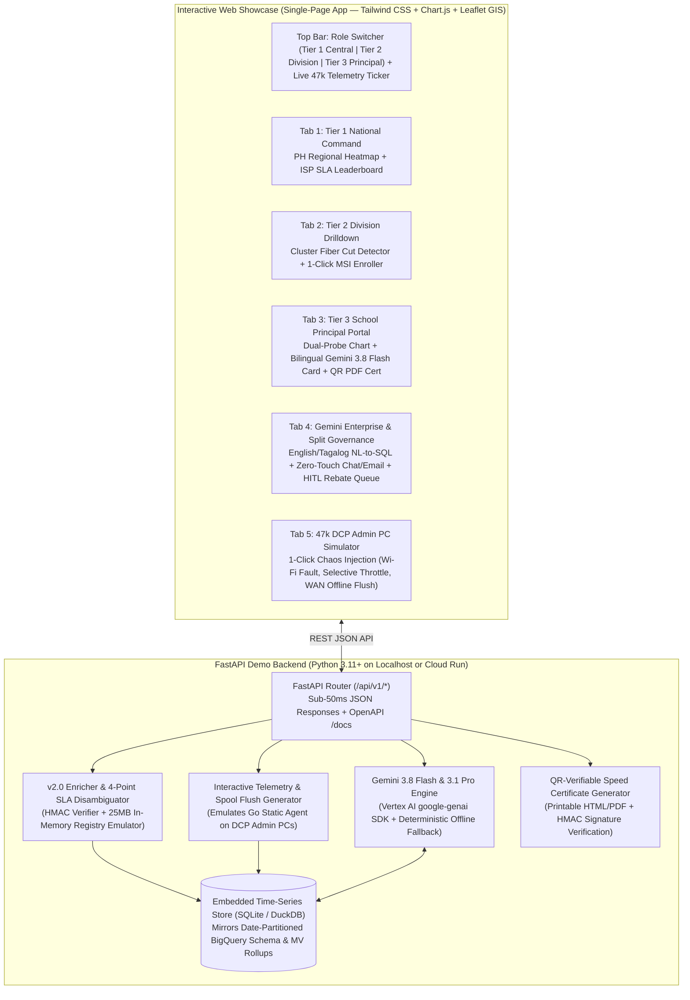

# PROTOTYPE & DEMO TECHNICAL DESIGN DOCUMENT (DEMO-TDD)
## Interactive Full-Stack Prototype & Executive Showcase for DepEd Network Speed Tracker
### Self-Contained FastAPI + Interactive 5-Tab Web Showcase Implementing BRD v2.0 & TDD v2.0 (`Localhost` & `Google Cloud Run`)

**Document Reference:** DEPED-ICTS-DEMO-TDD-NST-2026-v1.0  
**Project Code:** PROJECT-BAYANIHAN-NETPULSE-DEMO  
**Parent Specifications:** [01_DEPED_NW_SPEED_TRACKER_BRD.md](./01_DEPED_NW_SPEED_TRACKER_BRD.md) (`v2.0`) & [02_DEPED_NW_SPEED_TRACKER_TDD.md](./02_DEPED_NW_SPEED_TRACKER_TDD.md) (`v2.0`)  
**Target Environments:** Localhost Zero-Dependency Sandbox (`http://localhost:8080`) & Google Cloud Run (`asia-southeast1`)  
**AI Models Featured:** `Gemini 3.8 Flash` (Bilingual Diagnostics, Conversational Analytics, Synthetic Scenarios) & `Gemini 3.1 Pro` (ISP SLA Auditor & COA Rebate Memo Generator)  
**Security Classification:** OFFICIAL – Executive Demonstration & Proof-of-Concept Specification  

---

### Table of Contents
1. [Executive Summary & Demo Objectives](#1-executive-summary--demo-objectives)
2. [Prototype System Architecture & Dual-Mode Execution](#2-prototype-system-architecture--dual-mode-execution)
3. [Application Directory Structure](#3-application-directory-structure)
4. [Interactive 5-Tab UI/UX Showcase Specification](#4-interactive-5-tab-uiux-showcase-specification)
5. [Backend REST API & Simulation Engine Specification](#5-backend-rest-api--simulation-engine-specification)
6. [Pre-Seeded Philippine School Archetypes & Telemetry Dataset](#6-pre-seeded-philippine-school-archetypes--telemetry-dataset)
7. [Gemini 3.8 Flash & Gemini 3.1 Pro Integration (Live + Deterministic Fallback)](#7-gemini-38-flash--gemini-31-pro-integration-live--deterministic-fallback)
8. [Verification, Automated Test Suite & Cloud Run Deployment](#8-verification-automated-test-suite--cloud-run-deployment)

---

### 1. Executive Summary & Demo Objectives

#### 1.1 Purpose of the Interactive Prototype
While [01_DEPED_NW_SPEED_TRACKER_BRD.md](./01_DEPED_NW_SPEED_TRACKER_BRD.md) (`v2.0`) and [02_DEPED_NW_SPEED_TRACKER_TDD.md](./02_DEPED_NW_SPEED_TRACKER_TDD.md) (`v2.0`) define the national-scale target architecture for 47,000 public schools, DepEd decision-makers (the Office of the Undersecretary for Administration, ICTS Directors, Regional/Division Superintendents, and COA Auditors) require an **immediate, hands-on interactive prototype** to experience how the system works end-to-end.

This document specifies the engineering design for the **DepEd NetPulse Interactive Full-Stack Prototype & Demo**—a single-container web application that faithfully demonstrates every `BRD v2.0` and `TDD v2.0` innovation in real time:
1. **Zero-CapEx DCP Admin PC Agent Telemetry (`v2.0` Schema):** Live inspection of signed JSON payloads containing **Local Hop Diagnostics** (`Ethernet` vs. `Wi-Fi RSSI -85 dBm` + local gateway `192.168.1.1` ping) alongside **Dual-Probe WAN Metrics** (`DepEd Cloud Run Anchor` vs. `M-Lab NDT7 / Ookla`).
2. **Dispute-Proof SLA Attribution:** Interactive demonstration showing how weak classroom Wi-Fi is automatically **exempted** from ISP penalties, while verified **`PC-Online / WAN-Offline`** outages and **ISP Selective Throttling** (`10:00 AM – 02:00 PM` school-hour degradation) are caught and penalized.
3. **Hybrid 3-Tier Role Switcher:** Seamless switching between **Tier 1 (Central Office National View)**, **Tier 2 (Regional / Division Superintendent View)**, and **Tier 3 (Cost-Guarded Cloud Run School Principal Portal with QR-verifiable PDF Speed Test Certificates)**.
4. **Gemini Enterprise Intelligence (`Gemini 3.8 Flash` & `Gemini 3.1 Pro`):**
   - **Bilingual Conversational Analytics (`Gemini 3.8 Flash`):** Ask questions in plain **English or Tagalog/Taglish**, inspect the generated **Date-Partitioned BigQuery SQL**, and view instant charts.
   - **Split Governance Action Center (`Gemini 3.1 Pro`):** Watch **Zero-Touch Technical Trouble Tickets** auto-dispatch to the DepEd Helpdesk and simulated **Google Workspace Gmail / Google Chat** cards, while reviewing and approving **Human-in-the-Loop (HITL) Financial SLA Rebate Vouchers** (`PENDING_DITO_REVIEW` $\rightarrow$ `APPROVED_FOR_REBATE`).
5. **Interactive 47,000-Node Chaos & Jitter Simulator:** One-click scenario buttons to inject live school telemetry waves, regional typhoon fiber cuts, out-of-order SQLite spool flushes, and selective ISP throttling.

---

### 2. Prototype System Architecture & Dual-Mode Execution

To ensure the prototype runs reliably in any presentation environment (whether on an air-gapped laptop during a DepEd executive briefing or deployed live on Google Cloud Run), the backend implements a **Dual-Mode Execution Engine**:
- **Mode A — Live Vertex AI & BigQuery Mode (When `GOOGLE_CLOUD_PROJECT` is set):** Calls `gemini-3.8-flash` and `gemini-3.1-pro` via the `google-genai` SDK on Vertex AI and writes/queries date-partitioned BigQuery tables.
- **Mode B — Self-Contained Deterministic Sandbox Mode (Default Localhost Fallback):** Uses an embedded in-memory / SQLite time-series engine pre-seeded with realistic 17-region Philippine school telemetry and high-fidelity `Gemini 3.8 Flash` / `Gemini 3.1 Pro` response synthesis so the demo works with **zero external cloud dependencies**.



---

### 3. Application Directory Structure

When implemented inside [`/usr/local/google/home/markea/Desktop/DepEd/nw-speed-tracker`](file:///usr/local/google/home/markea/Desktop/DepEd/nw-speed-tracker), the prototype resides in a clean, modular structure:

```text
/usr/local/google/home/markea/Desktop/DepEd/nw-speed-tracker/
├── 01_DEPED_NW_SPEED_TRACKER_BRD.md                 # BRD v2.0 (Business & Governance Baseline)
├── 02_DEPED_NW_SPEED_TRACKER_TDD.md                 # TDD v2.0 (National Production Architecture)
├── 03_DEPED_NW_SPEED_TRACKER_PROTOTYPE_DEMO_TDD.md  # This Document (Interactive Prototype TDD)
├── Deped Network Speed Tracker.pdf                  # Original Foundational Reference PDF
├── README.md                                        # Use-Case Documentation Index
└── demo-app/                                        # Self-Contained Full-Stack Prototype
    ├── Dockerfile                                   # Cloud Run Production Container Spec
    ├── requirements.txt                             # FastAPI, Uvicorn, Pydantic, google-genai, pytest
    ├── run_demo.sh                                  # 1-Command Local Launcher (venv + seed + server)
    ├── test_demo_app.py                             # Automated End-to-End Pytest Verification Suite
    ├── backend/
    │   ├── __init__.py
    │   ├── main.py                                  # FastAPI Application & Static Mounts
    │   ├── database.py                              # Date-Partitioned Schema Emulator & Seed Data
    │   ├── sla_engine.py                            # 4-Point SLA Eligibility & Rebate Calculator
    │   ├── gemini_agents.py                         # Gemini 3.8 Flash & 3.1 Pro Workflows
    │   └── simulator.py                             # 47k DCP Admin PC Telemetry & Chaos Generator
    └── static/
        ├── index.html                               # Unified 5-Tab Executive & Principal Showcase UI
        ├── styles.css                               # DepEd Official Palette & Responsive Styling
        ├── app.js                                   # Interactive Charts, Map, NL-to-SQL & HITL Actions
        └── certificate.html                         # Printable QR-Verifiable ISP Speed Proof Certificate
```

---

### 4. Interactive 5-Tab UI/UX Showcase Specification

#### 4.1 Global Header & Persistent Controls
- **DepEd Official Branding:** Navy Blue (`#0038A8`), Philippine Flag Red (`#CE1126`), Gold (`#FCD116`), and Slate UI cards with a persistent **`⚠️ DEPED ICTS NETPULSE — INTERACTIVE DEMO & SIMULATION SANDBOX`** banner.
- **Live 3-Tier RBAC Role Switcher:** Dropdown in the top-right allowing the user to experience how data visibility and BigQuery Row-Level Security (RLS) change dynamically across:
  1. `🏛️ Tier 1: Central Office (Undersecretary / ICTS Director — All 17 Regions)`
  2. `🗺️ Tier 2: Division Superintendent (SDO Cavite / SDO Leyte — Division Scope)`
  3. `🏫 Tier 3: School Principal (104512 Bacoor NHS / 112804 Iloilo Central ES — Single School)`
- **Live Ingestion Pulse Indicator:** Displays simulated national scale (`47,000 Enrolled DCP Admin PCs` | `Jitter Window: 1–900s Active` | `25 MB In-Memory Registry: 0.02ms Lookup`).

---

#### 4.2 Tab 1: Tier 1 National Command Center (`DepEd Central Office View`)

```
+-------------------------------------------------------------------------------------------------------+
| [KPI 1: Enrolled DCP PCs]  [KPI 2: School-Hour Uptime]  [KPI 3: Avg Speed vs CIR]  [KPI 4: SLA Rebate]|
|   46,412 / 47,000 (98.7%)    96.4% (Mon-Fri 7AM-5PM)      78.2% of Contracted       ₱4,820,500.00     |
+---------------------------------------------------+---------------------------------------------------+
| 🗺️ PHILIPPINES REGIONAL CONNECTIVITY HEATMAP      | 🏆 NATIONAL ISP SLA COMPLIANCE & ANTI-GAMING      |
| [Interactive Leaflet / SVG Map of 17 PH Regions]  | ISP Name         | Anchor Speed | Public | Rebate |
| • NCR: 94.2% Compliance (Green)                   | PLDT Enterprise  | 84.5%        | 92.1%  | ₱1.12M |
| • Region IV-A: 82.1% Compliance (Amber)           | Converge ICT     | 88.0%        | 90.4%  | ₱0.64M |
| • Region VIII: 61.4% (Red - Leyte Fiber Cut!)     | Globe Business   | 76.2%        | 89.5%  | ₱1.45M |
| • BARMM: 71.8% (Starlink Rain Fade Advisory)      | SpeedNet Regional| 21.4% ⚠️     | 95.0%  | ₱1.61M |
+---------------------------------------------------+---------------------------------------------------+
```

- **Key Interactive Features:**
  - Clicking any of the **17 Philippine Regions** on the map filters the regional health breakdown and drills directly into Tab 2.
  - Highlights the **Dual-Probe Anti-Gaming Delta**: exposes when an ISP reports `95.0%` on public speedtest servers (`MLAB_NDT7 / Ookla`) while delivering only `21.4%` to the **DepEd Cloud Anchor** (`⚠️ ISP Selective Throttling Flagged`).

---

#### 4.3 Tab 2: Tier 2 Regional & Division Superintendent View (`SDO Drill-Down`)
- **Contextual Cluster Failure Banner (Vertex AI / BigQuery ML Anomaly Detection):**
  - Displays active cluster alerts where **5+ schools in the same Division and ISP** transition into `VERIFIED_WAN_OFFLINE` (`local_gateway_reachable = TRUE`, `wan_reachable = FALSE`) within a 15-minute window.
  - Shows how the system **suppresses 24 duplicate individual school router tickets** and auto-files a single **Master Regional Fiber Cut Ticket (`#DEPED-INC-2026-9012`)**.
- **Division School Watchlist Table:**
  - Color-coded status badges differentiating:
    - `🔴 VERIFIED ISP SLA BREACH` (Eligible for PHP Rebate)
    - `🟠 ISP SELECTIVE THROTTLING` (High Public Speedtest vs. Low DepEd Cloud Anchor)
    - `🔵 LOCAL SCHOOL WI-FI ADVISORY` (Weak Admin PC Wi-Fi `-85 dBm` — **Exempt from ISP Penalty**)
    - `🟢 COMPLIANT`
- **1-Click Division Enrollment Installer Generator (`DEC-04` / `TDD-DEC-03`):**
  - Interactive modal where a Division IT Officer (DITO) selects a school and generates the pre-bound Windows `.msi` / Linux `systemd` bootstrap command with a one-time cryptographic enrollment token (`deped-netpulse-agent.exe --enroll --school-id=104512 --token=OTK-R04A-88219`).

---

#### 4.4 Tab 3: Tier 3 Cost-Guarded School Principal Portal (`$0 BI Seat License View`)

```
+-------------------------------------------------------------------------------------------------------+
| 🏫 SCHOOL: 104512 - Bacoor National High School (Region IV-A | SDO Cavite)   [📄 Download QR PDF Cert]|
| ISP: SpeedNet / Telco-A (100 Mbps Fiber | ₱12,500/mo) | Partition Cache: 15-Min TTL (4.2 KB Scanned) |
+-------------------------------------------------------------------------------------------------------+
| 🔌 LOCAL HOP VERIFICATION (Admin PC -> School Router 192.168.1.1):                                    |
| [✅ Medium: ETHERNET (RJ45)] [✅ Router Reachable: TRUE] [✅ Router Ping: 1.2ms] [✅ Local Loss: 0.0%] |
| ➡️ VERDICT: Local School Network is 100% Healthy. Bandwidth degradation is confirmed on ISP WAN.     |
+-------------------------------------------------------------------------------------------------------+
| 📈 DUAL-PROBE SCHOOL-HOUR SPEED CURVE (07:00 AM - 05:00 PM PHT | Last 5 School Days)                  |
|   --- Dashed Gray Line: Contracted Baseline (100 Mbps)                                                |
|   --- Dotted Blue Line: Public Reference Speedtest (94 Mbps - Whitelisted by ISP)                     |
|   === Solid Red Line:   DepEd Cloud Anchor Throughput (Drops to 14 Mbps from 10:00 AM to 02:00 PM!)   |
+-------------------------------------------------------------------------------------------------------+
| 🤖 GEMINI 3.8 FLASH GROUNDED ROOT-CAUSE DIAGNOSTIC CARD (Event-Driven | Cached)                       |
| [🇺🇸 Plain English for Principal]                  | [🇵🇭 Paliwanag sa Tagalog para sa Punong-Guro]     |
| "Your Admin PC has a clean 1.2ms wired Ethernet   | "Maayos ang koneksyon ng Admin PC sa router ng    |
| connection to the school router, proving internal | paaralan (1.2ms Ethernet), kaya walang sira sa    |
| school wiring is healthy. However, real speed to  | loob ng school. Ngunit bumabagsak sa 14 Mbps ang  |
| DepEd Cloud drops to 14 Mbps between 10 AM and    | bilis patungong DepEd Cloud tuwing 10 AM–2 PM     |
| 2 PM while public speedtests show 94 Mbps. This   | habang mataas sa public speedtest. Ipinapakita    |
| confirms ISP Selective Traffic Shaping. Ticket    | nito na may throttling sa panig ng ISP. Kusang    |
| #DEPED-INC-4419 has been automatically filed."    | nagbukas ng Ticket #DEPED-INC-4419 sa ISP."       |
+---------------------------------------------------+---------------------------------------------------+
```

- **Interactive School Selector:** Switch between 5 pre-seeded showcase schools representing every `BRD v2.0` scenario:
  1. **`104512` — Bacoor National High School (Region IV-A):** *ISP Selective Throttling (`10 AM – 2 PM` drop on DepEd Cloud Anchor vs. 94 Mbps on Public Speedtest).*
  2. **`109821` — Tondo Elementary School (NCR):** *Weak Classroom Wi-Fi on Admin PC (`WIFI RSSI -86 dBm`, `98ms` router ping) — shows how Gemini 3.8 Flash advises the Principal to plug in an Ethernet cable and **exempts** the ISP from penalty.*
  3. **`121405` — Palo National High School (Region VIII - Leyte):** *Verified `PC-Online / WAN-Offline` part of a 24-school Regional Fiber Backbone Cut.*
  4. **`139501` — Basilan Island High School (BARMM):** *Starlink LEO Satellite with `15 MB` metered payload cap and monsoon rain-fade jitter profile.*
  5. **`112804` — Iloilo Central Elementary School (Region VI):** *100% Compliant Fiber benchmark (`96.4 Mbps` average).*
- **1-Click Printable QR-Verifiable PDF Speed Test Certificate:** Opens `/static/certificate.html?school_id=104512` with the official DepEd header, 5-day Dual-Probe table, Local Hop verification badge, HMAC-SHA256 signature hash, and scannable QR code.

---

#### 4.5 Tab 4: Gemini Enterprise Hub — Bilingual Conversational Analytics & Split Governance
- **Section A: Bilingual Conversational Analytics (`Gemini 3.8 Flash` in Looker Simulation):**
  - Natural language search bar supporting English, Tagalog, and Taglish queries, plus 4 one-click preset buttons:
    1. `"Which schools in Region IV-A have been 50% below contracted speed this week, excluding weak local Wi-Fi?"`
    2. `"Aling mga ISP ang may pinakamaraming SLA violation ngayong buwan at magkano ang total rebate?"`
    3. `"Show schools where public speedtest is >80 Mbps but DepEd Cloud Anchor is <25 Mbps (Selective Throttling)."`
    4. `"Ipakita ang mga paaralan sa Region VIII na 'PC-Online / WAN-Offline' dahil sa fiber cut."`
  - Displays:
    1. **Conversational Answer Summary** (in matching English or Tagalog),
    2. **Generated Date-Partitioned BigQuery SQL** (highlighting `WHERE measured_at >= ...` partition pruning),
    3. **Dynamic Chart & Structured Result Table**.
- **Section B: Split-Governance Operationalization Center (`DEC-07` & `DEC-08`):**
  - **Left Column — Zero-Touch Autonomous Ticketing & Google Workspace Dispatch:**
    - Displays the real-time stream of **auto-filed technical trouble tickets** (`ServiceNow / Jira / DepEd Helpdesk`) and renders interactive previews of the **automated Google Chat Alert Card** and **Google Workspace Gmail Notice** sent to the ISP NOC, DITO, and School Principal.
  - **Right Column — Mandatory Human-in-the-Loop (HITL) Financial SLA Rebate Queue (`Gemini 3.1 Pro`):**
    - Lists all monthly SLA rebate claims in state `PENDING_DITO_REVIEW` (with calculated PHP deduction amount, number of verified breach school days, and local-hop health verification).
    - Clicking **"Inspect COA Dispute Memo"** opens the formal **Notice of SLA Breach & Mandatory Billing Rebate Deduction** drafted by `Gemini 3.1 Pro`.
    - Clicking **✅ `[Approve Rebate Deduction (HITL)]`** transitions the record to `APPROVED_FOR_REBATE`, recording both the AI `created_by_agent_id` (`agent-sla-auditor@...`) and the human `approved_by_human_email` (`dito.cavite@deped.gov.ph`) in the immutable audit trail!

---

#### 4.6 Tab 5: Interactive 47,000-Node DCP Admin PC Telemetry & Chaos Simulator
- Allows the user to trigger live synthetic payloads modeled after the Go Static Agent (`v2.0` schema) and observe real-time ingestion, HMAC verification, 4-point SLA classification, and Gemini agent triggers:
  - **Button 1:** `⚡ Inject Staggered School-Hour Wave (50 Schools with 1–900s Jitter)`
  - **Button 2:** `📶 Inject Weak School Wi-Fi Event (School 109821: RSSI -86 dBm -> Verify SLA Exemption)`
  - **Button 3:** `🎭 Inject ISP Selective Throttling (School 104512: 95 Mbps Public vs 12 Mbps DepEd Anchor)`
  - **Button 4:** `🔌 Inject 'PC-Online / WAN-Offline' Spool Flush (School 121405: Router 1.4ms OK, WAN Down -> Auto-Ticket + Rebate)`
- Includes a **Live Signed JSON Payload & Enricher Inspector** showing the exact incoming `v2.0` JSON, HMAC-SHA256 verification status, and BigQuery Partition assignment (`PARTITION: 2026-10-07`).

---

### 5. Backend REST API & Simulation Engine Specification

| HTTP Method & Endpoint | Description | Target SLA / Behavior |
| :--- | :--- | :--- |
| `GET /health` | Health check & mode status (`SANDBOX` vs `VERTEX_AI_LIVE`, cache size, row count) | `< 10 ms` (`200 OK`) |
| `GET /api/v1/national/summary` | Returns Tier 1 national KPIs, 17-region heatmap metrics, and ISP SLA leaderboard | `< 40 ms` |
| `GET /api/v1/divisions` | Lists divisions with regional filter, cluster fiber-cut alerts, and school watchlist | `< 40 ms` |
| `POST /api/v1/devices/enrollment-command` | Generates a 1-click DCP Admin PC Go service enrollment command & one-time token | `< 20 ms` |
| `GET /api/v1/schools/{school_id}` | Returns Tier 3 School Portal payload (15-min cached rollup, 5-day Dual-Probe series, Local Hop metrics, and cached `Gemini 3.8 Flash` bilingual diagnosis) | `< 30 ms` |
| `GET /api/v1/schools/{school_id}/certificate` | Returns cryptographic proof metadata & HMAC QR payload for the printable PDF Speed Certificate | `< 25 ms` |
| `POST /api/v1/telemetry/ingest` | Validates `v2.0` signed JSON payload, runs 4-point SLA disambiguator, and inserts into partitioned store | `< 25 ms` |
| `POST /api/v1/gemini/conversational-query` | Executes bilingual (English/Tagalog) Conversational Analytics (`Gemini 3.8 Flash`), returning natural language answer, Date-Partitioned BigQuery SQL, and chart series | `< 1.5 s` |
| `GET /api/v1/governance/dashboard` | Returns Zero-Touch tickets, Google Workspace Gmail/Chat dispatch logs, and the HITL Rebate Queue | `< 35 ms` |
| `POST /api/v1/governance/rebates/{violation_id}/approve` | Executes the Human-in-the-Loop (HITL) approval (`PENDING_DITO_REVIEW` $\rightarrow$ `APPROVED_FOR_REBATE`) and logs human approver identity | `< 25 ms` |
| `POST /api/v1/simulator/trigger` | Fires one of the 4 live `BRD v2.0` simulation scenarios and returns the enriched result + triggered agent actions | `< 150 ms` |

---

### 6. Pre-Seeded Philippine School Archetypes & Telemetry Dataset

On startup (`database.py`), the prototype automatically seeds:
1. **17 Philippine Regions** (`NCR`, `CAR`, `R01`–`R13`, `BARMM`) with aggregate school counts summing to **47,000 public schools** and realistic regional ISP mixes.
2. **5 Telecommunications Providers (ISPs):**
   - `PLDT Enterprise` (Fiber — 100 Mbps CIR, ₱12,500/mo)
   - `Globe Business` (Fiber / LTE — 100 Mbps CIR, ₱12,000/mo)
   - `Converge ICT` (Fiber — 100 Mbps CIR, ₱11,500/mo)
   - `Starlink PH` (LEO Satellite — 50 Mbps CIR, ₱9,500/mo, `15 MB` metered probe cap)
   - `SpeedNet Regional` (Regional Fiber — 100 Mbps CIR, ₱12,500/mo — exhibits **Selective Traffic Shaping** between `10:00 AM` and `02:00 PM`)
3. **5 Detailed Showcase Schools** with **5 days of hourly school-hour telemetry (`07:00 AM – 05:00 PM PHT`)**, pre-computed `Gemini 3.8 Flash` bilingual diagnostic cards, Zero-Touch tickets, Google Chat/Gmail dispatch logs, and `Gemini 3.1 Pro` COA Rebate Dispute Memos ready for live HITL approval.

---

### 7. Gemini 3.8 Flash & Gemini 3.1 Pro Integration (Live + Deterministic Fallback)

The `backend/gemini_agents.py` module initializes the official `google-genai` client when Vertex AI credentials are present and transparently falls back to deterministic, schema-validated bilingual synthesis when running in offline local demo mode:

```python
"""
Reference Gemini 3.8 Flash & Gemini 3.1 Pro Dual-Mode Adapter for the Prototype Demo
"""

import os
from google import genai
from google.genai import types

MODEL_FLASH = "gemini-3.8-flash"
MODEL_PRO = "gemini-3.1-pro"


class NetPulseGeminiEngine:
    def __init__(self):
        self.project = os.getenv("GOOGLE_CLOUD_PROJECT")
        self.location = os.getenv("GOOGLE_CLOUD_LOCATION", "asia-southeast1")
        self.live_enabled = bool(self.project)
        self.client = None
        if self.live_enabled:
            try:
                self.client = genai.Client(vertexai=True, project=self.project, location=self.location)
            except Exception:
                self.live_enabled = False

    def generate_bilingual_diagnosis(self, school_record: dict) -> dict:
        if self.live_enabled and self.client:
            resp = self.client.models.generate_content(
                model=MODEL_FLASH,
                contents=f"Diagnose school telemetry in English and Tagalog JSON: {school_record}",
                config=types.GenerateContentConfig(response_mime_type="application/json", temperature=0.2),
            )
            return resp.text
        # Deterministic high-speed fallback for offline executive presentations
        return school_record.get("cached_bilingual_diagnosis", {})
```

---

### 8. Verification, Automated Test Suite & Cloud Run Deployment

#### 8.1 Running Locally (Zero Cloud Dependencies)
```bash
cd /usr/local/google/home/markea/Desktop/DepEd/nw-speed-tracker/demo-app
bash run_demo.sh
# Launches FastAPI on http://localhost:8080
```

#### 8.2 Automated Verification Suite (`test_demo_app.py`)
The prototype includes a `pytest` suite (`test_demo_app.py`) verifying:
1. `test_01_health_and_partitioned_seed`: Confirms all 17 Regions, 5 ISPs, and showcase schools are seeded with date-partitioned keys.
2. `test_02_local_wifi_bottleneck_exemption`: Pushes a `v2.0` payload with `WIFI` and `wifi_rssi_dbm = -86` and verifies `diagnostic_category == "LOCAL_WIFI_BOTTLENECK_EXEMPT"` and `is_sla_breach_eligible == False`.
3. `test_03_selective_isp_throttling_detection`: Pushes a payload with `public_ref_dl_mbps = 95.0` and `deped_anchor_dl_mbps = 12.0` (on healthy wired `ETHERNET`) and verifies `is_selective_throttling == True` and `is_sla_breach_eligible == True`.
4. `test_04_verified_wan_offline_spool_flush`: Pushes a backlogged `VERIFIED_WAN_OFFLINE` payload (`local_gateway_reachable = True`, `deped_anchor_dl_mbps = 0.0`) and verifies Zero-Touch ticket creation.
5. `test_05_bilingual_conversational_analytics`: Tests both English and Tagalog natural language queries and verifies that the generated BigQuery SQL enforces `WHERE DATE(measured_at) >= ...` partition pruning.
6. `test_06_split_governance_hitl_rebate_approval`: Verifies that a rebate claim starts in `PENDING_DITO_REVIEW` and transitions to `APPROVED_FOR_REBATE` with human approver attribution upon calling `POST /api/v1/governance/rebates/{id}/approve`.
7. `test_07_school_portal_qr_certificate`: Verifies the Tier 3 School Portal endpoint and cryptographic QR certificate generation.

#### 8.3 Deploying to Google Cloud Run
```bash
gcloud run deploy deped-netpulse-demo \
  --source /usr/local/google/home/markea/Desktop/DepEd/nw-speed-tracker/demo-app \
  --region asia-southeast1 \
  --allow-unauthenticated \
  --set-env-vars="DEMO_ENV=CLOUD_RUN,GEMINI_FLASH_MODEL=gemini-3.8-flash,GEMINI_PRO_MODEL=gemini-3.1-pro"
```
